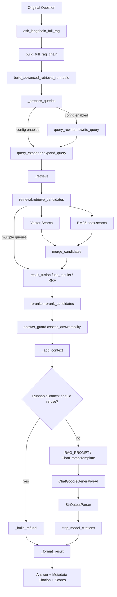

# Phase 8：LangChain 代码指南

本文完全基于当前仓库代码，目标读者是已经手写过 RAG、刚开始学习 LangChain 的 Python 开发者。

## 1. 先说结论

当前项目不是“把所有代码重写成 LangChain”，而是采用两层策略：

1. 纯向量学习链使用 LangChain 的 `Document`、`Embeddings`、`Chroma`、`Retriever`、`ChatPromptTemplate` 和 Runnable。
2. 完整高级链保留已经验证过的 BM25、Hybrid、RRF、Reranker、Rewrite、Expansion，只用 Runnable 编排它们。

因此 LangChain 在本项目里的主要价值是统一接口和编排，不是替代检索算法。

还有一个必须明确的事实：当前 FastAPI `app.py` 仍调用手写的 `rag_service.ask_rag()`。LangChain 完整链的入口是 `langchain_rag.lc_full_rag.ask_langchain_full_rag()`，目前由 Benchmark 或 Python 代码直接调用，尚未接入 `/chat`。

## 2. 最新整体架构

### 2.1 两个真实入口

| 入口 | 文件与函数 | 当前用途 |
|---|---|---|
| 线上/业务入口 | `app.py:chat()` → `rag_service.ask_rag()` | FastAPI `/chat`，仍是手写 RAG |
| LangChain 完整入口 | `langchain_rag/lc_full_rag.py:ask_langchain_full_rag()` | Phase 8 完整链、Benchmark、后续迁移基础 |

### 2.2 LangChain 完整链调用图



### 2.3 每个阶段的数据

| 阶段 | 文件/函数 | 输入 | 输出 | 下一步 | LangChain 组件 |
|---|---|---|---|---|---|
| 用户入口 | `lc_full_rag.ask_langchain_full_rag` | `question: str` 和可选开关 | 最终结果字典 | 构建并 `invoke` Chain | `Runnable.invoke` |
| Query Processing | `_prepare_queries` | 状态字典 | `original_query`、`retrieval_query`、`expanded_queries` | `_retrieve` | `RunnableLambda` 包装普通函数 |
| Rewrite | `query_rewriter.rewrite_query` | 原始 Query | 改写 Query | Expansion | 复用手写实现，没有被替换 |
| Expansion | `query_expander.expand_query` | Retrieval Query | 多个 Query | Retrieval | 复用手写实现，没有被替换 |
| Retrieval | `_retrieve` → `retrieve_candidates` | Query、Chroma、开关、Top-K | 候选字典列表 | Guard/Context | Runnable 只负责编排 |
| Hybrid | `retrieval._retrieve_candidate_pool` | Query | Vector+BM25 候选 | RRF/Reranker | 复用手写实现，没有被替换 |
| RRF | `result_fusion.fuse_results` | 多组候选 | 去重、累计 `fusion_score` 的候选 | Reranker | 复用手写实现，没有被替换 |
| Reranker | `reranker.rerank_candidates` | Query+候选 | 带 `rerank_score` 的排序结果 | Context | 复用手写实现，没有被替换 |
| Context | `_add_context`、`format_candidate_context` | 候选列表 | Context 字符串、LangChain Documents | Prompt | `Document`、`RunnableLambda` |
| Refusal | `assess_answerability` + `RunnableBranch` | 候选分数 | 拒答或进入生成 | Prompt/Result | `RunnableBranch` |
| Prompt | `lc_rag.RAG_PROMPT` | `context`、原始 `question` | Chat messages/PromptValue | Gemini | `ChatPromptTemplate` |
| LLM | `lc_llm.get_chat_model` | Chat messages | `AIMessage` | Parser | `ChatGoogleGenerativeAI` |
| Parser | `StrOutputParser` | `AIMessage` | `str` | Citation 清理 | `StrOutputParser` |
| Citation | `strip_model_citations`、`build_sources` | Answer、候选 Metadata | 正文和可信 `sources` | 返回 | 自定义 Python，未交给 LLM |

最终 Gemini 始终收到 `state["question"]`，也就是 Original Question。Rewrite 和 Expansion 只改变 Retrieval Query。

## 3. LangChain 核心组件

### 3.1 Document

`Document` 是“文本 + Metadata + 可选稳定 ID”的标准容器：

```python
Document(
    id=document_id,
    page_content=document,
    metadata=metadata,
)
```

当前使用位置：

- `lc_vectorstore.load_source_documents()`：把原 Chroma 数据转换成 Document。
- `lc_full_rag.candidate_to_document()`：把高级 Retrieval 候选绑定成 Document，并保留分数。

手写版使用字典：`{"text": ..., "source": ..., "page": ...}`。Document 的收益是可以直接交给 VectorStore、Retriever 和其他 LangChain 组件。代价是需要做一次数据结构适配。

### 3.2 DocumentLoader

概念上，DocumentLoader 负责从 PDF、网页、数据库等来源产生 `Document`。

**当前项目未使用 LangChain DocumentLoader。** PDF 仍由 `document_loader.load_pdf()` 调用 PyMuPDF 解析，并返回手写字典。这是有意保留的既有逻辑。

### 3.3 TextSplitter

TextSplitter 负责把长 Document 切成小 Document，并处理 overlap、分隔符和 Metadata 继承。

**当前项目未使用 LangChain TextSplitter。** `document_loader.split_text()` 仍按字符窗口实现 Chunk；`langchain-text-splitters` 虽已安装，但没有接入当前业务。

### 3.4 Embeddings

LangChain `Embeddings` 统一两个接口：

```python
embed_query(text: str) -> list[float]
embed_documents(texts: list[str]) -> list[list[float]]
```

本项目的 `ExistingEmbeddingAdapter` 没有创建新模型，而是委托给原 `embed_text()` 和 `embed_texts()`。因此模型、前缀规则和 normalize 行为保持一致。这个 Adapter 是必要的协议转换，不是新的 Embedding 算法。

### 3.5 VectorStore

VectorStore 表示能够保存向量并执行相似度搜索的存储层。当前纯向量学习链使用：

```python
Chroma(
    collection_name="company_knowledge_langchain",
    embedding_function=ExistingEmbeddingAdapter(),
    persist_directory="chroma_db_langchain",
    collection_configuration={"hnsw": {"space": "l2"}},
)
```

它解决了“如何把 Embeddings 接到 Chroma、如何返回 Document”的样板代码。

重要边界：完整高级 `lc_full_rag.py` 没有用这个 VectorStore 做 Hybrid Retrieval，而是只读原 `chroma_db` 并复用 `retrieve_candidates()`。

### 3.6 Retriever

Retriever 是“输入 Query，输出 `list[Document]`”的统一查询接口。当前纯向量链调用：

```python
vectorstore.as_retriever(
    search_type="similarity",
    search_kwargs={"k": top_k},
)
```

`lc_rag.py` 使用这个 Retriever；完整高级链由于需要携带 BM25/RRF/Reranker 分数，采用 `RunnableLambda` 适配候选字典，没有强行实现原生 `BaseRetriever`。

### 3.7 ChatPromptTemplate

它把 system/human 消息、固定约束和动态变量组合成 Chat Model 输入：

```python
RAG_PROMPT = ChatPromptTemplate.from_messages([
    ("system", "...{refusal_message}..."),
    ("human", "知识库上下文：{context}\n问题：{question}"),
]).partial(refusal_message=REFUSAL_MESSAGE)
```

与手写大字符串相比，角色、变量和固定参数更清晰。它不会自动保证 Prompt 正确，Prompt 约束仍需要项目自己设计。

### 3.8 ChatModel

`ChatGoogleGenerativeAI` 把 Gemini 包装成 Runnable。当前通过 `lc_llm.get_chat_model()` 创建，模型名和 Key 都复用 `config.py`。

手写版调用 `google.genai.Client.models.generate_content()`；LangChain 版可以直接参与 `prompt | llm | parser`。

### 3.9 Runnable

Runnable 是 LangChain 的统一执行协议。常见方法包括：

- `invoke(input)`：同步执行一个输入。
- `ainvoke(input)`：异步执行一个输入。
- `batch(inputs)`：批量执行多个输入。
- `stream(input)`：逐块返回输出。

当前代码实际使用 `invoke()`；尚未使用 `ainvoke()`、`batch()` 或真正的 token streaming。

### 3.10 RunnableLambda

它把普通 Python 函数包装成 Runnable，例如：

```python
RunnableLambda(_prepare_queries)
RunnableLambda(_add_context)
RunnableLambda(strip_model_citations)
```

适合把已有代码接入 LCEL。它不会减少函数内部算法，只让函数获得统一组合接口。

### 3.11 RunnablePassthrough

它保留原状态，并通过 `assign()` 增加新字段：

```python
context_chain = retrieval_chain.assign(
    context=RunnableLambda(...),
)
```

输入字典中的旧字段不会丢失，新增字段会合并进去。这相当于手写 `{**state, "context": value}` 的 Runnable 版本。

### 3.12 RunnableParallel

它可以让多个互不依赖的 Runnable 对同一输入并行执行，再把输出合并成字典。

**当前项目没有显式创建 `RunnableParallel`。** `RunnablePassthrough.assign()` 在语义上会组织并行字段计算，但项目没有利用并发 Retrieval 或多模型并行。

### 3.13 RunnableSequence / LCEL

表达式：

```python
prompt | llm | StrOutputParser()
```

会生成一个 RunnableSequence。`|` 是 Python 运算符重载，不是 Shell 管道。前一个组件的返回值会成为后一个组件的输入。

LCEL 是 LangChain Expression Language，即用 `|`、字典映射、Branch、Passthrough 等方式声明执行图。

### 3.14 Output Parser

当前使用 `StrOutputParser`，它把 `AIMessage` 转换成普通字符串。它不校验答案事实，也不负责 Citation。

项目还用普通函数 `strip_model_citations()` 做后处理，确保最终可信 Citation 来自 Metadata。

## 4. LCEL / Runnable 深入理解

### `|` 到底是什么

LangChain 为 Runnable 实现了 `__or__`。执行：

```python
chain = prompt | llm | parser
```

等价于声明：Prompt 的输出交给 LLM，LLM 的输出再交给 Parser。此时没有发请求；只有 `chain.invoke(input)` 才真正执行。

### 输入如何传递

`RAG_PROMPT` 需要 `context` 和 `question`。上游状态字典必须含有这两个键。Prompt 输出 `PromptValue`/消息列表，恰好满足 ChatModel 输入；ChatModel 输出 `AIMessage`，恰好满足 `StrOutputParser` 输入。

如果相邻组件的数据结构不兼容，就需要 `RunnableLambda` 做转换。

### invoke、batch、stream

```python
chain.invoke({"question": "...", "context": "..."})
```

一次同步执行，当前项目就是这种方式。

```python
chain.batch([input1, input2, input3])
```

对多个输入执行同一 Chain，适合离线评估。但 Gemini 限流、Reranker GPU/CPU 负载和 Cache 写入锁需要额外控制，所以当前评估仍显式循环。

```python
for chunk in chain.stream(input):
    ...
```

用于流式输出。当前 Chain 最后经过 `StrOutputParser`、Citation 清理和结果格式化，还没有实现面向 FastAPI 的流式协议。

### 何时使用 RunnableLambda

适合：已有纯函数、数据格式转换、轻量校验、状态字段补充。

不适合：为了“看起来像 LangChain”而把每一行 Python 都包装；复杂算法仍应保留清晰的普通函数和单元测试。

### 何时使用 RunnableParallel

只有分支互不依赖时。例如同时执行两个独立 Retriever。但当前 Hybrid/RRF 需要明确分数绑定和去重，直接复用手写 `retrieve_candidates()` 更清晰。

### Pipeline 不等于 Agent

当前 Chain 是预先定义好的固定执行图。它不会自主选择工具、规划步骤或循环反思，因此不是 Agent。固定 RAG 通常比 Agent 更可预测、更容易评估。

## 5. 最重要的 15 个方法

### 5.1 `ExistingEmbeddingAdapter.embed_query()` / `embed_documents()`

**文件路径：** `langchain_rag/lc_embedding.py`

**所属类：** `ExistingEmbeddingAdapter(Embeddings)`

**实际代码：**

```python
def embed_query(self, text: str) -> list[float]:
    return embed_text(text)

def embed_documents(self, texts: list[str]) -> list[list[float]]:
    return embed_texts(texts)
```

**作用：** 把原项目函数适配成 LangChain `Embeddings` 协议，不改变向量。

**输入：** `text` 是一个 Query；`texts` 是多个文档文本。

**输出：** 单个 768 维向量，或多个 768 维向量。

**调用流程：** `Chroma` 保存文档时调用 `embed_documents()`，搜索时调用 `embed_query()`；内部继续调用原 `embedding.py`。

**执行示例：** `adapter.embed_query("国际出差")` 返回浮点数列表。

**与手写版的区别：** 数值计算没有区别，只增加标准接口。

**小白知识点：** 继承抽象基类后必须实现约定方法；这里的 `self` 是 Adapter 实例。

### 5.2 `load_source_documents()`

**文件路径：** `langchain_rag/lc_vectorstore.py`

**所属类：** 无，模块函数。

**实际代码：**

```python
source_data = source_collection.get(include=["documents", "metadatas"])
documents = [
    Document(id=record_id, page_content=document, metadata=metadata)
    for record_id, document, metadata in records
]
```

**作用：** 只读原 Chroma，把原 Chunk 转换为 LangChain Document，并保留稳定 ID。

**输入：** 无显式参数；读取 `chroma_db/company_knowledge`。

**输出：** `(documents, ids)` 元组。

**调用流程：** 被 `initialize_vectorstore()` 调用；不会重新解析 PDF 或切 Chunk。

**执行示例：** 原 ID `travel_policy.pdf_page_2_chunk_0` 会成为 `Document.id`。

**与手写版的区别：** 原数据是 Chroma 返回的平行列表；现在绑定为 Document 对象。

**小白知识点：** `zip()` 把同位置的 ID、文本、Metadata 组合；排序用于稳定写入顺序。

### 5.3 `initialize_vectorstore()`

**文件路径：** `langchain_rag/lc_vectorstore.py`

**所属类：** 无。

**实际代码：**

```python
if not existing_data["ids"]:
    vectorstore.add_documents(documents=source_documents, ids=source_ids)
else:
    _validate_existing_collection(source_documents, source_ids, existing_data)
```

**作用：** 创建或验证独立 `chroma_db_langchain`，拒绝静默覆盖不一致数据。

**输入：** 无；配置由模块常量提供。

**输出：** `langchain_chroma.Chroma` 实例。

**调用流程：** 被 `lc_retriever.as_retriever()` 和纯向量搜索函数调用。

**执行示例：** 空库时写入 93 个 Document；已有库时逐 ID 检查文本和 Metadata。

**与手写版的区别：** 原 `ingest.py` 会删除 collection 再写入；此函数保护原库，并只操作独立实验库。

**小白知识点：** `@lru_cache(maxsize=1)` 缓存 VectorStore 对象，不等于跳过每次内容验证。

### 5.4 `as_retriever()`

**文件路径：** `langchain_rag/lc_retriever.py`

**所属类：** 无。

**实际代码：**

```python
return vectorstore.as_retriever(
    search_type="similarity",
    search_kwargs={"k": top_k},
)
```

**作用：** 把 VectorStore 转成标准 Retriever。

**输入：** `top_k`，必须至少为 1。

**输出：** 可 `invoke(query)` 的 Retriever，结果是 `list[Document]`。

**调用流程：** `lc_rag.build_rag_chain()` 获取 Retriever，然后把它接在 `itemgetter("question")` 后。

**执行示例：** `as_retriever(3).invoke("密码多久换？")` 返回 3 个 Document。

**与手写版的区别：** 不再手动构造 query embedding 和解析 Chroma 平行列表。

**小白知识点：** Retriever 通常不返回 Distance；需要 Distance 时使用 VectorStore 的 `similarity_search_with_score()`。

### 5.5 `get_chat_model()`

**文件路径：** `langchain_rag/lc_llm.py`

**所属类：** 无。

**实际代码：**

```python
@lru_cache(maxsize=1)
def get_chat_model():
    return ChatGoogleGenerativeAI(
        model=LLM_MODEL,
        api_key=GEMINI_API_KEY,
        temperature=0,
    )
```

**作用：** 用现有配置创建并复用 LangChain Gemini ChatModel。

**输入：** 无；Key 和模型来自 `config.py`。

**输出：** `ChatGoogleGenerativeAI` Runnable。

**调用流程：** 被最小链和完整链构建函数调用。

**执行示例：** ChatModel 接收 PromptValue，返回 `AIMessage`。

**与手写版的区别：** 手写版返回 `response.text`；ChatModel 保留消息角色，并能进入 LCEL。

**小白知识点：** 装饰器会缓存一个对象；源码中没有硬编码 API Key。

### 5.6 `build_rag_chain()`

**文件路径：** `langchain_rag/lc_rag.py`

**所属类：** 无。

**实际代码：**

```python
retrieval_chain = RunnablePassthrough.assign(
    retrieved_documents=itemgetter("question") | retriever,
)
answer_chain = context_chain.assign(
    answer=RAG_PROMPT | get_chat_model() | StrOutputParser()
)
```

**作用：** 构建最小“纯 Vector Retriever → Prompt → Gemini”链。

**输入：** `top_k`。

**输出：** Runnable；还没有执行。

**调用流程：** `ask_langchain_rag()` 构建后调用 `.invoke()`。

**执行示例：** 输入 `{"question": "国际出差怎么审批？"}`，输出含 answer/sources/documents 的字典。

**与手写版的区别：** 手写版逐行调用并维护临时变量；这里通过状态字典和 Runnable 组合。

**小白知识点：** `itemgetter("question")` 从字典取一个字段；`assign()` 保留旧字段并增加新字段。

### 5.7 `_prepare_queries()`

**文件路径：** `langchain_rag/lc_full_rag.py`

**所属类：** 无，内部辅助函数。

**实际代码：**

```python
retrieval_query = (
    rewrite_query(original_question)
    if use_query_rewrite else original_question
)
expanded_queries = (
    expand_query(retrieval_query)
    if use_query_expansion else [retrieval_query]
)
```

**作用：** 根据开关准备 Retrieval Query，并保留 Original Question。

**输入：** `state`、`use_query_rewrite`、`use_query_expansion`。

**输出：** 新状态字典，增加 `original_query`、`retrieval_query`、`expanded_queries`。

**调用流程：** 由 `build_advanced_retrieval_runnable()` 包成 RunnableLambda。

**执行示例：** 两个开关关闭时，expanded queries 就是 `[original_question]`。

**与手写版的区别：** 算法完全复用原函数，只改变编排方式。

**小白知识点：** `**state` 是字典展开；函数返回新字典，避免隐式修改上游状态。

### 5.8 `_retrieve()`

**文件路径：** `langchain_rag/lc_full_rag.py`

**所属类：** 无。

**实际代码：**

```python
candidates = retrieve_candidates(
    state["retrieval_query"],
    get_source_collection(),
    use_hybrid=use_hybrid,
    use_reranker=use_reranker,
    final_top_k=final_top_k,
    expanded_queries=...,
)
```

**作用：** 将 Runnable 状态交给原高级 Retrieval，并计算 answerability 和延迟。

**输入：** 状态、Hybrid/Reranker/Expansion 开关、最终 Top-K。

**输出：** 增加 `candidates`、`answerability`、`retrieval_latency_ms` 的状态。

**调用流程：** 调用原 `retrieve_candidates()` 和 `assess_answerability()`；下一步 `_add_context()`。

**执行示例：** 候选保留 document、metadata、distance、BM25、fusion、rerank 分数。

**与手写版的区别：** Retrieval 算法没有被 LangChain 替换；这里只是 Adapter。

**小白知识点：** 关键字参数使开关含义明确；`None` BM25 index 让原函数按原路径创建索引。

### 5.9 `candidate_to_document()` / `format_candidate_context()`

**文件路径：** `langchain_rag/lc_full_rag.py`

**所属类：** 无。

**实际代码：**

```python
metadata = {
    **candidate["metadata"],
    "original_distance": candidate.get("original_distance"),
    "bm25_score": candidate.get("bm25_score"),
    "fusion_score": candidate.get("fusion_score"),
    "rerank_score": candidate.get("rerank_score"),
}
return Document(page_content=candidate["document"], metadata=metadata)
```

**作用：** 保证文本、Metadata、分数仍绑定在同一个对象上；同时生成 Prompt Context。

**输入：** 一个候选，或候选列表。

**输出：** `Document`，或格式化后的 Context 字符串。

**调用流程：** `_add_context()` 同时调用二者。

**执行示例：** Metadata 包含 `source/page/chunk_id/rerank_score`。

**与手写版的区别：** 手写版维护多组平行列表；Document 减少错位风险，但最终兼容输出仍保留平行列表。

**小白知识点：** `dict.get()` 在字段不存在时返回 `None`，适合 BM25-only 或未启用 RRF 的候选。

### 5.10 `build_advanced_retrieval_runnable()`

**文件路径：** `langchain_rag/lc_full_rag.py`

**所属类：** 无。

**实际代码：**

```python
return (
    RunnableLambda(lambda state: _prepare_queries(...))
    | RunnableLambda(lambda state: _retrieve(...))
    | RunnableLambda(_add_context)
)
```

**作用：** 把 Query Processing、高级 Retrieval、Context 绑定成一个可执行序列。

**输入：** 构建时接收各种开关；运行时接收状态字典。

**输出：** RunnableSequence。

**调用流程：** 被 `retrieve_advanced()` 和 `build_full_rag_chain()` 调用。

**执行示例：** `.invoke({"question": ..., "_request_started_at": ...})` 返回带候选与 Context 的状态。

**与手写版的区别：** 原算法不变，但阶段边界可组合、可单独测试。

**小白知识点：** 构建 Chain 不会执行；`.invoke()` 才会执行。闭包中的开关会被 lambda 捕获。

### 5.11 `build_full_rag_chain()`

**文件路径：** `langchain_rag/lc_full_rag.py`

**所属类：** 无。

**实际代码：**

```python
answer_runnable = (
    RAG_PROMPT
    | get_chat_model()
    | StrOutputParser()
    | RunnableLambda(strip_model_citations)
)
return (
    retrieval_runnable
    | RunnableBranch(
        (_should_refuse, RunnableLambda(_build_refusal)),
        generation_runnable,
    )
    | RunnableLambda(_format_result)
)
```

**作用：** 构建完整 Retrieval、拒答、Gemini 和结果格式化 Chain。

**输入：** Top-K 和所有 Retrieval 开关。

**输出：** 可执行 Runnable。

**调用流程：** `ask_langchain_full_rag()` 调用它；内部复用高级 Retrieval Runnable。

**执行示例：** Guard 不通过时走 refusal 分支，不调用 Gemini。

**与手写版的区别：** `rag_service.py` 使用普通 `if`；LangChain 版使用 `RunnableBranch` 声明分支。

**小白知识点：** Branch 的第一个元素是 `(条件, 分支)`，最后一个参数是默认分支。

### 5.12 `ask_langchain_full_rag()`

**文件路径：** `langchain_rag/lc_full_rag.py`

**所属类：** 无。

**实际代码：**

```python
return build_full_rag_chain(...).invoke({
    "question": question.strip(),
    "_request_started_at": time.perf_counter(),
})
```

**作用：** LangChain 完整 RAG 的公共函数入口。

**输入：** 原始问题以及可选开关。

**输出：** 兼容评估的字典，包含 Answer、Refused、Sources、Documents、Metadata、所有分数和延迟。

**调用流程：** `experiment_langchain_full.py` 调用；未来 FastAPI 可选择接入，但当前尚未接入。

**执行示例：** `ask_langchain_full_rag("密码多久换？")`。

**与手写版的区别：** 对应 `rag_service.ask_rag()`，返回字段有意保持相近。

**小白知识点：** `*` 后面的参数只能用关键字传入，可以防止误把布尔开关放错位置。

### 5.13 `retrieve_candidates()`

**文件路径：** `retrieval.py`

**所属类：** 无，手写核心函数。

**实际代码：**

```python
queries = expanded_queries or [question]
if len(queries) == 1:
    candidates = _retrieve_candidate_pool(...)
else:
    result_sets = [_retrieve_candidate_pool(...) for query in queries]
    candidates = fuse_results(result_sets, queries)
if use_reranker:
    return rerank_candidates(question, candidates, top_n=final_top_k)
```

**作用：** 统一执行单/多 Query、Vector/BM25、RRF 和 Reranker。

**输入：** Question、Chroma collection、开关、BM25 index、Top-K、Expansion Query。

**输出：** 候选字典列表。

**调用流程：** 手写 `rag_service` 和 LangChain `_retrieve` 都调用它。

**执行示例：** Expansion 有 4 个 Query 时先分别检索，再 RRF，最后只 Rerank 一次。

**与手写版的区别：** 它本身就是手写版；LangChain 没有替换它。

**小白知识点：** `dict.fromkeys()` 用于保序去重；候选字典必须始终绑定 document 和 metadata。

### 5.14 `fuse_results()`

**文件路径：** `result_fusion.py`

**所属类：** 无。

**实际代码：**

```python
fused["fusion_score"] += 1.0 / (rrf_k + rank)
```

**作用：** 使用 Reciprocal Rank Fusion 合并多个 Query 的候选，同一 Chunk 多次命中会累计得分。

**输入：** `result_sets`、对应 `queries`、默认 `rrf_k=60`。

**输出：** 按 Fusion Score 排序、按 `source/page/chunk_id` 去重的候选列表。

**调用流程：** 被 `retrieve_candidates()` 在多 Query 模式调用。

**执行示例：** 一个 Chunk 在两个 Query 中分别排第 1、3，得分是 `1/61 + 1/63`。

**与手写版的区别：** 完全复用手写实现。

**小白知识点：** RRF 比较排名而不是直接混合不同量纲的 Vector/BM25 分数。

### 5.15 `rerank_candidates()`

**文件路径：** `reranker.py`

**所属类：** 无。

**实际代码：**

```python
pairs = [(question, candidate["document"]) for candidate in candidates]
scores = get_reranker().predict(pairs, ...)
reranked.sort(key=lambda candidate: candidate["rerank_score"], reverse=True)
```

**作用：** 用本地 CrossEncoder 同时阅读 Query 和 Chunk，重新评分排序。

**输入：** 原 Query、候选列表、最终数量。

**输出：** 带 `rerank_score` 的 Top-N 候选。

**调用流程：** `retrieve_candidates()` 在 Fusion/合并之后调用一次。

**执行示例：** Chroma Top-10 与 BM25 Top-10 合并后，由 CrossEncoder 统一比较。

**与手写版的区别：** 完全复用手写实现；LangChain 没有提供自动更优的 Reranker。

**小白知识点：** Bi-Encoder 可以预计算文档向量；CrossEncoder 通常更准但必须逐候选计算，成本更高。

## 6. 手写版与 LangChain 版对比

| 功能 | 原手写文件/方法 | LangChain 文件/方法 | 变化 | 实际收益 |
|---|---|---|---|---|
| PDF Loading | `document_loader.load_pdf` | 无 LangChain Loader | **复用手写实现，并没有被 LangChain 替换** | 不引入页码和解析差异 |
| Chunking | `document_loader.split_text` | 无 LangChain TextSplitter | **复用手写实现，并没有被 LangChain 替换** | 保持现有 Chunk 与 Ground Truth |
| Embedding | `embedding.embed_text(s)` | `ExistingEmbeddingAdapter` | 加一层接口适配，数值不变 | 可交给 LangChain VectorStore |
| Chroma 建库 | `ingest.py` | `lc_vectorstore.initialize_vectorstore` | 独立库、Document API、校验而非覆盖 | 安全对比，不影响原库 |
| Chroma Query | `collection.query(...)` | `Chroma.similarity_search_with_score()` | 平行列表变为 Document+score | 调用简洁、类型统一 |
| Retriever | 手写函数直接返回候选 | `lc_retriever.as_retriever` | 标准 Query→Documents 接口 | 能直接放入 LCEL |
| Hybrid Search | `retrieval.py`、`bm25_search.py` | `lc_full_rag._retrieve` 调原函数 | **复用手写实现，并没有被 LangChain 替换** | 避免重新验证算法 |
| RRF | `result_fusion.fuse_results` | 同一个函数 | **复用手写实现，并没有被 LangChain 替换** | 分数和去重规则完全一致 |
| Reranker | `reranker.rerank_candidates` | 同一个函数 | **复用手写实现，并没有被 LangChain 替换** | 保留本地模型和绑定关系 |
| Query Rewrite | `query_rewriter.rewrite_query` | `_prepare_queries` 调原函数 | **复用手写实现，并没有被 LangChain 替换** | Cache 和 fallback 不变 |
| Query Expansion | `query_expander.expand_query` | `_prepare_queries` 调原函数 | **复用手写实现，并没有被 LangChain 替换** | Cache、实体保护和 fallback 不变 |
| 拒答 | `rag_service` 中普通 `if` | `RunnableBranch` + 同一 Guard | 判断算法不变，分支声明化 | 生成分支更清晰 |
| Prompt | `rag_service.py` f-string | `lc_rag.RAG_PROMPT` | 角色化模板和变量绑定 | Prompt 结构清晰 |
| Gemini | `llm.generate_answer` | `lc_llm.get_chat_model` | 原 SDK 调用变成 ChatModel Runnable | 可组合、可 batch/stream 扩展 |
| Citation | API/结果 Metadata，加上 LLM Prompt Citation | `build_sources` + `strip_model_citations` | 明确不信任模型 Citation | Citation 可验证 |
| Evaluation | `eval/*.py` | 相同 evaluator + 两个 LangChain Benchmark | 复用同一 Ground Truth | 可做回归对比 |

## 7. LangChain 真正省下的 5 类代码

### 7.1 Embedding 协议统一

**Before：**

```python
question_embedding = embed_text(question)
results = collection.query(query_embeddings=[question_embedding], ...)
```

**After：**

```python
vectorstore = Chroma(embedding_function=ExistingEmbeddingAdapter(), ...)
results = vectorstore.similarity_search_with_score(question, k=top_k)
```

**变化：** Query Embedding 的调用和结果 Document 绑定由 VectorStore 处理。实际模型代码没有消失，只移动到 Adapter 后面。

### 7.2 Retriever 标准接口

**Before：** 手动决定 query 参数、解析 `documents[0]`、`metadatas[0]`。

**After：**

```python
retriever = vectorstore.as_retriever(search_kwargs={"k": top_k})
documents = retriever.invoke(question)
```

**变化：** 调用方只依赖 Query→Documents；但需要 Distance 时仍应回到 VectorStore API。

### 7.3 Prompt 与模型组合

**Before：**

```python
prompt = f"...{context}...{question}..."
answer = generate_answer(prompt)
```

**After：**

```python
answer_runnable = RAG_PROMPT | get_chat_model() | StrOutputParser()
```

**变化：** 消除了手动把 Prompt 输出、模型响应和字符串解析连接起来的样板代码；Prompt 内容仍由项目维护。

### 7.4 状态字段追加

**Before：**

```python
documents = ...
context = ...
answer = ...
return {"question": question, "documents": documents, ...}
```

**After：**

```python
state = RunnablePassthrough.assign(retrieved_documents=...)
state = state.assign(context=RunnableLambda(...))
state = state.assign(answer=answer_runnable)
```

**变化：** 每一阶段的输入输出边界更明显；代价是初学时需要理解状态字典和 Runnable 类型。

### 7.5 拒答分支声明

**Before：** `rag_service.py` 中普通 `if` 后提前 return。

**After：**

```python
RunnableBranch(
    (_should_refuse, RunnableLambda(_build_refusal)),
    generation_runnable,
)
```

**变化：** 分支成为执行图的一部分。判断阈值和 Guard 算法仍是手写代码，并没有被框架自动解决。

## 8. LangChain 的真实优势与局限

### 8.1 当前已经获得的优势

1. **统一接口：** Embedding、Retriever、ChatModel、Parser 都能用 Runnable 方式连接。
2. **组件可替换性：** 纯向量链以后可以替换 VectorStore/ChatModel，而不用重写全部调用方。
3. **Pipeline 编排：** Query、Retrieval、Branch、Prompt、LLM 的边界比一个大函数清晰。
4. **兼容自定义代码：** RunnableLambda 让原 BM25/RRF/Reranker 保持原样。
5. **可测试性：** `retrieve_advanced()` 可以不调用 Gemini，独立验证高级 Retrieval。
6. **Metadata 绑定：** Document 有助于减少文本与 Metadata 错位。

### 8.2 框架具备但当前尚未利用

1. `ainvoke()` 异步执行。
2. `batch()` 批量执行。
3. `stream()` token streaming。
4. 显式 `RunnableParallel` 并行分支。
5. LangSmith tracing/observability。
6. LangChain DocumentLoader 和 TextSplitter。
7. Tool Calling、Agent、Memory。

这些能力不能因为“框架支持”就认为项目已经拥有。

### 8.3 局限

- LangChain 不会自动提高 Retrieval Accuracy。回归测试中两边结果相同正说明算法决定质量。
- LangChain 不会自动解决 Hallucination。完整 Benchmark 中 LangChain 生成侧仍出现过 Q008 hallucination。
- 框架增加依赖、类型转换和调试层级。
- Hybrid、RRF、Reranker、Guard 等业务算法依然需要自定义。
- LangChain 版本升级可能改变导入路径、参数和返回结构。
- Runnable 图过度细分时，普通 Python 调试反而更困难。

## 9. 当前是否过度封装

本轮不做大规模重构，仅记录建议。

| 文件/位置 | 观察 | 是否建议简化 |
|---|---|---|
| `lc_full_rag.py` 引用 `lc_rag.RAG_PROMPT` 和 `strip_model_citations` | 完整链依赖“最小链”模块里的共享资源，职责边界不理想 | 后续可移到 `lc_prompt.py`，当前不要为移动而移动 |
| `candidate_to_document()` | 创建的 Document 主要用于 Debug/兼容输出，生成 Context 仍直接使用 candidate | 若下游不消费 `retrieved_documents`，可考虑只保留序列化结构 |
| `format_context()` 与 `format_candidate_context()` | 两套非常相似的 Context Formatter | 后续可统一为一个接受 Document/候选的 Formatter |
| `retrieve_advanced()` 每次构建 Runnable | 构建成本小，但固定配置下重复构建 | 性能测试证明有意义后再缓存，避免配置缓存错误 |
| `lc_retriever.retrieve()` | 只是 `as_retriever().invoke()` 的薄包装 | 保留：它是简单公共入口，成本低 |
| `initialize_vectorstore()` 每次验证全量内容 | 安全但每次纯向量检索都读取并比较 93 个 Chunk | 后续可把“初始化/验证”和“查询”拆开，只在启动时验证 |
| `lc_rag.py` 与 `lc_full_rag.py` | 最小链和完整链有重复 | 当前保留：前者是纯向量基线且被后者复用，不属于无用 Demo |
| Full Pipeline 使用 RunnableLambda 适配高级 Retrieval | 没有实现自定义 `BaseRetriever` | 当前合理；候选需要保留多种分数，不必为了原生化牺牲结构 |

## 10. 文件分类与清理记录

### A. 正式业务文件

- `langchain_rag/lc_embedding.py`
- `langchain_rag/lc_vectorstore.py`
- `langchain_rag/lc_retriever.py`
- `langchain_rag/lc_llm.py`
- `langchain_rag/lc_rag.py`
- `langchain_rag/lc_full_rag.py`
- 根目录所有原手写 RAG、FastAPI、配置、Retrieval 和知识库模块

### B. 长期验证文件

- `eval/test_case.json`
- `eval/retrieve_eval.py`
- `eval/answer_eval.py`
- `eval/answer_judge.py`
- `eval/end_to_end_eval.py`
- `eval/retrieval_miss_debug.py`
- `eval/experiment_langchain.py`
- `eval/experiment_langchain_full.py`
- 现有 Chunk、Top-K、Reranker、Hybrid、Rewrite、Expansion 实验脚本和结果

### C. 已删除的临时过程文件

- `langchain_rag/lc_document_demo.py`：只打印一个示例 Document。
- `langchain_rag/lc_embedding_test.py`：一次性 Embedding 一致性脚本，已被正式回归结论覆盖。
- `langchain_rag/lc_retrieval_test.py`：单题打印测试，已被 `experiment_langchain.py` 覆盖。
- `langchain_rag/lc_rag_test.py`：单题 Gemini 打印测试，已被完整 Benchmark 覆盖。

保守保留 `demo/` 和根目录 `test_pdf.py`：它们不是 Phase 8 新增文件，可能仍承担早期学习用途；本轮没有足够依据删除。

## 11. 清理后的目录树

```text
rag-demo/
├── app.py
├── config.py
├── document_loader.py
├── embedding.py
├── ingest.py
├── knowledge_service.py
├── llm.py
├── rag.py
├── rag_service.py
├── retrieval.py
├── bm25_search.py
├── result_fusion.py
├── reranker.py
├── query_rewriter.py
├── query_expander.py
├── answer_guard.py
├── langchain_rag/
│   ├── __init__.py
│   ├── lc_embedding.py
│   ├── lc_vectorstore.py
│   ├── lc_retriever.py
│   ├── lc_llm.py
│   ├── lc_rag.py
│   └── lc_full_rag.py
├── eval/
│   ├── test_case.json
│   ├── retrieve_eval.py
│   ├── answer_eval.py
│   ├── answer_judge.py
│   ├── end_to_end_eval.py
│   ├── retrieval_miss_debug.py
│   ├── experiment_langchain.py
│   ├── experiment_langchain_full.py
│   ├── 其他正式实验脚本
│   └── results/
├── docs/
│   └── PHASE8_LANGCHAIN_CODE_GUIDE.md
├── data/pdf/
├── README.md
├── requirements.txt
└── phase8-requirements.txt
```

## 12. 下一步学习建议

### 必须掌握

1. `Document` 的内容和 Metadata 边界。
2. `Embeddings`、VectorStore、Retriever 三层职责。
3. Runnable 的输入/输出数据结构。
4. `invoke()`、`|`、`assign()`、`RunnableLambda`、`RunnableBranch`。
5. Prompt 与 Citation 必须分开信任。
6. 如何用 Evaluation 证明“封装没有改变算法结果”。

### 接下来最值得练习

1. 为 Chain 增加 `ainvoke()`，理解异步而不改变算法。
2. 给 FastAPI 新增独立、可选的 LangChain endpoint，而不是立即替换原 `/chat`。
3. 实现 streaming 时，把 Answer token 与最终 Citation 分成两个事件。
4. 使用结构化日志记录每个 Runnable 阶段的 latency 和错误。
5. 把 Prompt/Citation 工具抽成共享模块，并增加小型单元测试。

### 可以暂时忽略

- Agent、多 Agent、长期 Memory。
- 为了“全 LangChain”而替换稳定的 BM25/RRF/Reranker。
- 未有实际需求前引入复杂 tracing 平台。
- 在 Retrieval 回归没通过之前尝试更复杂 Chain。

### 更适合普通 Python 的场景

- 分数绑定、复杂去重、业务阈值。
- 对错误恢复和缓存写入有严格控制。
- 算法需要精确调试和性能分析。

### 更适合 LangChain 的场景

- 标准模型/向量库接口适配。
- Prompt、Model、Parser 的组合。
- 固定 Pipeline 的同步、异步、批处理和流式扩展。
- 需要在相同接口下替换 Provider。

## 13. 自测题（含答案）

1. **问：Full LangChain RAG 是否通过 `lc_retriever.as_retriever()` 做 Hybrid Search？**  
   答：否。它通过 RunnableLambda 调用原 `retrieve_candidates()`；`lc_retriever` 只服务纯向量链。

2. **问：为什么 `embed_query()` 和 `embed_documents()` 分开？**  
   答：有些模型对 Query 和 Document 使用不同编码规则；本项目虽然都委托原函数，但接口必须保留这种可能性。

3. **问：调用 `build_full_rag_chain()` 会立即请求 Gemini 吗？**  
   答：不会。只有对返回的 Runnable 调用 `invoke()` 等执行方法时才运行。

4. **问：`prompt | llm | parser` 中的 `|` 是什么？**  
   答：Runnable 的 Python 运算符重载，用来创建 RunnableSequence。

5. **问：当前项目是否使用 LangChain PDF Loader 和 TextSplitter？**  
   答：没有，仍使用 PyMuPDF 和手写 `split_text()`。

6. **问：Rewrite 开启后，Gemini 最终回答哪个问题？**  
   答：Original Question；Rewritten Query 只用于 Retrieval。

7. **问：RRF 何时发生？**  
   答：`retrieve_candidates()` 收到多个 Query 时，对多组检索结果进行融合。

8. **问：为什么不能让 LLM 决定 Citation？**  
   答：模型可能编造来源；可信 Citation 必须来自检索 Metadata。

9. **问：Retriever 与 VectorStore 的主要区别？**  
   答：VectorStore 管理向量存储和搜索；Retriever 是统一的 Query→Documents 接口。

10. **问：`RunnablePassthrough.assign()` 做什么？**  
    答：保留原输入字典，同时计算并加入新字段。

11. **问：为什么 Full Pipeline 没有强制实现 BaseRetriever？**  
    答：高级候选包含 Vector、BM25、Fusion、Rerank 多种分数；Runnable 适配更直接，避免丢失结构。

12. **问：LangChain 是否会自动提升命中率？**  
    答：不会。相同算法、向量和数据应得到相同结果，提升需要改变检索策略或数据质量。

13. **问：当前项目是否真正使用了 batch 和 stream？**  
    答：没有，只使用同步 `invoke()`。

14. **问：当前 Chain 是 Agent 吗？**  
    答：不是，它是固定执行图，不会自主规划或选择工具。

15. **问：修改 Embedding 或 Chroma 后最先跑什么？**  
    答：先跑纯 Retrieval Regression，再跑 deterministic Answer Evaluation，最后按需要运行 Judge/End-to-End Benchmark。
