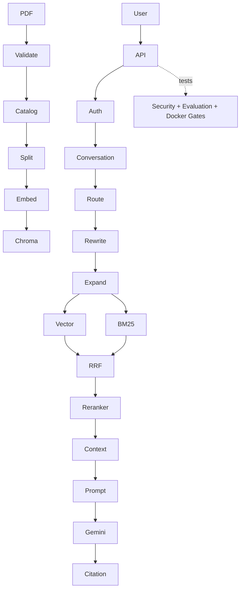

# RAG Phase 1–12 最终项目指南

## 三版本

- V1 根目录：手写 RAG，适合理解底层和历史回归。
- V2 `langchain_rag/`：LangChain Wrapper，部分复用 V1。
- V3 `rag_langchain_native/`：独立 LangChain-first，包含 Catalog、版本、ACL、租户、会话、安全和 CI。



## 本地运行

```powershell
$env:V3_AUTH_SECRET="replace-with-a-long-random-secret"
python -m uvicorn rag_langchain_native.api:app --host 127.0.0.1 --port 8011
python -m pytest rag_langchain_native/tests -m "not live"
python -m rag_langchain_native.cli --help
python -m rag_langchain_native.eval.enterprise_retrieval_eval
python -m rag_langchain_native.eval.enterprise_answer_eval
docker compose -f rag_langchain_native/docker-compose.yml up --build
```

## 阅读顺序

`config.py` → `catalog.py` → `security.py` → `lifecycle.py` → `retrieval.py` → `query_processing.py` → `chain.py` → `enterprise.py` → `api.py` → `backup.py` → `eval/quality_gate.py`。

当前真实仓库没有 Phase10 Observability 源模块（只有历史缓存目录痕迹），所以本阶段没有虚构 Trace 查看命令。商业生产还需 OIDC/MFA/KMS、分布式限流与锁、托管数据库/向量库、隔离文件扫描、备份加密、真实 OpenTelemetry、SLO、模型红队、SBOM/镜像签名与灾难恢复演练。

详细安全、CI、测试和 Branch Protection 操作分别见同目录 Phase11/Phase12 文档。
