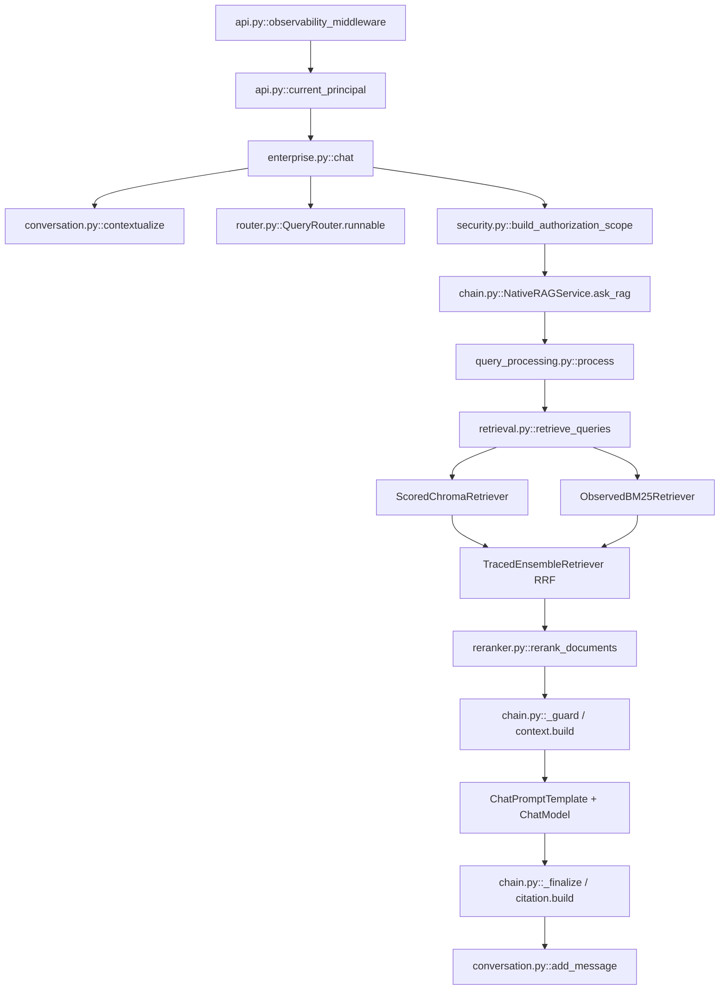

# Phase 10：RAG Observability

## 1. 实施结论与真实链路

Phase 10 在 V3 上增加横向可观测能力，没有改变 Embedding、Chunk、Vector/BM25、RRF、Reranker、Prompt、ACL 或 Ground Truth。默认数据只写入 `rag_langchain_native/runtime/observability/`，不上传 SaaS，也不采集问题、Prompt、Context、Answer、文档正文或凭证。



## 2. 模块职责

| 文件 | 职责 |
|---|---|
| `observability/config.py` | 开关、Exporter、采样率、日志级别、保留期与隐私默认值 |
| `observability/core.py` | OpenTelemetry、Span、JSON 日志、低基数 Metrics、请求摘要与 ContextVar |
| `observability/callbacks.py` | LangChain Callback，跟踪 Chain/Retriever/ChatModel，读取真实 Usage |
| `observability/failure.py` | 失败分类和安全错误摘要 |
| `observability/cost.py` | 用管理员核实的本地价格配置计算估算成本 |
| `observability/report.py` | 最近请求、Trace 树和窗口聚合 CLI |
| `eval/observability_overhead.py` | ON/OFF 离线性能开销实验 |

## 3. Trace 与 Span

HTTP 请求由 middleware 建立 `rag.request`。CLI/Evaluation 直接调用 Service 时，`ask_rag()` / `retrieve_only()` 补建请求 Trace；已有上下文时复用，不产生第二个根。

实际 Span 包括：

- `authentication`、`authorization.admin`、`authorization.scope`
- `conversation.load`、`conversation.contextual_rewrite`
- `query.route`、`query.rewrite`、`query.expand`
- `retrieval`、`vector.search`、`bm25.search`、`fusion.rrf`
- `reranker`、`context.build`、`citation.build`
- Callback 产生的 `langchain.chain.*`、`langchain.retriever.*`、`langchain.llm.*`
- `document.register`、`document.version_upload`、`document.pdf_parse`、`document.chunking`、`document.chroma_index`、`document.publish`、`document.rollback`、`document.delete`、`document.restore`

关闭的 Rewrite、Expansion、Reranker 不伪造执行 Span。`ContextVar` 隔离并发请求状态，避免用线程不安全全局变量；自建线程仍需显式传播 Context。

## 4. Structured Logging 与保护

终端及 `application.jsonl` 使用 JSON，含 timestamp、level、service、operation、request_id、trace_id、event、status、duration_ms、error_type。默认 5 MB 轮转、5 个备份，轮转文件保留 7 天。

统一 `redact()` 清理 password、API key、Authorization、Cookie、JWT、access/refresh/session token、Prompt、Context、Answer、Question、Document/Content。Token 数量（`input_tokens`）不是凭证，仍可统计。异常只记录分类与异常类名，不保存可能含敏感正文的原始消息/堆栈。

## 5. Metrics

Metrics 进入 OpenTelemetry Meter 和本地 `metrics.jsonl`：API 请求/成功/错误/时延/状态段；Vector/BM25/RRF/Reranker 时延和候选数；LLM 请求/错误/重试/Token；Fallback；文档入库成功/失败、发布、回滚。

Label 只允许 route、operation、status、error_type 等低基数字段；request_id、user_id、conversation_id、document_id、tenant_id 被统一丢弃。当前不匿名公开 `/metrics`；未来接 Prometheus 时应放内部网络或管理认证后。

## 6. Token Usage 与 Cost

Callback 优先读 `AIMessage.usage_metadata`，再检查 `response_metadata` 与 `LLMResult.llm_output`。Rewrite、Expansion、Contextual Rewrite、Answer 分别计量。SDK 没给 Usage 时标记 `unavailable`，不按字符数猜。

价格文件是 `runtime/observability/pricing.json`：

```json
{
  "currency": "USD",
  "pricing_version": "管理员核实的日期或合同版本",
  "models": {
    "精确模型名称": {
      "input_per_million": 0.0,
      "output_per_million": 0.0
    }
  }
}
```

`0.0` 仅说明数据结构，不是价格声明。未配置模型为 `unknown_pricing`；Usage 缺失为 `usage_unavailable`；Mock 为 `mocked_usage`，均不计入估算总额。估算费用不是账单。

## 7. Failure、Fallback 与拒答

`FailureType` 区分认证、授权、租户、文档/版本、入库、Embedding、Retrieval、Reranker、LLM 限流/超时/服务、Cache、内部错误。正常拒答、正常零结果、Evaluation 答案错误不属于同一种系统错误。

Rewrite/Expansion/Contextual Rewrite 失败后回退原 Query：记录局部失败和 `fallback`，根请求仍可 success，并保留 `fallback_count`，表达“请求完成但发生降级”。

## 8. Multi-Tenant 与调试访问

tenant_id 只以 SHA-256 短指纹进入内部归属。管理 API：

- `GET /observability/requests?limit=20`
- `GET /observability/traces/{trace_id}`
- `GET /observability/summary?minutes=60`

都要求真实 Token 和 admin，且自动限制为自己的租户。`trace_detail()` 必须先在该租户请求摘要找到归属，否则 Not Found。Trace ID 不是权限凭证。

## 9. 本地查看与配置

```powershell
python -m rag_langchain_native.observability.report recent --limit 10
python -m rag_langchain_native.observability.report trace --request-id <request_id>
python -m rag_langchain_native.observability.report trace --trace-id <trace_id>
python -m rag_langchain_native.observability.report summary --minutes 60
```

| 环境变量 | 默认 | 说明 |
|---|---:|---|
| `V3_OBSERVABILITY_ENABLED` | true | 总开关 |
| `V3_OBSERVABILITY_EXPORTER` | local | local / otlp / none |
| `V3_OBSERVABILITY_SAMPLE_RATE` | 1.0 | 0–1 |
| `V3_OBSERVABILITY_LOG_LEVEL` | INFO | 日志级别 |
| `V3_OBSERVABILITY_CAPTURE_CONTENT` | false | 当前仍不自动写业务正文 |
| `V3_OBSERVABILITY_OTLP_ENDPOINT` | 空 | 仅 OTLP 模式必填 |
| `V3_OBSERVABILITY_RETENTION_DAYS` | 7 | 本地保留期 |

OTLP 只有显式配置才启用；本地 CLI 不依赖 Docker、Jaeger、Tempo 或付费 SaaS。

## 10. 验证与性能

```powershell
python -m pytest rag_langchain_native/tests -q
python -m rag_langchain_native.eval.observability_overhead
python -m pip check
```

200 个离线微型 Mock 样本：OFF 平均约 0.0162 ms；ON 平均约 4.5174 ms、P95 约 5.1018 ms；0 error，600/600 Span 完整。绝对开销约 4.5012 ms。Mock 几乎不做业务工作，因此 27755% 的相对值没有生产解释力；真实环境仍需并发压测。

## 11. 安全与生产局限

- 本地 `SimpleSpanProcessor` 同步写 JSONL，适合教学和确定性测试；高吞吐生产应使用 Batch + OTLP Collector。
- 本地文件权限依赖 OS 账号，未实现存储加密和审计不可抵赖。
- 没有内置“最新价格”；必须由管理员核实。
- 没有付费调用 Gemini。本阶段用真实 LangChain Usage 数据结构离线验证；字段缺失时安全标记 unavailable。
- `capture_content=false`；未来若允许内容调试，需要额外 ACL、加密、审批和短保留。
- 通过测试不等于生产安全合规，仍需威胁建模、压力测试、集中访问控制和隐私评审。

## 12. Phase 11 建议

接入内部 Collector + Tempo、Prometheus/Grafana；改为 Batch Export；建立 SLO/告警；对 Trace 存储加密和审计；在预生产做并发、采样和故障注入。
