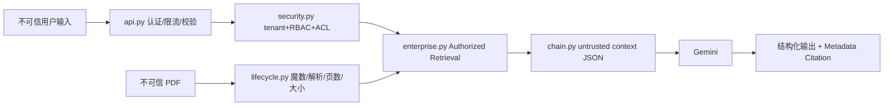
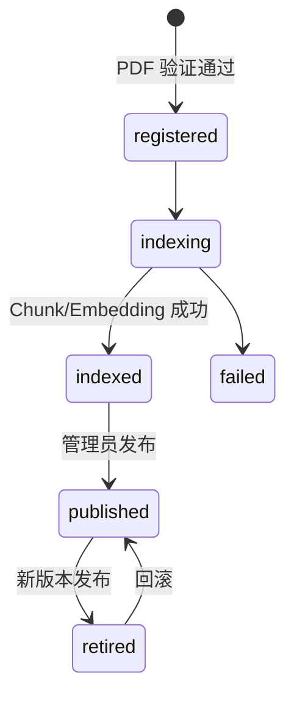

# Phase 11：Security & Production

## 范围与威胁模型

本阶段只加固 V3；V1、V2、历史 Ground Truth 和旧 Chroma 均不修改。审计参考 [OWASP GenAI Security Project](https://genai.owasp.org/) 和 [OWASP API Security Top 10](https://owasp.org/API-Security/editions/2023/en/0x11-t10/)。

应用内 System Prompt、服务端身份与授权范围是可信控制面；用户问题、会话、PDF、Metadata、Retrieved Chunk 和模型输出均是不可信数据。Prompt 不是授权机制，真实边界是 `security.py::build_authorization_scope()` 在检索前生成的版本白名单。



## 已实施防护

- Token：HMAC、有效期、issuer、audience、token version；tenant/roles 从 Catalog 重载。
- 权限：Vector/BM25 共用 active-version 白名单；Fusion/Reranker/Context/Citation 只接触授权候选。
- Prompt Injection：Context 使用 `untrusted_retrieved_document` JSON；System Prompt 明确文档不是指令；V3 没有 Agent/Tool/命令执行。
- Upload：分块预算读取、`%PDF-` 魔数、PyMuPDF 解析、页数限制和服务端路径；验证通过后才注册便捷上传文档。
- API：请求体大小、单进程限流、并发 Semaphore、Pydantic 边界、受限 CORS、安全响应头、生产关闭 Swagger。
- Secret：`.env.example` 只有占位符；生产 Secret 少于 32 字符时 Fail Closed；镜像不复制 `.env`。
- Backup：SQLite `backup()`、写锁内快照、SHA-256 Manifest、只恢复到新/空目录。
- Container：非 root、只读根文件系统、drop capabilities、本地回环端口、持久 Volume、Healthcheck。

## 生命周期与一致性



SQLite 与 Chroma 不是同一事务。V3 采用先索引后切 active pointer；失败时旧版本保持可用。`runtime_lock.py` 只保证单进程 writer 串行，多副本需要维护窗口或外部锁。

## Docker、HTTPS 与运行

```powershell
docker build -f rag_langchain_native/Dockerfile -t rag-v3:local .
Copy-Item rag_langchain_native/.env.example rag_langchain_native/.env.production
docker compose -f rag_langchain_native/docker-compose.yml up --build
```

Compose 只绑定 `127.0.0.1:8011`。`deploy/Caddyfile` 是真实域名 HTTPS 示例，不含私钥且未在本机申请证书。`/health` 不访问外部依赖；`/ready` 检查 Catalog 与 runtime，不调用 Gemini。

## Backup / Restore

```powershell
python -m rag_langchain_native.cli backup D:\backups\rag-v3
python -m rag_langchain_native.cli verify-backup D:\backups\rag-v3
python -m rag_langchain_native.cli restore-backup D:\backups\rag-v3 D:\restore-test
```

恢复拒绝覆盖 active runtime。生产备份还需加密、离线存储与定期恢复演练；恢复到不同路径时 Catalog 的绝对 `storage_path` 需在维护流程中迁移。

## 已知局限

- 本地 Token 不替代 OIDC/MFA/KMS/密钥轮换。
- Prompt Injection 无法彻底消除；Mock 只验证程序边界，不证明真实模型永不受诱导。
- 限流、写锁和 SQLite 是单节点方案。
- 尚无恶意软件扫描和隔离 PDF 解析。
- Docker、真实域名 HTTPS 需要具备相应外部环境后再验证。

## 依赖审计结果（2026-10-09）

`langchain-classic` 已从 1.0.2 升至 1.0.8，`pytest` 已从 9.0.2 升至 9.0.3，并完成全量回归。`chromadb==1.5.9` 仍有四个无可用修复版本的公告；原始 `pip-audit` 因此失败。V3 不暴露 Chroma HTTP 服务，并用应用 ACL 形成补偿控制，但这不能消除依赖风险。精确、到期的 CI 例外和撤销条件见 `SECURITY_RISK_ACCEPTANCE.md`。
