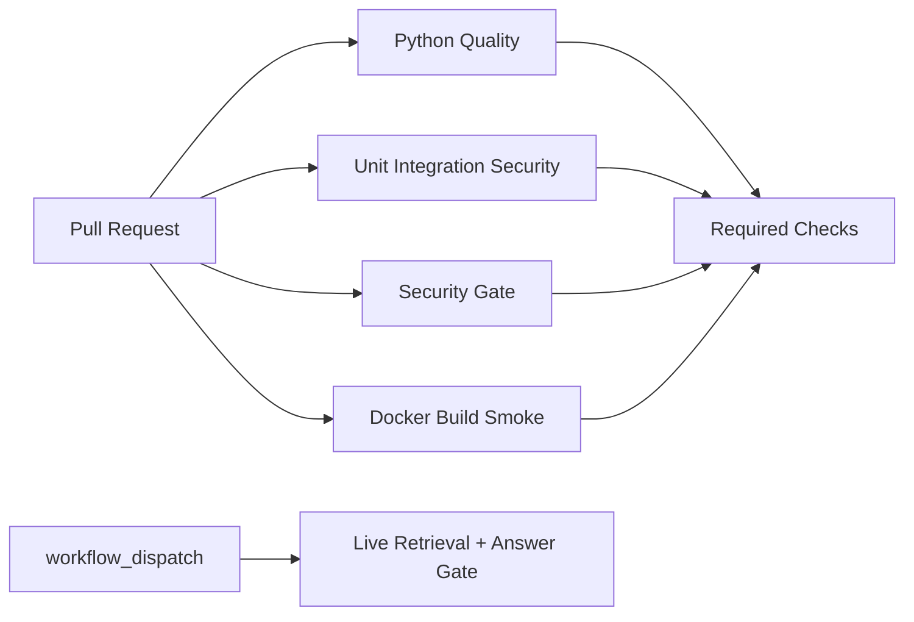

# Phase 12：CI/CD 与 Evaluation Gate



普通 PR 不调用 Gemini。真实模型 Evaluation 只由受保护 Environment 手动触发，Secret 不暴露给不可信 PR。

## Workflows

| 文件 | Job | 内容 |
|---|---|---|
| `v3-ci.yml` | Python Quality | pip check、compileall、Ruff |
| `v3-ci.yml` | Unit Integration Security | 离线 pytest、JUnit Artifact |
| `v3-ci.yml` | Security Gate | Bandit、pip-audit、安全 pytest |
| `v3-ci.yml` | Docker Build Smoke | 构建、启动、readiness |
| `v3-ci.yml` | Offline Evaluation Gate | Mock Retrieval/Answer/Citation/ACL/Gate |
| `v3-live-evaluation.yml` | Live Retrieval and Answer Gate | 手动真实评估 |
| `v3-release-validation.yml` | Release Candidate Validation | 测试/构建，不建 Tag、不推镜像 |

权限默认 `contents: read`，Actions 固定完整 commit SHA，并禁用 checkout 凭证持久化。

## Gate 与 Baseline

阈值见 `eval/quality_gate.json`，来源见 `eval/baselines/v3_phase9.json`。它复制已有 `phase9_summary.json` 的真实 28 条 Retrieval、32 条 Answer 结果：Hit@1 ≥ .94，Hit@3/5 ≥ .98，Hit@10 = 1，Answer ≥ .94，Citation/Refusal = 1，Security failure = 0。平均 Retrieval 延迟只允许基线 +25%，但该历史延迟不是受控硬件基准，只能作粗粒度告警。

指标/样本缺失返回 2（BLOCKED），退化返回 1（FAILED），满足返回 0。Gate 不修改测试集，也不会自动降低阈值。

```powershell
python -m rag_langchain_native.eval.quality_gate `
  --retrieval rag_langchain_native/eval/results/phase9_retrieval_benchmark.json `
  --answer rag_langchain_native/eval/results/phase9_answer_benchmark.json `
  --security rag_langchain_native/eval/results/phase9_security_evaluation.json
```

## Branch Protection（需人工在 GitHub 开启）

Settings → Rules → Rulesets → New branch ruleset，目标 `main`：要求 PR、解决会话、禁止 force push，并将以下 Job 设为 Required：`Python Quality`、`Unit Integration Security`、`Security Gate`、`Docker Build Smoke`、`Offline Evaluation Gate`。Workflow 文件存在不表示远程规则已经启用。

合法 Baseline 更新必须附相同数据集、配置、样本量、运行环境和评审说明。Release workflow 只验证候选，不创建 Tag/Release、不推镜像、不部署。
