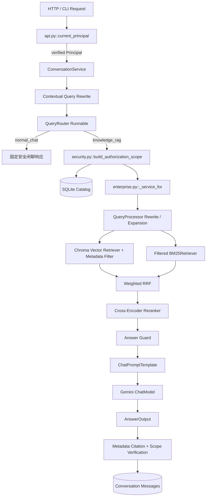
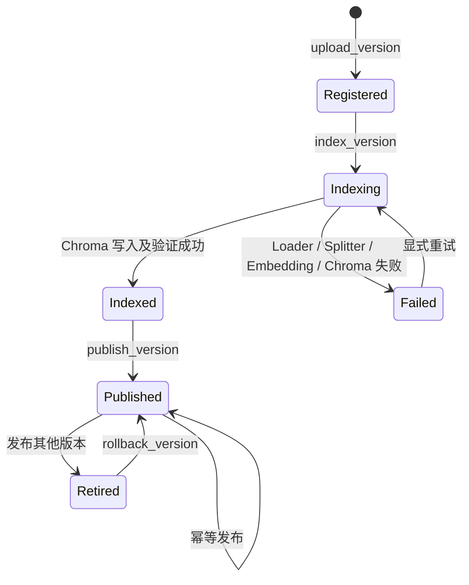

# Phase 9 — Enterprise RAG 实施说明

> 本文只描述当前仓库中已经实现并验证的 V3 Phase 9。它是企业原型，不等同于生产级
> IAM、数据防泄漏或合规系统。

## 1. 已实现能力

- SQLite Document Catalog：租户、知识库、用户、逻辑文档、不可变版本、ACL、会话。
- 文档生命周期：Register、Upload、Index、Publish、Rollback、Soft Delete、Restore。
- 企业 Chunk Metadata 与稳定 `chunk_uid`。
- HMAC 签名 Token、本地 PBKDF2 密码、FastAPI Security Dependency。
- `general/hr/finance/admin` RBAC，以及 user/role/group Document ACL。
- Vector 与 BM25 共用同一 active/authorized version scope。
- Multi-Tenant Catalog、文件、Metadata、Cache Namespace、Conversation 与 Citation 隔离。
- Conversation CRUD 与基于历史的 Contextual Query Rewrite。
- `normal_chat` / `knowledge_rag` Query Router。
- 权限感知 Retrieval、RAG Answer、文档管理和下载 API。
- Retrieval、Answer、Judge 和 Security Evaluation。

## 2. 最新架构



权限不是在答案末尾补救：Catalog 先算出可见 `version_id`，Chroma 使用 Metadata Filter，
BM25 在建索引前使用同一集合过滤。RRF、Reranker、Context、Gemini 和 Citation 只看到
授权候选。

## 3. Document Lifecycle



逻辑 Document 的 `active_version_id` 指向当前版本。软删除改变 Document 状态，不物理删除
向量；Restore 可恢复原 active version。发布、回滚和删除会增加 Knowledge Base `epoch`，
旧服务/Cache Key 因 epoch 不同而失效。

SQLite 与 Chroma 没有跨系统事务。当前恢复策略是：

1. 新版本先写文件并注册为 `registered`。
2. 标记 `indexing`，解析、切块并写 Chroma。
3. 成功后标记 `indexed`；失败则尽力删除该 `version_id` 的向量并标记 `failed`。
4. 只有 `indexed/retired/published` 才能被发布。
5. 发布最后才原子切换 SQLite active pointer，因此失败不会影响旧版本。

## 4. Catalog 数据模型

| 表 | 主要字段 | 职责 |
|---|---|---|
| `tenants` | tenant_id, name | 企业客户边界 |
| `knowledge_bases` | tenant_id, kb_id, epoch | 租户内知识库和失效版本号 |
| `users` | user_id, tenant_id, password_hash, roles, groups | 服务端身份事实 |
| `documents` | document_id, source, classification, active_version_id, status | 逻辑文档 |
| `document_versions` | version_id, version_number, content_hash, path, status | 不可变文件版本 |
| `document_acl` | document, subject_type/id, permission | user/role/group 例外授权 |
| `conversations` | conversation_id, tenant_id, user_id, kb_id | 会话所有权 |
| `messages` | conversation_id, role, content, timestamp | 历史消息 |

`content_hash` 对同一 Document 的重复内容做幂等；`document_id` 跨版本稳定；`version_id`
定位具体文件；`chunk_uid` 包含 tenant/kb/document/version/page/chunk，是 Chroma 的唯一 ID。

## 5. Metadata Schema

每个企业 Chunk 至少包含：

```text
tenant_id, knowledge_base_id, document_id, version_id,
document_name, source, document_type, classification,
page, chunk_id, chunk_uid
```

Retrieval 还会附加 `vector_distance`、`vector_rank`、`fusion_score`、
`matched_retrievers`、`matched_queries` 和 `rerank_score`。Citation 从最终 Document Metadata
读取 `source/page/chunk_id/document_id/version_id/tenant_id/knowledge_base_id`，不是让 LLM 编造。

## 6. Authentication、RBAC、ACL

- `security.py::AuthService.login()` 验证 PBKDF2 密码并签发 HMAC Token。
- `verify_token()` 验证签名、过期时间和 token_version，再从 Catalog 重载用户。
- Token 不携带可信 role/tenant；聊天 JSON 中伪造这些字段不会获得权限。
- classification 为 `general` 时所有已认证用户可读；`hr/finance/admin` 需要对应 role。
- 显式 ACL 可以把文档授予 user、role 或 group。
- admin 能管理本租户文档，但不能跨租户。
- 身份/Scope 失败采用 fail closed；空 Scope 直接结构化拒答，绝不回退全库。

## 7. Vector / BM25 授权一致性

`security.py::build_authorization_scope()` 只选择：

1. 当前 verified tenant；
2. 指定知识库；
3. Document 为 active；
4. Version 为 published 且是 active pointer；
5. RBAC/ACL 允许。

Chroma filter 使用 `tenant_id + knowledge_base_id + version_id in (...)`。请求可按
document/version/classification 继续缩小范围，但只能与服务端授权集合取交集，不能扩大。
BM25 因为是内存
索引，由 `NativeRetrievalEngine` 在 `BM25Retriever.from_documents()` 前按同一 version 集合
过滤。后续 `_verify_output_scope()` 再做防御性检查。

## 8. Multi-Tenant 边界

- Catalog 查询都有 tenant scope。
- 上传路径是 `runtime/uploads/tenants/{tenant}/knowledge_bases/{kb}/...`。
- Chroma 共享企业 collection，但强制 Metadata Filter；Chunk ID 含 tenant。
- BM25 每个授权 Service 只由允许版本构建。
- Query Cache Key 含 tenant、kb、epoch、允许版本摘要和用户权限摘要。
- Conversation 读取同时匹配 tenant 与 user。
- Citation 输出再次验证版本和 tenant。

局限：共享 Chroma 属于应用层逻辑隔离，不是独立存储/加密密钥的强物理隔离。高合规场景
应采用每租户数据库/collection、独立密钥和基础设施级访问控制。

## 9. Conversation 与 Router

`ConversationService.contextualize()` 读取最近 N 条授权历史，执行：

```text
history + current question
  -> ChatPromptTemplate
  -> ChatModel
  -> StrOutputParser
  -> standalone retrieval query
```

失败时回退本轮原问题。Original Question 仍交给 Answer Prompt；contextual query 只用于
Retrieval。Router 是 `RunnableLambda` 的确定性安全路由：仅明确问候走 `normal_chat`，其他
未知输入默认 `knowledge_rag`。它不是 Agent，也不能绕过 ACL。

## 10. FastAPI 接口

| 方法 | 路径 | 权限 | 作用 |
|---|---|---|---|
| GET | `/health` | 无 | 不加载 Gemini 的健康检查 |
| POST | `/auth/login` | 密码 | 返回签名 Token |
| POST | `/retrieve` | 已认证 | Authorized Retrieval-only |
| POST | `/chat` | 已认证 | Conversation + Router + Enterprise RAG |
| POST | `/conversations` | 已认证 | 创建会话 |
| GET/DELETE | `/conversations/{id}` | owner | 历史/删除 |
| POST | `/documents/register` | admin | 注册逻辑文档 |
| POST | `/documents/{id}/versions` | admin | 上传并可索引版本 |
| POST | `/upload` | admin | 注册+上传+索引便捷入口 |
| GET | `/documents` | 已认证 | 仅列出可见文档 |
| GET | `/documents/{id}/versions` | read ACL | 版本列表 |
| POST | `/documents/{id}/publish` | admin | 发布 |
| POST | `/documents/{id}/rollback` | admin | 回滚 |
| DELETE | `/documents/{id}` | admin | 软删除 |
| POST | `/documents/{id}/restore` | admin | 恢复 |
| GET | `/documents/{id}/download` | read ACL | 授权下载 |

## 11. 关键代码

1. `catalog.py::DocumentCatalog.publish_version()`：事务切换 active pointer 与 epoch。
2. `lifecycle.py::index_version()`：LangChain Loader/Splitter/Embedding/Chroma 与失败恢复。
3. `security.py::AuthService.verify_token()`：验证 Token 并重载服务端权限。
4. `security.py::build_authorization_scope()`：统一 Vector/BM25 安全边界。
5. `retrieval.py::ScoredChromaRetriever`：带 Chroma Metadata Filter 的向量检索。
6. `retrieval.py::NativeRetrievalEngine`：过滤 BM25、Hybrid RRF 与多 Query RRF。
7. `enterprise.py::_service_for()`：用 Scope/epoch 构建隔离的 NativeRAGService。
8. `conversation.py::contextualize()`：历史问题独立化。
9. `router.py::QueryRouter.route()`：安全默认路由。
10. `api.py::current_principal()`：所有受保护 HTTP 路由的认证入口。

## 12. 实际运行命令

```powershell
$env:V3_AUTH_SECRET = "本地随机长字符串"
.\rag_langchain_native\.venv\Scripts\python.exe -m uvicorn rag_langchain_native.api:app --host 127.0.0.1 --port 8011
.\rag_langchain_native\.venv\Scripts\python.exe -m pytest rag_langchain_native\tests -q
.\rag_langchain_native\.venv\Scripts\python.exe -m rag_langchain_native.eval.security_eval
.\rag_langchain_native\.venv\Scripts\python.exe -m rag_langchain_native.eval.enterprise_retrieval_eval --bootstrap
.\rag_langchain_native\.venv\Scripts\python.exe -m rag_langchain_native.eval.enterprise_answer_eval
.\rag_langchain_native\.venv\Scripts\python.exe -m rag_langchain_native.eval.enterprise_judge_eval
```

## 13. 真实测试与 Benchmark（本次运行）

| 指标 | Phase 8 历史基线 | Phase 9 |
|---|---:|---:|
| Retrieval Hit@1 | 27/28, 96.43% | 27/28, 96.43% |
| Hit@3 / Hit@5 / Hit@10 | 100% / 100% / 100% | 100% / 100% / 100% |
| MRR | 0.9821 | 0.9821 |
| Avg Retrieval Latency | 930.43 ms | 1024.49 ms |
| P95 Retrieval Latency | 882.07 ms | 1113.74 ms |

两次不是严格受控的性能实验（模型冷启动、机器状态不同），约 94 ms 平均差异只能视为本次
观测，不能直接归因于授权逻辑。

Phase 9 Answer：32 cases，deterministic Answer Accuracy 96.43%，Citation 100%，Refusal
100%，平均 End-to-End 7094.40 ms；失败 ID 为 Q023。Q023 正文包含正确审批信息，但模型
结构化字段给出 `refused=true`，属于“正文与拒答标志冲突”。Judge 对保存答案的 32/32
评分成功：Correctness/Faithfulness/Completeness 均 2.0/2.0，Hallucination 0%。

Security Evaluation：7/7；完整 pytest 为 27 passed。Retrieval Hit@K 不能证明
权限安全，Security Evaluation 与 pytest 才覆盖 tenant/RBAC/ACL/token/conversation 边界。

## 14. 当前安全边界与不足

- 本地 HMAC Token 不是企业 OIDC；没有密钥轮换、MFA、SSO、集中撤销和审计。
- 必须由 HTTPS/反向代理保护 Token；当前开发服务器本身不配置 TLS。
- SQLite 适合学习/单实例原型，不适合多实例高并发；没有 Alembic 迁移和分布式锁。
- Chroma 与 SQLite 无跨系统事务，当前是补偿式恢复，不是严格原子提交。
- 共享 collection 是逻辑隔离；向量中仍保存 retired/deleted Chunk，只是无法被授权召回。
- 缺少恶意 PDF、压缩炸弹、病毒、Prompt Injection、内容脱敏和下载水印防护。
- 没有审计日志、速率限制、配额、监控告警、Secret Manager 和数据保留策略。
- CLI 密码参数可能进入 shell history，只用于本地学习。
- Query Router 是保守规则，不是经过业务语料训练的分类器。
- Q023 显示 Answer 文本与 `refused` 字段仍需一致性校验。

## 15. Phase 10 建议

1. 企业 IdP/OIDC、短期 Access Token、Refresh Token、密钥轮换和审计事件。
2. PostgreSQL + Alembic + Outbox/Job Queue，把 Ingestion 变成可重试后台任务。
3. 每租户独立 collection/加密密钥及对象存储 pre-signed download。
4. 上传扫描、格式/大小限制、Prompt Injection 检测和敏感信息治理。
5. Answer/refused 一致性规则、基于评估集校准的 threshold 与人工反馈闭环。
6. OpenTelemetry/LangSmith tracing、结构化日志、SLO 和并发/负载测试。

