# RAG 完整工程架构与初学者源码学习指南

> 本文以当前工作区源码为唯一事实依据，审计日期为 2026-10-09。历史评估结果只代表其生成时的配置与环境；“代码存在”“本轮测试通过”“已经部署到生产”是三件不同的事。本文没有调用 Gemini、没有修改数据库，也没有把示例数据写成真实运行结果。

## 目录

1. [项目总体介绍](#1-项目总体介绍)
2. [完整系统架构](#2-完整系统架构)
3. [目录与模块地图](#3-目录与模块地图)
4. [PDF 到知识库](#4-pdf-到知识库的完整流程)
5. [用户问题到最终答案](#5-用户问题到最终答案的完整流程)
6. [LangChain 的实际作用](#6-langchain-的实际作用)
7. [核心 RAG 技术方案](#7-核心-rag-技术方案详解)
8. [企业级 RAG 能力](#8-企业级-rag-能力)
9. [Observability](#9-observability)
10. [Security 与 Production](#10-security--production)
11. [CI/CD 与质量门禁](#11-cicd-与自动化质量门禁)
12. [20 个关键 Python 方法](#12-最关键的-python-方法详解)
13. [真实函数调用关系](#13-真实函数调用关系)
14. [运行手册](#14-如何实际运行整个项目)
15. [初学者阅读路线与自测](#15-初学者阅读路线与自测)
16. [项目现状与未来优化](#16-项目现状与未来优化)

---

# 1. 项目总体介绍

本章回答三个最基础的问题：为什么需要 RAG、这个仓库做了什么、为什么保留 V1/V2/V3。

## 1.1 项目解决什么问题

普通 LLM 只知道训练时形成的通用知识，不天然知道公司的最新差旅制度、网络产品手册或内部权限规则。把整批 PDF 每次都塞给模型也不可行：上下文有限、费用高、速度慢，而且很难给出可靠页码。

RAG（Retrieval-Augmented Generation，检索增强生成）把问题拆为两段：

1. **离线知识库构建**：PDF 解析成文本，切成 Chunk，计算 Embedding，保存到 Chroma。
2. **在线问答**：从知识库找出少量相关 Chunk，把它们作为 Context 交给 Gemini，再由程序根据真实 Metadata 生成 Citation。

当前项目能够完成 PDF 入库、向量与关键词混合检索、RRF 融合、Cross-Encoder 重排、可选 Query Rewrite/Expansion、拒答、Gemini 回答和确定性引用。V3 又增加了文档版本、租户与权限、会话、监控、安全、容器与 CI 配置。

## 1.2 Phase 1–12 的实际演进

| 阶段 | 解决的问题 | 当前代码证据 |
|---|---|---|
| Phase 1–4 | 从 PDF、Embedding、Chroma 到 FastAPI 的基础 RAG | 根目录 `document_loader.py`、`embedding.py`、`ingest.py`、`rag_service.py`、`app.py` |
| Phase 5 | 不只依赖语义向量：增加 BM25、Hybrid、RRF 与 Reranker | 根目录 `bm25_search.py`、`result_fusion.py`、`reranker.py`、`retrieval.py` |
| Phase 6 | 改善用户查询表达和召回覆盖 | 根目录 `query_rewriter.py`、`query_expander.py` 及缓存 |
| Phase 7 | 将“召回对不对”和“回答好不好”分开评估 | `eval/retrieve_eval.py`、`answer_eval.py`、`answer_judge.py`、`end_to_end_eval.py` |
| Phase 8 | 学习 LangChain，并形成独立 LangChain-first V3 | `langchain_rag/` 与 `rag_langchain_native/` |
| Phase 9 | 文档 Catalog/版本、RBAC/ACL、多租户、Conversation、Router | V3 `catalog.py`、`lifecycle.py`、`security.py`、`enterprise.py` 等 |
| Phase 10 | Trace、日志、Metrics、Token/费用与本地报告 | V3 `observability/`；默认本地 JSONL，可选 OTLP |
| Phase 11 | Prompt trust boundary、API/上传安全、备份、容器与反向代理示例 | V3 `backup.py`、`rate_limit.py`、`Dockerfile`、`docker-compose.yml`、`deploy/Caddyfile` |
| Phase 12 | GitHub Actions、依赖审计、离线与 Live Gate、发布候选验证 | `.github/workflows/`、`eval/quality_gate.py`、`quality_gate.json` |

这里的“阶段完成”不等于生产认证。例如 Caddy 配置是部署示例，GitHub workflow 文件存在不代表远程 Actions 已在本轮跑过，Prompt 防护也不等于消除了所有 Prompt Injection。

## 1.3 V1 / V2 / V3 的定位

| 版本 | 入口 | 核心特点 | 保留价值 |
|---|---|---|---|
| V1 Manual | `app.py::chat()` → `rag_service.py::ask_rag()` | 直接调用 Chroma、SentenceTransformer、Google GenAI；检索算法透明 | 学底层、做算法实验、作为回归对照 |
| V2 Wrapper | `langchain_rag/lc_full_rag.py::ask_langchain_full_rag()` | 使用 Runnable 编排，但高级检索仍调用 V1 `retrieve_candidates()`、Rewrite/Expansion | 展示从手写代码逐步迁移到框架的过渡形态 |
| V3 Native | `rag_langchain_native/api.py::chat()` → `EnterpriseRAGService.chat()` | 独立实现；LangChain Loader/Splitter/Embedding/VectorStore/Retriever/Prompt/ChatModel/LCEL | 当前主工程；适合长期扩展与企业能力验证 |

V2 **不是** V3 的同义词。V2 的 `lc_full_rag.py` 明确导入根目录 `retrieval.retrieve_candidates`、`query_rewriter.rewrite_query` 和 `query_expander.expand_query`；V3 不依赖这些 V1 业务函数。

## 1.4 能力状态总览

- **已实现并参与 V3 主链**：LangChain PDF Loader、递归 Chunk、E5 Embedding、Chroma、BM25Retriever、加权 RRF、本地 Cross-Encoder、LCEL、结构化回答、确定性 Citation、Answer Guard。
- **企业主链已实现**：SQLite Catalog、不可变版本、显式发布/回滚、软删除/恢复、服务端 Token 验证、RBAC/ACL、租户/知识库/active version 过滤、会话所有权、Contextual Rewrite、简单 Router。
- **可观测性已接入**：OpenTelemetry Span、本地 JSONL Trace/Request/Metric、结构化日志、LangChain Callback、Usage 提取、成本估算接口、失败分类、管理员查看 API/CLI。
- **安全与部署已实现或提供**：输入/上传限制、并发与本地限流、敏感信息 Redaction、非 root Docker、只读容器根文件系统、Volume、Caddy 示例、一致性备份/校验/安全恢复。
- **自动化已配置**：3 个 GitHub Actions workflow、Dependabot、Ruff、pytest、Bandit、pip-audit、Docker smoke、离线/Live Gate。
- **仅部分或需外部验证**：LangSmith 没有接入；没有 Prometheus `/metrics`；没有真正 SSE token streaming；Docker 本机未安装；远程 GitHub branch protection、真实域名 HTTPS、Live Gemini workflow 和生产负载均未在本轮验证。

### 本章需要掌握

RAG 有离线 Ingestion 与在线 Query 两阶段；三个版本是学习和回归对照，不是简单的新旧覆盖关系；“有代码”不等于“已在生产验证”。

---

# 2. 完整系统架构

本章先给全景，再说明每层由谁负责。

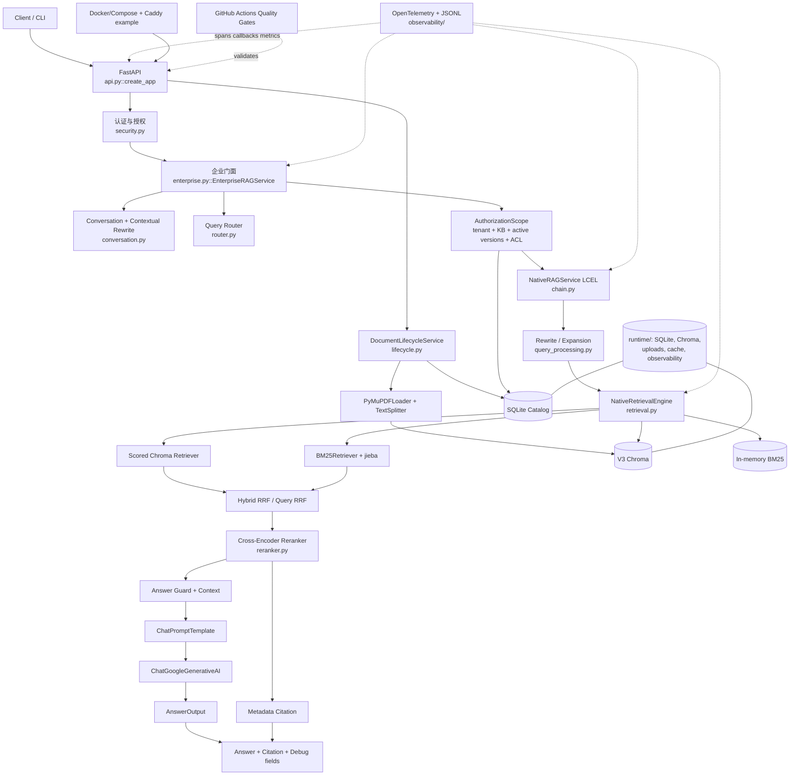

| 层 | 职责与必要性 | 真实位置 | 技术归属 |
|---|---|---|---|
| Client/API | 把 HTTP/CLI 输入变成经过验证的 Python 对象 | `api.py`、`cli.py` | FastAPI/Pydantic + 自写代码 |
| Authentication | 证明“你是谁”；不能相信客户端自报角色 | `security.py::AuthService` | HMAC/hashlib + SQLite；不是标准 JWT/OIDC |
| Authorization | 决定“你能看什么”并生成 active version 白名单 | `build_authorization_scope()` | 自写 RBAC/ACL |
| Conversation/Router | 将追问独立化；把纯问候与知识问答分开 | `conversation.py`、`router.py` | LangChain Prompt/Runnable + 自写规则 |
| RAG Chain | 保留状态并按阶段串联 Query、Retrieval、Guard、LLM | `chain.py::build_rag_chain()` | LangChain LCEL |
| Retrieval | Vector + BM25 + 两层 RRF + Reranker | `retrieval.py`、`reranker.py` | LangChain Retriever + 最小自定义融合/评分保留 |
| Catalog/Lifecycle | 管逻辑文档、版本、发布状态和源文件 | `catalog.py`、`lifecycle.py` | SQLite + Python |
| Storage | 保存元数据、向量、上传文件和缓存 | `runtime/` | SQLite、Chroma、JSON、文件系统 |
| Observability | 关联一次请求的阶段、耗时、错误与 Token | `observability/` | OpenTelemetry + LangChain Callback + JSONL |
| Deployment/CI | 让运行环境可重复，并自动阻止明显回归 | Docker、Caddy、`.github/` | Docker/GitHub Actions |

### 本章需要掌握

LangChain 主要在 RAG 数据流内；Catalog、权限、备份、API 安全和 CI 并不是 LangChain 自动提供的，它们仍需要普通 Python 与工程基础设施。

---

# 3. 目录与模块地图

## 3.1 精简目录树

```text
rag-demo/
├── app.py, rag_service.py, retrieval.py, ...       # V1 手写业务
├── data/pdf/                                        # 原始 PDF（只读数据源）
├── chroma_db/                                       # V1 向量库（运行数据）
├── eval/
│   ├── test_case.json                               # 历史 Ground Truth
│   ├── retrieve_eval.py                             # V1 Retrieval Evaluation
│   ├── answer_eval.py / answer_judge.py
│   └── end_to_end_eval.py / experiments / results/
├── langchain_rag/                                   # V2 Wrapper
│   ├── lc_embedding.py / lc_vectorstore.py
│   ├── lc_retriever.py / lc_llm.py / lc_rag.py
│   └── lc_full_rag.py
├── rag_langchain_native/                            # V3 主工程
│   ├── config.py / api.py / cli.py
│   ├── ingestion.py / embedding.py / vectorstore.py
│   ├── retrieval.py / reranker.py / query_processing.py / chain.py
│   ├── catalog.py / lifecycle.py / security.py
│   ├── conversation.py / router.py / enterprise.py
│   ├── rate_limit.py / runtime_lock.py / backup.py
│   ├── observability/
│   │   ├── config.py / core.py / callbacks.py
│   │   └── failure.py / cost.py / report.py
│   ├── eval/                                        # V3 评估与质量门禁
│   ├── tests/                                       # V3 离线测试和安全测试
│   ├── runtime/                                     # V3 独立数据（Git 忽略）
│   ├── Dockerfile / docker-compose.yml / deploy/Caddyfile
│   └── docs/
└── .github/
    ├── workflows/v3-ci.yml
    ├── workflows/v3-live-evaluation.yml
    ├── workflows/v3-release-validation.yml
    └── dependabot.yml
```

虚拟环境、`__pycache__`、`.pytest_cache`、模型 Cache 和 Chroma 内部文件没有展开，因为它们不是业务源码。

## 3.2 V1 与 V2 模块地图

| 文件 | 核心作用 | 主链状态 |
|---|---|---|
| `app.py` | V1 FastAPI；`/chat` 调 `rag_service.ask_rag()` | V1 HTTP 主入口 |
| `document_loader.py` | PyMuPDF 逐页读取、固定字符切块 | V1 Ingestion |
| `embedding.py` | 直接加载 `multilingual-e5-base` 并 encode 原文 | V1 Ingestion/Query |
| `ingest.py` | 删除并重建 V1 `company_knowledge` collection | V1 管理脚本 |
| `retrieval.py` | Vector/BM25/Expansion Fusion/Rerank 编排 | V1 Retrieval 主体 |
| `bm25_search.py` | 中文字符/双字与英文 token，内存 BM25 | V1 Retrieval |
| `result_fusion.py` | 多 Query RRF | V1 Retrieval |
| `reranker.py` | 本地 Cross-Encoder | V1 Retrieval |
| `query_rewriter.py` / `query_expander.py` | Gemini、缓存与失败回退 | V1 Query Processing |
| `answer_guard.py` | 检索阈值拒答 | V1/V2 |
| `llm.py` | 直接调用 Google GenAI | V1 Generation |
| `eval/*.py` | Retrieval、确定性回答、Judge、端到端评估 | 长期评估工具 |
| `langchain_rag/lc_embedding.py` | 把 V1 `embed_text(s)` 适配成 Embeddings | V2 Adapter |
| `langchain_rag/lc_vectorstore.py` | 只读 V1 Chunk 建 V2 独立 Chroma | V2 Vector 实验 |
| `langchain_rag/lc_rag.py` | 纯 Vector 的 LCEL 最小 RAG | V2 简化链 |
| `langchain_rag/lc_full_rag.py` | LCEL 编排，但高级 Retrieval/Rewrite/Expansion 复用 V1 | V2 完整入口，未接根 `app.py` |

## 3.3 V3 正式模块对照表

| 文件/模块 | 核心作用 | 上游 | 下游 | 主链/阅读顺序 |
|---|---|---|---|---|
| `config.py` | 不可变 Settings、路径、模型、Top-K、安全预算 | 全部模块 | 环境变量/路径 | 主链，1 |
| `ingestion.py` | PDF→Page Document→Chunk→Chroma | CLI、Lifecycle、评估 | Loader/Splitter/VectorStore | 入库，4 |
| `embedding.py` | E5 `query:`/`passage:`、归一化、模型缓存 | VectorStore | HuggingFaceEmbeddings | 入库+检索，5 |
| `vectorstore.py` | V3 Chroma 连接、读写 Document | Ingestion/Retrieval | langchain-chroma | 主链，6 |
| `retrieval.py` | Scored Vector、BM25、Hybrid/Query RRF | Chain | Chroma、BM25Retriever | 主链，7 |
| `reranker.py` | Cross-Encoder 统一重排并保留 score | Chain | HuggingFaceCrossEncoder | 主链，8 |
| `query_processing.py` | Rewrite/Expansion、Cache、限流、回退 | Chain | ChatModel、Prompt | 可选主链，9 |
| `chain.py` | LCEL 主链、Guard、Context、Answer、Citation | CLI/Enterprise | Retrieval、Gemini | 核心，2 |
| `catalog.py` | SQLite 表和事务；Document/Version/User/ACL/Conversation | Lifecycle/Security | sqlite3 | 企业主链，10 |
| `lifecycle.py` | 注册、上传、索引、发布、回滚、软删除 | API/CLI | Catalog/Ingestion/Chroma | 企业入库，11 |
| `security.py` | 密码摘要、签名 Token、Principal、RBAC/ACL Scope | API/Enterprise | Catalog | 企业主链，12 |
| `conversation.py` | 会话所有权、历史、Contextual Rewrite | Enterprise | Catalog/ChatModel | 企业主链 |
| `router.py` | 确定性问候路由；不确定默认 RAG | Enterprise | RunnableLambda | 企业主链 |
| `enterprise.py` | 把认证主体、Scope、会话与 Native Chain 接在一起 | API/CLI/Eval | 上述企业与 RAG 模块 | 企业总入口，3 |
| `api.py` | FastAPI 路由、中间件、依赖注入、安全头 | HTTP | Enterprise/Lifecycle/Auth | HTTP 入口 |
| `cli.py` | 本地命令入口 | 终端 | Ingestion/Service/Lifecycle/Backup | 工具入口 |
| `observability/*` | Trace/Log/Metric/Usage/Cost/报告 | API 与各阶段埋点 | OpenTelemetry/JSONL | 横切能力 |
| `backup.py` | SQLite 一致性备份、文件快照、Manifest 哈希 | CLI | sqlite3/shutil | 运维工具 |
| `rate_limit.py` | 单进程滑动窗口限流 | API middleware | 内存 deque | 安全工具 |
| `runtime_lock.py` | 单进程写锁 | Lifecycle/Backup | threading.RLock | 一致性工具 |
| `eval/*` | V3 Retrieval/Answer/Security/Gate/Ablation | 命令或 CI | 正式 Service | 评估，不在请求主链 |
| `tests/*` | Fake/临时数据离线测试 | pytest/CI | 各模块 | 测试，不在主链 |

### 本章需要掌握

入口、业务服务、存储和评估是不同层次。初学者不要从 `api.py` 一口气读到底；先理解 `chain.py` 的数据状态，再补 Retrieval 与企业权限。

---

# 4. PDF 到知识库的完整流程

## 4.1 企业上传的真实调用图

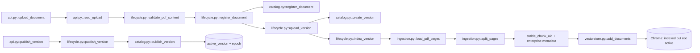

注意：**BM25 不在上传时写入一个独立持久化文件**。`NativeRetrievalEngine.__init__()` 从 Chroma 读取当前授权 Document，调用 `BM25Retriever.from_documents()` 建内存索引。发布/回滚会改变 Catalog epoch 并清理进程内 Service Cache，下一次构建的 Vector 与 BM25 使用同一 active version 范围。

## 4.2 各步骤的数据传递

| 步骤 | 目的 | 函数 | 输入 → 输出 | 失败影响 |
|---|---|---|---|---|
| HTTP 读取 | 防止无限请求占内存 | `api.py::read_upload()` | `UploadFile` → `bytes` | 超过上限返回 413 |
| PDF 验证 | 扩展名可伪造，检查真实内容与页数 | `validate_pdf_content()` | `bytes` → `int pages` | 不创建 Catalog Version |
| 注册 Document | 建逻辑文档身份 | `DocumentCatalog.register_document()` | 名称/source/tenant → document row | 同 scope/source 幂等返回旧记录 |
| 上传 Version | 内容 hash 幂等、源文件隔离保存 | `upload_version()` | `bytes` → version row | 临时 `.uploading` 不成为正式版本 |
| Load | 把 PDF 每页变成 LangChain Document | `load_pdf_pages()` | `Path` → `list[Document]` | Version 最终标为 failed |
| Split | 形成检索粒度并保留页码 | `split_pages()` | Page Documents → Chunk Documents | 空 Chunk 拒绝索引 |
| Enrich | 加 tenant/KB/document/version/chunk UID | `index_version()` | Chunk → enterprise Chunk | 权限/Citation Metadata 从此绑定 |
| Embed/Chroma | 将文本与向量保存 | `add_documents()` | `Iterable[Document]` → `list[str]` IDs | 清理该 version 残留并标 failed |
| Publish | 原子切 active version | `catalog.publish_version()` | document/version IDs → document row | 旧 active 仍保持可用 |

## 4.3 Document、Chunk、ID 与 Metadata

LangChain `Document` 的核心结构是：

```python
Document(
    page_content="国际出差应提前10个工作日申请……",
    metadata={"source": "travel_policy.pdf", "page": 2, ...},
    id="稳定的 chunk_uid",
)
```

- **逻辑 Document**：Catalog 中的一份制度，例如“差旅制度”，其 `document_id` 跨版本不变。
- **Document Version**：这份制度的一次不可变上传，例如 V1/V2，各有 `version_id` 和 content hash。
- **Chunk Document**：某个 Version 某一页的一段文本；`chunk_uid` 是 Chroma 记录的稳定唯一键。
- **`chunk_id`**：页内序号，不单独全局唯一。
- **`source/page`**：用户可理解的来源与页码，是 Retrieval Ground Truth 和 Citation 的核心。

教学示例（不是实际数据库值）：

```text
travel_policy.pdf
document_id = doc_a1
version_id  = ver_b2 (version_number=2)
page        = 2
chunk_id    = 0
chunk_uid   = SHA256(tenant|kb|doc_a1|ver_b2|2|0) 的前若干位
```

`PyMuPDFLoader(mode="page")` 返回 0-based page，`load_pdf_pages()` 加 1，与 PDF 阅读器和 `eval/test_case.json` 对齐。`RecursiveCharacterTextSplitter` 使用 `chunk_size=200`、`chunk_overlap=30`，优先按段落、换行和中文标点切分。Overlap 能降低答案句被边界切断的风险，但会增加索引量与重复候选。

Chroma 保存 Chunk 文本、Metadata、向量与 ID；SQLite 保存文档关系、版本状态、用户、ACL 和会话。复杂关系不应全塞进 Chroma Metadata。

## 4.4 更新为何不会让旧版本干扰检索

新版本先 `registered → indexing → indexed`，只有显式 `publish` 才切换 `documents.active_version_id`。旧 Chunk 可以仍留在 Chroma，Vector 使用 `version_id` Metadata filter，BM25 在建索引前也按相同 `allowed_version_ids` 过滤。Rollback 重新发布已经成功索引的旧版本，不必重新解析 PDF。

这不是 SQLite 与 Chroma 的分布式事务：代码采取“先索引、后发布”的补偿策略。索引失败时删除该 version 的向量并把 Version 标为 failed，旧 active version 不受影响。

### 本章需要掌握

PDF 是原料，Document 是带 Metadata 的标准对象，Chunk 是检索单位；Version 控制可见性，Metadata 将检索、安全和 Citation 串在一起。

---

# 5. 用户问题到最终答案的完整流程

本章使用测试集真实问题 Q002：**“国际出差需要提前多久申请，并由谁最终批准？”**。其 Ground Truth 是 `travel_policy.pdf` 第 2 页，关键词为“提前10个工作日”和“分管副总裁”。下列改写文本仅为结构示意；本轮没有调用 Gemini。

## 5.1 真实企业问答图

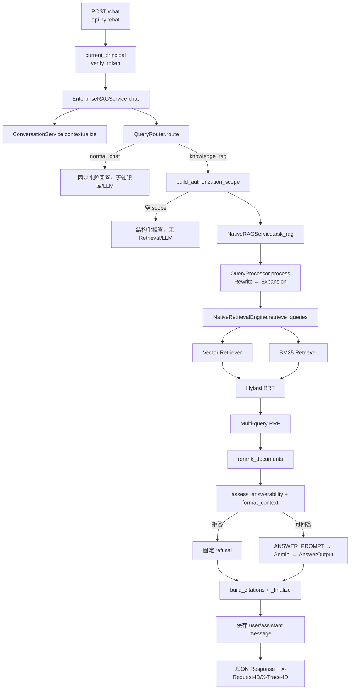

## 5.2 数据如何一步步变化

1. **API 输入**

   `QueryRequest` 中的 `question: str`、`knowledge_base_id`、可选 conversation/document/version/classification。Pydantic 做结构校验，`validate_question()` 再执行可配置字符预算。

2. **认证**

   `HTTPBearer` 提取 Token；`AuthService.verify_token()` 验证 HMAC 签名、issuer、audience、过期和 token version，再从 SQLite 重新加载 tenant/roles/groups，输出 `Principal`。角色不是客户端可信字段。

3. **Conversation**

   `str + list[message dict] → ChatPromptTemplate | ChatModel | StrOutputParser → str`。没有历史时原样返回；失败返回原问题并标记 `contextual_rewrite_failed=True`。Original Question 始终保留。

4. **Router**

   `str → RunnableLambda(QueryRouter.route) → "normal_chat" | "knowledge_rag"`。当前实现只把精确问候语路由为闲聊，其余不确定问题安全地进入知识库路径；它不是 Agent。

5. **授权范围**

   `Principal + KB + 可选筛选 → AuthorizationScope`。服务端先取 tenant 内 published active documents，再做 RBAC/ACL，客户端 filter 只能缩小集合。输出包含允许的 document/version IDs 与 epoch。

6. **Query Processing**

   基础 LCEL 保留两路：`original_question` 供回答，`retrieval_question` 供检索。Rewrite 开启时可将口语问题变清晰；Expansion 开启时得到 `list[str]`，第一项永远是检索 Query。默认两者关闭，因此行为不额外调用 Gemini。

7. **Vector Retrieval**

   `str → embed_query() → list[float](768维) → Chroma cosine → list[Document]`。`ScoredChromaRetriever` 把 `vector_distance` 与 rank 写回同一个 Document Metadata。

8. **BM25 Retrieval**

   `str → jieba/字母数字 tokenize → BM25Retriever.invoke() → list[Document]`。它擅长精确术语、型号和字面匹配。当前 V3 没有稳定保存原始 BM25 数值，只保留 route rank/Fusion 信息。

9. **Fusion**

   Hybrid RRF 先融合 Vector 与 BM25；若有多个 Expansion Query，再做 Query-level RRF。去重键基于稳定 Chunk ID，不按文本去重。输出仍是 `list[Document]`，Metadata 增加 fusion score、matched retrievers/queries 和 rank。

10. **Reranker**

    `query + list[Document] → Cross-Encoder scores → Top final_k Documents`。默认最终 3 条。Cross-Encoder 同时阅读问题与候选全文，排序更精细，但无法找回候选池中不存在的 Chunk。

11. **Guard 与 Context**

    `assess_answerability()` 根据 rerank score（或可用时 vector/BM25 信号）决定是否允许生成。`format_context()` 把每个文档编码成 `type=untrusted_retrieved_document` 的 JSON 行，明确文档是数据而非系统指令。

12. **Prompt 与 Gemini**

    `{"question": original, "context": str}` 经 `ANSWER_PROMPT` 变成 `ChatPromptValue/messages`；`ChatGoogleGenerativeAI.with_structured_output(AnswerOutput)` 返回包含 `answer/refused/refusal_reason` 的 Pydantic 对象。Gemini 回答的是 Original Question，不是 rewritten query。

13. **Citation 与返回**

    `build_citations()` 从最终 Context 使用的 Document Metadata 去重生成 source/page/chunk/document/version/tenant/KB。Citation 不是模型自由文本。`_finalize()` 返回 `answer`、`refused`、queries、sources、documents、retrieved_context 和 latency；企业门面再附 tenant、KB、route、epoch、total latency。

## 5.3 最终对象的结构示意

```json
{
  "question": "国际出差需要提前多久申请，并由谁最终批准？",
  "original_query": "...",
  "retrieval_query": "...",
  "expanded_queries": ["..."],
  "answer": "（模型输出，本轮未实际调用）",
  "refused": false,
  "sources": [{"source": "travel_policy.pdf", "page": 2, "version_id": "..."}],
  "documents": [{"rank": 1, "document": "...", "metadata": {}}],
  "route": "knowledge_rag",
  "tenant_id": "...",
  "retrieval_latency_ms": 0.0,
  "total_latency_ms": 0.0
}
```

数字 `0.0` 和省略号是结构示例，不是实测值。

### 本章需要掌握

Original Question、Retrieval Query 与 Expanded Queries 用途不同；权限必须在候选进入 Context 前生效；回答与 Citation 来自同一组最终 Document，但由不同机制生成。

---

# 6. LangChain 的实际作用

## 6.1 当前真正使用的组件

| 组件 | V3 中做什么 | 真实位置 | 是否原生/扩展 |
|---|---|---|---|
| `Document` | 将文本、Metadata、ID 绑定 | Ingestion 到 Citation 全链 | 原生 |
| `PyMuPDFLoader` | PDF 每页变 Document | `ingestion.py` | Community Loader |
| `RecursiveCharacterTextSplitter` | 按语义边界递归切块 | `ingestion.py::split_pages()` | 原生 splitter |
| `HuggingFaceEmbeddings` | 区分 query/document 编码 | `embedding.py` | 原生集成 |
| `Chroma` | add/search/get 与持久化 | `vectorstore.py` | 原生 VectorStore 集成 |
| `BaseRetriever` | 统一 `invoke(query) -> list[Document]` | `ScoredChromaRetriever` | 原生接口 + 自定义 score |
| `BM25Retriever` | 内存关键词检索 | `ObservedBM25Retriever` | 原生实现 + Span 子类 |
| `EnsembleRetriever` | 多 Retriever 调用与 RRF 框架 | `TracedEnsembleRetriever` | 原生基类 + 自定义调试字段 |
| `CrossEncoderReranker` | 文档压缩/重排协议 | `reranker.py` | langchain-classic + score 扩展 |
| `ChatPromptTemplate` | Query、Conversation、Answer Prompt | `query_processing.py`、`conversation.py`、`chain.py` | 原生 |
| `ChatGoogleGenerativeAI` | Gemini 的 ChatModel/Runnable | `chain.py::get_chat_model()` | 原生集成 |
| `StrOutputParser` | AIMessage → `str` | Rewrite/Contextual fallback | 原生 |
| `RunnableLambda` | 把小型 Python 转换接入 LCEL | Chain/Router/QueryProcessor | 原生包装 |
| `RunnableParallel` | 同一 state 并行/并列提取字段 | `build_rag_chain()` | 原生 |
| `RunnablePassthrough.assign` | 保留 state 并添加 answer 字段 | `build_rag_chain()` | 原生 |
| `RunnableBranch` | Guard 的拒答/生成二选一 | `build_rag_chain()` | 原生 |

`MultiQueryRetriever` 和 `ContextualCompressionRetriever` **没有实际使用**。Expansion 需要保留 query-level RRF 调试信息，Reranker 需要保留 score，因此项目选择最小自定义实现。LangSmith **未接入**。

## 6.2 LCEL 到底是什么

LCEL 是 LangChain Expression Language。`A | B` 调用对象重载的管道操作，构造一个 `RunnableSequence`；它不是立刻执行。直到 `.invoke(input)`，A 才处理输入，其完整输出成为 B 的输入。

真实 Rewrite 代码：

```python
chain = REWRITE_PROMPT | self._require_model() | StrOutputParser()
rewritten = chain.invoke(
    {"question": question},
    config=observability.langchain_config(),
).strip()
```

数据类型是：

```text
dict {question: str}
  → ChatPromptTemplate
ChatPromptValue / messages
  → ChatModel
AIMessage
  → StrOutputParser
str
```

- `invoke(x)`：同步处理一个输入。
- `batch([x1, x2])`：批量处理；V3 多 Query Retrieval 实际调用 Retriever 的 `batch()`。不能假设所有底层都必然并行。
- `ainvoke(x)`：异步处理一个输入；`NativeRAGService.aask_rag()` 已提供，但当前 `/chat` 使用同步 `def` 和 `chat()`。
- `stream(x)`：逐块输出。框架支持该协议，但 V3 没有 SSE endpoint，也没有把整个状态链设计成真正 token streaming。

`RunnableParallel` 的真实用途：

```python
answer_inputs = RunnableParallel(
    question=RunnableLambda(lambda state: state["original_question"]),
    context=RunnableLambda(lambda state: state["context"]),
)
```

输入 `state: dict` 同时交给两条支路，各自抽取字段，输出新字典 `{"question": str, "context": str}`，刚好匹配 Prompt 变量。这里的 `state` 不是神秘全局对象，只是上一个 Runnable 返回的普通 Python `dict`。

## 6.3 V1/V2/V3 八项对照

| 功能 | V1 | V2 | V3 | 真正变化 |
|---|---|---|---|---|
| PDF | `fitz.open` 手动逐页 | 高级链仍用 V1 数据 | `PyMuPDFLoader` | 统一输出 Document |
| Chunk | 字符串步长循环 | 复用 V1 Chunk | Recursive splitter | 边界规则改变，不保证与 V1 文本完全同一 |
| Embedding | `SentenceTransformer.encode` | Adapter 调 V1 函数 | HuggingFaceEmbeddings | 统一接口；V3 正确加 E5 前缀/归一化，因此不是 V1 的数值复制 |
| Vector | 原生 Chroma collection.query | langchain-chroma 独立库 | Chroma + Scored Retriever | 样板解析减少；为 distance 仍扩展 |
| Hybrid/RRF | 自写 BM25/Fusion | RunnableLambda 调 V1 `retrieve_candidates` | BM25Retriever + Ensemble 基类 + 自定义 trace/RRF | V3 真正独立，算法思想仍相同 |
| Reranker | sentence-transformers CrossEncoder | 复用 V1 | LangChain CrossEncoder/Reranker 接口 | 排序原理不变，接口统一 |
| Query | 根函数 + Gemini/cache | RunnableLambda 中调用 V1 | Prompt/Structured Output/Runnable + V3 Cache | V3 使用 LCEL，但缓存/限流仍手写 |
| Answer | 拼字符串 + Google SDK | Prompt/ChatModel LCEL | Structured Answer + Branch + state pipeline | V3 由 LCEL 实际编排 |

LangChain 没有自动提高准确率，也没有让 Gemini 更聪明。它真正减少的是接口适配和编排样板；权限、生命周期、稳定 ID、调试 score、Guard、缓存与业务返回结构仍需维护。

### 本章需要掌握

Runnable 是统一可执行协议，LCEL 是组合方式；V3 使用了真正的 LCEL 主链，但 `RunnableLambda` 中仍有合理的普通 Python 业务节点。框架化不等于零自定义代码。

---

# 7. 核心 RAG 技术方案详解

本章按“问题—原理—项目实现—局限—验证”快速建立技术地图。

## 7.1 PDF Parsing 与 Chunking

- **问题**：PDF 是版面容器，不能高效语义检索；整页/整文档主题过多。
- **原理**：Loader 每页提取文字，Splitter 在合适边界切成重叠小块。
- **实现**：`ingestion.py::load_pdf_pages()`、`split_pages()`。
- **局限**：扫描件需要 OCR；复杂表格/多栏版式可能丢结构；长度按字符而非 token。
- **验证**：`tests/test_ingestion.py` 检查页码、Chunk 和 Metadata。

## 7.2 Embedding

- **问题**：字面不同但语义相同的问题需要被找出来。
- **原理**：模型将文本映射到同一向量空间；cosine 距离越小通常越相近。
- **实现**：`embedding.py` 使用 `intfloat/multilingual-e5-base`，768 维、CPU、归一化，Query 前缀 `query: `，Document 前缀 `passage: `。
- **局限**：模型语义、语言和领域能力有限；改模型/前缀/归一化后应重建索引。
- **验证**：`tests/test_embedding_vectorstore.py`；Retrieval Evaluation 验证实际召回。

## 7.3 Chroma Vector Search

- **问题**：数万向量不能每次手工线性比较。
- **原理**：VectorStore 保存 ID、向量、文本、Metadata，并按 cosine 搜索 Top-K。
- **实现**：`create_vectorstore()`，`ScoredChromaRetriever._get_relevant_documents()`。
- **局限**：本地 Chroma 的多副本并发、备份和生产高可用能力有限。
- **验证**：Embedding/VectorStore 测试、Hit@K。

## 7.4 BM25

- **问题**：型号、缩写、专有名词可能被向量语义模糊化。
- **原理**：按词频、逆文档频率和长度归一化做关键词排名。
- **实现**：`BM25Retriever.from_documents(... preprocess_func=chinese_tokenize)`；中文使用 jieba，并兼顾字母数字/CJK。
- **局限**：当前为进程内全量索引，数据大时内存与重建时间增加；原始 BM25 score 未稳定写回 Metadata。

## 7.5 Hybrid Retrieval 与 RRF

- **问题**：Vector 擅长语义，BM25 擅长字面，单路各有盲区。
- **原理**：RRF 对每路第 `rank` 名贡献 `weight / (rank + c)`。不同算法原始分数尺度不兼容，按排名融合更稳。
- **实现**：`TracedEnsembleRetriever.weighted_reciprocal_rank()`；多 Query 再由 `_rrf_queries()` 融合。
- **局限**：权重、候选数和 `c=60` 仍需数据验证；RRF 不理解答案正确性。
- **验证**：`eval/ablation.py`、`tests/test_retrieval_reranker.py`。

## 7.6 Reranker

- **问题**：第一阶段为了 Recall 取较多候选，前几名不一定最准。
- **原理**：Cross-Encoder 同时读取 `(query, chunk)`，输出更精细相关性分数。
- **实现**：`ScoredCrossEncoderReranker.compress_documents()`；最终 `top_n=final_k`。
- **局限**：更慢；只能重排候选，不能修复 Recall miss。
- **验证**：Ablation 与 Retrieval Hit@K，不应只看 Answer 感觉。

## 7.7 Query Rewrite 与 Expansion

- **Rewrite**：一条模糊问法变一条清晰检索表达；风险是意图漂移。
- **Expansion**：保留原 Query，再生成多个角度以提高 Recall；风险是额外延迟、噪声与 LLM 成本。
- **实现**：`QueryProcessor.rewrite()/expand()`；Cache 优先、3.5 秒节流、异常回退。默认都关闭。
- **安全**：Query 只能改变检索表达，不能改变服务端 AuthorizationScope。
- **验证**：`tests/test_query_processing.py` 与专门 A/B/Ablation；不能用测试答案硬编码 Query。

## 7.8 Prompt、Context 与 Citation

- **Prompt**：`ANSWER_PROMPT` 明确只用 Context、拒绝外部知识，并把用户/历史/文档标为不可信数据。
- **Context**：`format_context()` 把最终 Top-K Document 变成字符串；ChatModel 不会自动理解 Python 对象。
- **Citation**：`build_citations()` 从 Metadata 生成，防止 LLM 编造文件名/页码。
- **局限**：提示词是纵深防御，不是权限边界；Citation 正确不代表答案每个主张都忠实。

## 7.9 Retrieval 与 Answer Evaluation

- **Retrieval Hit@K**：正确 `expected_source + expected_page` 是否进入前 K；只测检索。
- **MRR**：正确结果排名倒数的平均，越接近 1 越好。
- **Deterministic Answer**：检查关键答案/关键词、拒答和 Citation，稳定但不完全理解语义。
- **LLM Judge**：评 Correctness/Faithfulness/Completeness/Hallucination，能看语义但有成本和随机性。
- **实现**：历史入口是准确文件名 `eval/retrieve_eval.py` 和 `eval/test_case.json`；V3 有独立 `rag_langchain_native/eval/`，不会覆盖旧结果。

### 本章需要掌握

每个组件解决不同失败模式：召回、排序、生成、引用必须分别测；任何单项高分都不能证明整套系统可靠或安全。

---

# 8. 企业级 RAG 能力

## 8.1 文档版本生命周期

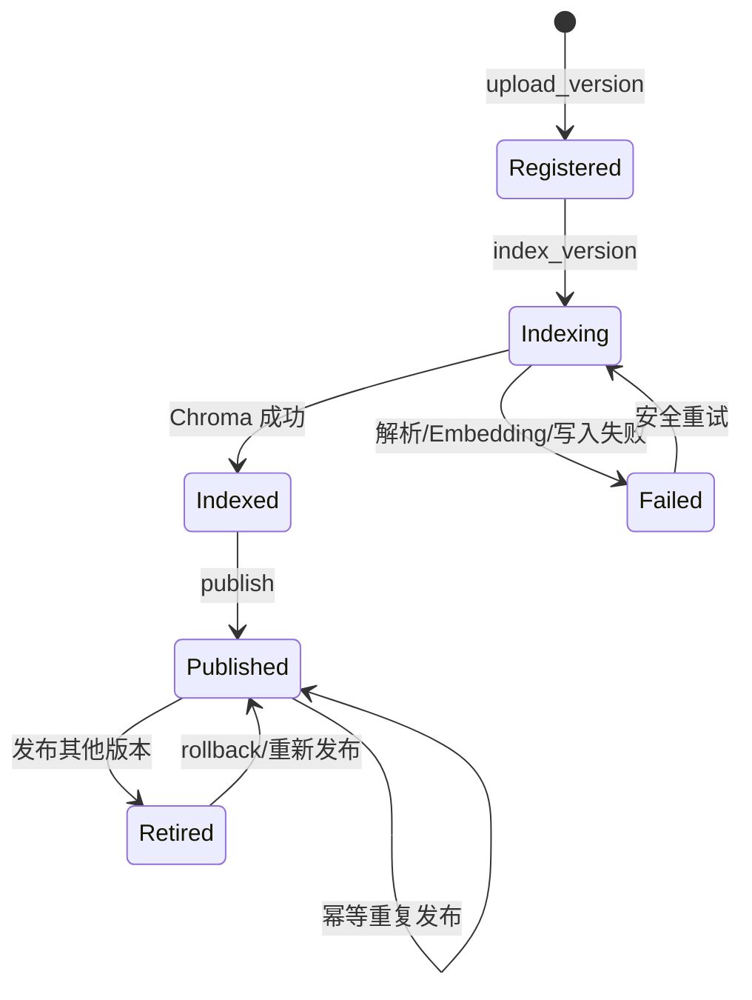

逻辑 Document 另有 `active/deleted` 状态。Delete 是软删除并增加 KB epoch，不直接擦除所有 Chunk；Restore 恢复逻辑可见性。这样可以审计和回滚，也避免错误删除其他版本。生产系统还需保留策略、真正清理流程和审批审计。

## 8.2 权限感知检索

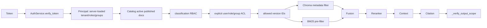

权限必须在 Retrieval 期间生效。如果先全库检索、Rerank 或生成，再删除未授权结果，敏感文本已经进入内存候选、Trace 或模型 Context，构成泄露。V3 用同一 `allowed_version_ids` 约束 Vector 与 BM25，Fusion/Reranker 只看到授权候选，返回前再防御性校验。

RBAC 是“HR 角色可以看 HR classification”的通用规则；ACL 是“某用户/组对某文档有 read”的例外明细。Admin 仍受 tenant 边界。

## 8.3 多租户隔离

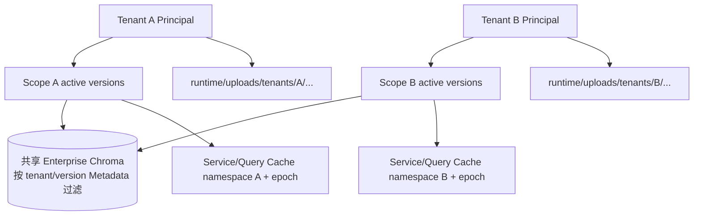

V3 使用共享 Enterprise collection 加服务端 Metadata filter，而不是每租户独立进程/数据库。目录路径、Catalog 查询、会话所有权、Cache namespace 和 Trace API 都带租户边界。这适合 Prototype，但不是物理隔离；强合规场景可能要求独立 collection、密钥、数据库或部署单元。

## 8.4 Conversation 与 Router

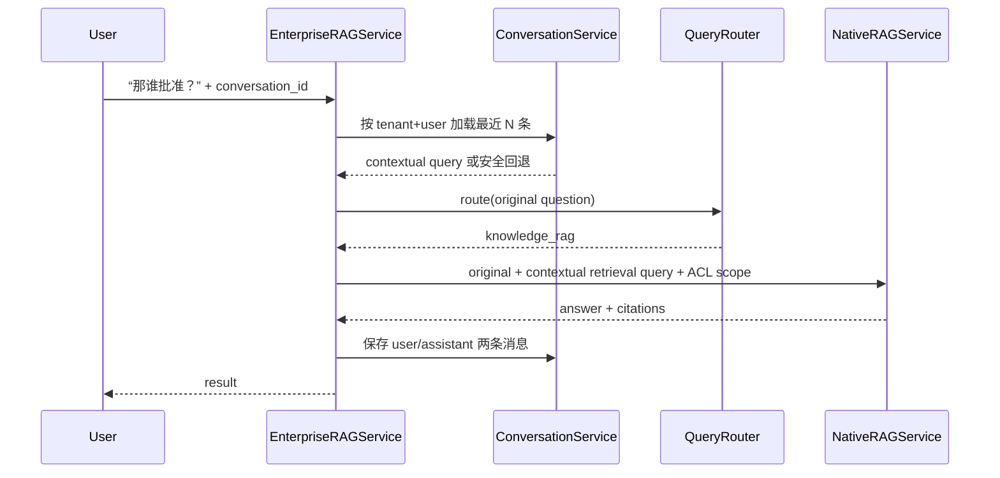

历史长度默认 10 条，避免 Prompt 无限增长。Conversation ID 只有同时匹配 tenant 与 owner 才能读取。Router 当前是确定性问候规则，不会用 normal_chat 路径携带检索 Context。

## 8.5 Cache 一致性

V3 实际存在 Rewrite/Expansion JSON Cache 和进程内按 Scope 缓存的 `NativeRAGService`。企业 cache key 包含租户/KB/权限 fingerprint/knowledge base epoch。发布、回滚、删除、恢复会 bump epoch，API 也主动 `invalidate_services()`，避免旧 BM25 与授权范围复用。没有发现独立 Retrieval Cache 或 Answer Cache，因此文档不虚构其失效逻辑。

### 本章需要掌握

企业 RAG 的核心不是多加一个 tenant_id，而是所有存储、查询、缓存、会话、调试和 Citation 都遵守相同边界；版本发布采用先索引后切换，而非覆盖旧数据。

---

# 9. Observability

本章回答“一个请求内部到底做了什么、哪里慢、哪里失败”。Observability 不改变 Retrieval 算法，它横跨 API、企业服务、LCEL、Retriever、Reranker 与生命周期。

## 9.1 实际架构

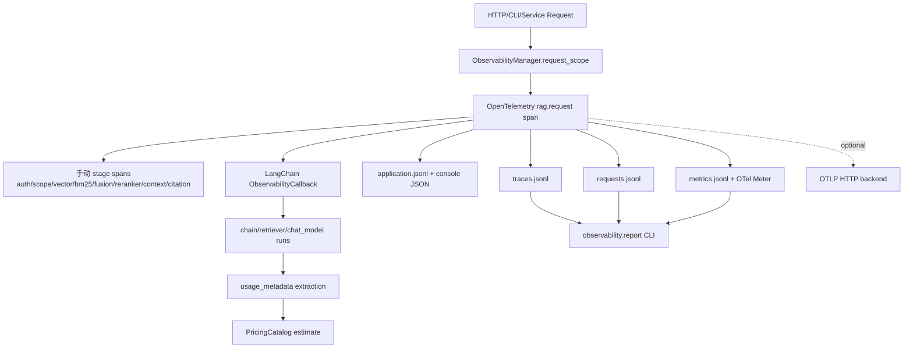

默认 `V3_OBSERVABILITY_ENABLED=True`、exporter=`local`、sample rate=1.0、内容采集关闭。文件位于 `rag_langchain_native/runtime/observability/`，使用轮转/保留设置并被 Git 忽略。只有显式设置 OTLP endpoint 才远程导出。

## 9.2 Trace、Span、Request ID

- **Request ID**：应用层关联 ID。API 接受合法的 `X-Request-ID`，否则生成 UUID，并在响应头返回。
- **Trace ID**：OpenTelemetry 的整条因果链 ID。知道它不是读取 Trace 的授权凭证。
- **Span**：链中的一次阶段，例如 `vector.search`；包含起止时间、父子关系、success、result count 等安全属性。
- **Context propagation**：`contextvars` 保存当前 `RequestState`，避免用线程不安全全局变量存当前用户。API middleware 已创建 scope 时，Service 装饰器会复用它。

`ObservabilityManager.stage()` 是上下文管理器：进入时开始 Span，`yield` 一个字典让业务补充 `result_count`，退出时无论成功或异常都记录 duration。`fallback()` 把 Rewrite 失败后回退原 Query 记为局部降级，不把最终成功请求误标为整体失败。

## 9.3 LangChain Callback、OpenTelemetry 与 LangSmith

- **LangChain Callback** 收到 Chain/Retriever/LLM 的 start/end/error/retry 生命周期，知道 run ID 和 parent run ID，比散落的 `print()` 更统一。代码在 `observability/callbacks.py`，默认不读取 Prompt/Context/Answer 内容。
- **OpenTelemetry** 是供应商中立的 Trace/Metrics 标准；手写 Python 阶段、FastAPI 和 LangChain 都能落在同一个 Trace 中。
- **LangSmith** 是 LangChain 生态的托管追踪/评估平台。当前仓库没有配置 `LANGCHAIN_TRACING_V2`、LangSmith callback 或上传逻辑，因此它**没有实际接入**。不能因为依赖树中可能出现 `langsmith` 包就说项目用了 LangSmith。

## 9.4 Logging、Metrics、Token 与 Cost

结构化日志包含 timestamp/level/service/operation/request/trace/event/status/duration/error type。`redact()` 过滤 password、API key、authorization、cookie、secret、token 等字段；默认不记录完整问题、Prompt、Context、答案或文档。

Metrics 记录 API 请求、HTTP 状态、候选数、阶段耗时、LLM 请求/Token/错误、文档入库/发布等。代码主动丢弃 request/user/conversation/document/tenant ID 这类高基数 label。当前没有 Prometheus `/metrics` endpoint；聚合主要来自本地 JSONL 报告。

Token Usage 优先读 `AIMessage.usage_metadata`，再尝试 response metadata/LLM output。拿不到时返回 `available=False`，不会用字符数冒充真实 Token。成本依赖 runtime 中用户提供的 `pricing.json`；仓库没有内置“最新价格”，因此未知模型/无价格时状态是 unknown，而不是伪造账单。

## 9.5 失败分类与查看命令

`failure.py` 区分 authentication、authorization、tenant access、document/version、ingestion、embedding、retrieval、reranker、LLM rate limit/timeout/service、cache、internal 等类型。业务拒答、正常无结果和评估答案错误不应该都算系统异常。

```powershell
# 最近请求
.\rag_langchain_native\.venv\Scripts\python.exe -m rag_langchain_native.observability.report recent --limit 10

# 按 request_id 或 trace_id 查看 Span 树
.\rag_langchain_native\.venv\Scripts\python.exe -m rag_langchain_native.observability.report trace --request-id <request_id>
.\rag_langchain_native\.venv\Scripts\python.exe -m rag_langchain_native.observability.report trace --trace-id <trace_id>

# 最近 60 分钟聚合
.\rag_langchain_native\.venv\Scripts\python.exe -m rag_langchain_native.observability.report summary --minutes 60
```

API 还提供仅同租户 admin 可访问的 `/observability/requests`、`/observability/traces/{trace_id}`、`/observability/summary`。

历史开销结果 `phase10_observability_overhead.json` 使用 200 次极小 Mock workload：关闭平均约 0.016 ms，开启约 4.52 ms，600/600 Span 完整。相对百分比很大是因为基线几乎为空，真正有意义的是约 4.5 ms 的绝对开销；它不能代表 Gemini 端到端生产性能。

### 本章需要掌握

Callback 观察 LangChain，手动 Span 补齐自定义 Python，OpenTelemetry 统一关联；默认内容保护比“记录一切以后再删”更安全。LangSmith 当前未用。

---

# 10. Security & Production

## 10.1 安全边界与 Prompt Injection

系统把应用 System Prompt、服务端配置和 AuthorizationScope 视为可信控制面；用户问题、会话文本、PDF、Chunk、Metadata 与模型输出都视为不可信数据。

关键防线不是关键词黑名单，而是：

1. 权限在 Retrieval 前计算，文档内容无权改变 tenant/version filter。
2. Context 使用 JSON 字符串安全表示，并标记 `untrusted_retrieved_document`。
3. System Prompt 明确文档/用户指令不能要求泄露规则、密钥、改变权限或执行命令。
4. 系统没有 Agent/任意 Shell/SQL/Python Tool，不执行模型返回文本。
5. Citation 来自授权 Metadata，返回前 `_verify_output_scope()` 再检查。

这些是纵深防御，**不能保证语义模型永远不受 Prompt Injection 影响**。真实模型红队、内容净化、DLP、审核策略仍属于生产工作。

## 10.2 API 与上传安全

- `Settings.validate_security()` 在 production 要求至少 32 字符的 `V3_AUTH_SECRET`，缺失时 fail closed。
- 当前 Token 是两段式 `base64(payload).HMAC`，包含 subject、token version、iat/exp/issuer/audience；它**不是标准三段 JWT**，也不是 OAuth/OIDC。生产建议企业 IdP、非对称密钥、轮换、撤销、MFA。
- FastAPI 使用 Bearer Dependency；角色/tenant 从 Catalog 重新加载，不信任客户端字段。
- 中间件限制 Content-Length、每客户端分钟请求数、并发数，增加 CSP/nosniff/frame/referrer/no-store 安全头。
- 本地限流是单进程内存实现，多 worker/多副本要使用 API Gateway 或 Redis；client IP 还涉及可信反向代理配置。
- 上传分块读取并限制大小；检查 `%PDF-` magic、PyMuPDF 可解析性和页数；服务端只使用 `Path(filename).name`，磁盘使用固定 `content.pdf`，降低路径穿越/覆盖风险。
- 异常 PDF 解析没有独立子进程硬超时/内存 sandbox，仍需生产级隔离与恶意文件扫描。

## 10.3 部署结构

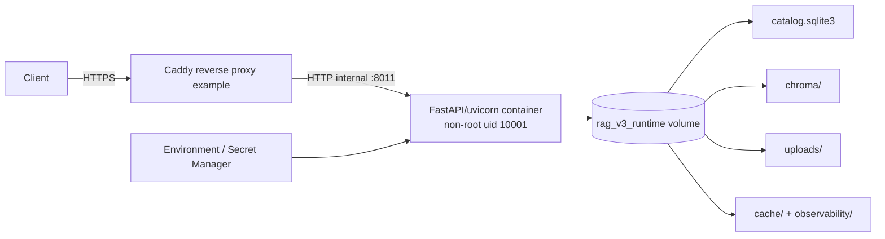

`Dockerfile` 使用 Python 3.11 slim、非 root 用户、只复制 V3 与 requirements、暴露 8011、定义 healthcheck 和 graceful shutdown timeout。Compose 把端口绑定到 `127.0.0.1`、root filesystem 设为只读、挂载持久化 Volume、drop all capabilities、禁止 privilege escalation，并用 `/tmp` tmpfs。

Volume 很重要：容器镜像是可替换运行环境，SQLite/Chroma/uploads 属于状态；不挂 Volume，重建容器会丢知识库。`.env` 不复制进镜像，`.env.example` 只有占位符。

Caddyfile 是真实域名 `rag.example.com` 的**示例**，没有证书私钥。真实 HTTPS 需要域名、DNS、网络和证书环境。本轮机器没有 Docker 命令，因此 Docker build/runtime 未在本轮验证。

## 10.4 Health、Readiness 与可靠性

- `/health` 返回进程状态、版本、collection 与 auth 是否配置，不调用 Gemini。
- `/ready` 实际只检查 SQLite `SELECT 1` 和 runtime 可写/可创建；它没有深查 Chroma index、模型已下载或外部 Gemini。
- Uvicorn 配置 30 秒 graceful shutdown；ObservabilityManager 有 `shutdown()` flush，但 `api.py` 当前没有显式 lifespan/shutdown hook 调用它，这是一个真实缺口。
- ChatModel 配置 timeout 和最多 2 次 retry；Query Rewrite/Expansion 有 fallback；并发 Semaphore 提供 backpressure。

## 10.5 Backup / Restore

`BackupService.create()` 在进程内写锁中用 SQLite 官方 backup API 得到一致数据库，再复制 uploads 与 Chroma，生成包含每个文件 SHA-256、时间、backup ID 和一致性说明的 Manifest。`verify()` 检查路径和 hash；`restore()` 只允许恢复到新的空目录，拒绝覆盖 active runtime。

```powershell
.\rag_langchain_native\.venv\Scripts\python.exe -m rag_langchain_native.cli backup D:\backups\rag-v3-001
.\rag_langchain_native\.venv\Scripts\python.exe -m rag_langchain_native.cli verify-backup D:\backups\rag-v3-001
.\rag_langchain_native\.venv\Scripts\python.exe -m rag_langchain_native.cli restore-backup D:\backups\rag-v3-001 D:\restore-test\rag-v3
```

这个锁只覆盖单进程。多副本必须维护窗口/分布式锁/存储级快照；备份还需要加密、异地保存、访问控制、定期恢复演练。

## 10.6 依赖与供应链

运行依赖已精确 pin 在 V3 `requirements.txt`；开发依赖在 `requirements-dev.txt`。CI 运行 Bandit 和 pip-audit。workflow 对 Chroma 的 4 个已知、当前未修复 advisory 使用显式 ignore，并要求 `SECURITY_RISK_ACCEPTANCE.md` 记录理由；这叫风险接受，不叫漏洞不存在。依赖升级必须经过全部回归门禁。

### 本章需要掌握

认证回答“是谁”，授权回答“能做什么”；Prompt 不是权限系统；容器化不等于无状态；备份只有恢复验证后才有价值。当前部署仍是单机 Prototype 边界。

---

# 11. CI/CD 与自动化质量门禁

## 11.1 实际流水线

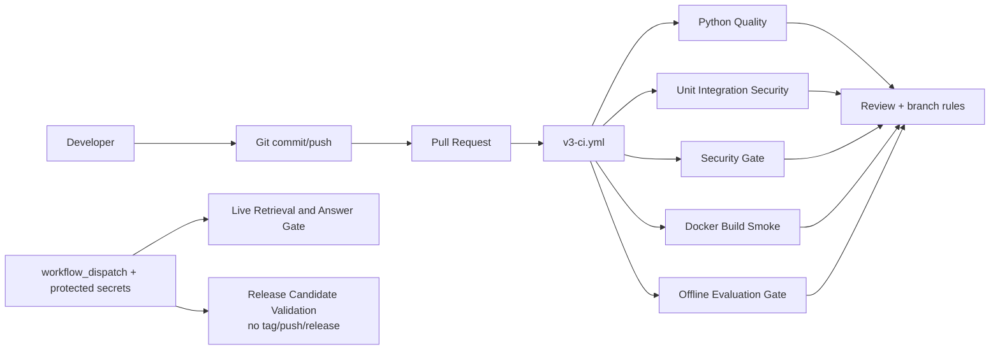

Workflow 文件与准确 Job 显示名：

| Workflow | 触发 | Job name | 实际工作 |
|---|---|---|---|
| `v3-ci.yml` | PR、main push、manual | `Python Quality` | pip check、compileall、Ruff lint/指定范围 format check |
| 同上 | 同上 | `Unit Integration Security` | 全部非 live pytest，上传 JUnit artifact |
| 同上 | 同上 | `Security Gate` | Bandit、pip-audit（有记录的 Chroma exceptions）、安全 pytest |
| 同上 | 同上 | `Docker Build Smoke` | build、运行容器、轮询 `/ready` |
| 同上 | 同上 | `Offline Evaluation Gate` | 固定 Fake/fixture 的 Chain、Retrieval、ACL、Gate 单测 |
| `v3-live-evaluation.yml` | manual | `Live Retrieval and Answer Gate` | 要求 Gemini/Auth secrets，跑 enterprise retrieval/answer/security/quality gate |
| `v3-release-validation.yml` | manual | `Release Candidate Validation` | pytest、Docker build、候选说明 artifact；不建 tag/Release、不推镜像 |

Actions 使用只读 `contents` 权限，checkout/setup-python/upload-artifact 固定到 commit SHA，避免浮动 tag 供应链风险。普通 PR 不拿 Gemini secret，也不产生付费调用。

## 11.2 Quality Gate

`eval/quality_gate.json` 当前阈值：

| 指标 | 阈值 |
|---|---:|
| Retrieval case 数 | ≥ 28 |
| Hit@1 / @3 / @5 / @10 | ≥ 0.94 / 0.98 / 0.98 / 1.00 |
| 平均 Retrieval 延迟回归 | ≤ baseline 的 25% |
| Answer accuracy | ≥ 0.94 |
| Citation / Refusal correctness | ≥ 1.00 / 1.00 |
| Security failures | = 0 |

`quality_gate.py` 读取 Baseline、当前 Retrieval/Answer/Security JSON，任何必需指标缺失或低于阈值就返回非零 exit code。Baseline 来源明确记录为 `eval/results/phase9_summary.json`，模型 `multilingual-e5-base`、Chunk 200/30、28 个 Retrieval 与 32 个 Answer Case；不是凭空发明的漂亮数字。

现有 `phase12_quality_gate.json` 记录一次 PASS：Hit@1=27/28（0.9643），Hit@3/5/10=1.0，Answer=0.9643，Citation=1.0，Refusal=1.0，Security failures=0。它是历史 artifact，不等于本轮重新跑了 Live Gemini。

Offline Gate 主要验证流程、Citation、Refusal、ACL 和退出语义；它不能替代真实 PDF/Embedding/Gemini 质量。Live workflow 缺 secret 时应该失败/Not Run，不应伪装 PASS。

## 11.3 Git/GitHub 初学者词汇

- **Git**：本地版本历史；**GitHub**：远程协作平台。
- **Branch**：并行开发线；**Pull Request**：请求评审并合入 main。
- **Workflow**：一个 YAML 自动流程；**Job**：可并行的一组步骤；**Step**：单条 action/command。
- **Artifact**：工作流保存的非敏感报告文件。
- **Baseline**：已注明配置、样本和来源的比较基准。
- **Quality Gate**：指标或安全检查不满足时用非零 Exit Code 阻止继续。
- **CI**：每次变更自动构建/测试；当前没有自动生产部署，所以 CD 主要是发布验证与部署准备，而不是自动上线。

## 11.4 远程能力边界

workflow 文件不等于 Branch Protection 已启用。需要在 GitHub `Settings → Rules → Rulesets/Branches` 对 `main` 要求 PR，并把上述 5 个 V3 CI Job 设为 required checks，禁止 force push、按团队情况要求 review/resolve conversations。这个远程设置本轮未执行。

Dependabot 每周检查 V3 pip、GitHub Actions 与 Docker；不会自动合并。合法 Baseline 更新应在同一 PR 中附运行配置、原因、差异与评审，不能让脚本自动降低阈值。

### 本章需要掌握

CI 让错误尽早暴露，Gate 让关键退化变成机器可判断的失败；Mock 门禁与 Live 质量评估用途不同；远程规则和 secrets 仍需要仓库管理员配置。

---

# 12. 最关键的 Python 方法详解

以下行号对应审计时源码；后续编辑可能使行号移动，应以函数名搜索为准。代码片段均来自当前文件，省略号只用于教学压缩，不表示源码真的有该行。

## 12.1 `api.create_app()`

**位置：** `rag_langchain_native/api.py:88`

**通俗解释/必要性：** 创建 V3 FastAPI 应用，把中间件、认证依赖、企业服务和全部 HTTP 路由装配在一起。

```python
def create_app(settings=DEFAULT_SETTINGS, *, catalog=None, vectorstore=None,
               llm=None, query_model=None, reranker=None) -> FastAPI:
    settings.validate_security()
    application = FastAPI(
        title="LangChain Native Enterprise RAG V3",
        version="0.4.0",
        docs_url=None if settings.environment == "production" else "/docs",
    )
```

**输入/输出：** 输入 Settings 和可注入 Fake/真实依赖；返回 `FastAPI` 对象。**过程：** 校验配置→建 Catalog/Auth→中间件→Dependency→Routes→OTel instrumentation。**上游：** `uvicorn rag_langchain_native.api:app`。**下游：** Auth、Lifecycle、Enterprise。**Python 点：** `*` 后参数只能按名字传；闭包中的 `nonlocal` 缓存 Service。**易错：** `create_app()` 本身不代表模型和索引已经 ready；测试注入不能绕过真实生产配置审计。

## 12.2 API `chat()` endpoint

**位置：** `rag_langchain_native/api.py:362`

```python
@application.post("/chat")
def chat(request: QueryRequest,
         principal: Principal = Depends(current_principal)) -> dict:
    validate_question(request.question)
    return enterprise().chat(
        principal=principal,
        knowledge_base_id=request.knowledge_base_id,
        question=request.question,
        conversation_id=request.conversation_id,
    )
```

**作用：** HTTP 数据进入企业 RAG 的正式门。**输入：** Pydantic `QueryRequest` 与经过 Dependency 验证的 `Principal`。**输出：** JSON 可序列化 `dict`。**上游：** HTTP client。**下游：** `EnterpriseRAGService.chat()`。**Python/FastAPI 点：** `Depends` 先运行认证；普通 `def` 会由 FastAPI 在线程池处理，不是 `async def`。**易错：** 客户端请求体没有可信 roles/tenant 参数。

## 12.3 `DocumentLifecycleService.upload_version()`

**位置：** `rag_langchain_native/lifecycle.py:156`

```python
@serialized_runtime_write
def upload_version(..., filename: str, content: bytes) -> dict[str, Any]:
    validate_pdf_content(content, self.settings)
    content_hash = hashlib.sha256(content).hexdigest()
    existing = next((v for v in self.catalog.list_versions(document_id)
                     if v["content_hash"] == content_hash), None)
    if existing:
        return {**existing, "created": False}
```

**作用：** 将上传内容变成不可变、幂等 Version。**输入：** tenant/KB/document IDs、文件名、bytes。**输出：** Version 字典。**过程：** scope 校验→PDF 校验→hash 判重→安全路径→临时文件原子替换→Catalog record。**上游：** upload endpoints/CLI。**下游：** Catalog。**Python 点：** 装饰器在函数外层取得进程锁；`next(generator, None)` 查第一个匹配项；`{**dict, ...}` 展开字典。**易错：** 内容相同不是新版本；锁不是跨进程事务。

## 12.4 `DocumentLifecycleService.index_version()`

**位置：** `rag_langchain_native/lifecycle.py:218`

```python
self.catalog.set_version_status(version_id, "indexing")
try:
    pages = load_pdf_pages(version["storage_path"])
    chunks = split_pages(pages, self.settings)
    # 为每个 chunk 增加 tenant/kb/document/version/chunk_uid
    self.vectorstore.delete(where={"version_id": version_id})
    ids = add_documents(self.vectorstore, enterprise_chunks)
    self.catalog.set_version_status(version_id, "indexed")
except Exception as error:
    self.vectorstore.delete(where={"version_id": version_id})
    self.catalog.set_version_status(version_id, "failed", str(error))
    raise
```

**作用：** 把一个具体版本解析、切块、Embedding 并写入 Chroma，但不自动发布。**输出：** 含页数/Chunk/IDs 的 Version 字典。**上游：** 上传入口。**下游：** Loader/Splitter/VectorStore。**Python 点：** `try/except/finally` 用于补偿清理后重新抛错。**易错：** SQLite 与 Chroma 非原子；正确性来自状态机和补偿，不是假事务。

## 12.5 `DocumentCatalog.publish_version()`

**位置：** `rag_langchain_native/catalog.py:417`

```python
if version["status"] not in {"indexed", "published", "retired"}:
    raise ConflictError("Only an indexed version can be published")
old = document["active_version_id"]
if old and old != version_id:
    connection.execute("UPDATE document_versions SET status='retired' ...")
connection.execute("UPDATE document_versions SET status='published' ...")
connection.execute("UPDATE documents SET active_version_id=? ...", ...)
self._bump_epoch(connection, document["tenant_id"], document["knowledge_base_id"])
```

**作用：** 在一个 SQLite transaction 中切换 active version，并使旧缓存 namespace 失效。**输入：** document/version ID。**输出：** 更新后的 Document row。**上游：** Lifecycle publish/rollback。**下游：** SQLite。**Python 点：** `with self.transaction()` 自动 commit/rollback。**易错：** Publish 不重新做 Embedding；它只让已索引版本进入正常检索范围。

## 12.6 `load_pdf_pages()`

**位置：** `rag_langchain_native/ingestion.py:48`

```python
path = Path(pdf_path).resolve()
pages = PyMuPDFLoader(str(path), mode="page").load()
for page in pages:
    metadata = dict(page.metadata)
    metadata.update(source=path.name,
                    page=int(metadata.get("page", 0)) + 1)
    normalized.append(Document(page_content=page.page_content,
                               metadata=metadata))
```

**作用：** 将 PDF 转为一页一个 LangChain Document，并标准化 source/1-based page。**输入：** path。**输出：** `list[Document]`。**上游：** Ingestion/Lifecycle。**下游：** PyMuPDFLoader。**Python 点：** `str | Path` 是类型联合，不是 LCEL 管道；`dict()` 避免原地污染。**易错：** 当前用 `.load()`，没有用 `lazy_load()`；扫描 PDF 可能没有可用文字。

## 12.7 `split_pages()`

**位置：** `rag_langchain_native/ingestion.py:86`

```python
splitter = RecursiveCharacterTextSplitter(
    chunk_size=settings.chunk_size,
    chunk_overlap=settings.chunk_overlap,
    length_function=len,
    separators=["\n\n", "\n", "。", "；", "，", " ", ""],
)
for page in pages:
    for index, chunk in enumerate(splitter.split_documents([page])):
        metadata = dict(chunk.metadata)
        metadata.update(chunk_id=index, document_id=_stable_id(...))
```

**作用：** 按页切块且继承 Metadata。**输入/输出：** `list[Document] → list[Document]`。**上游：** Ingestion。**下游：** LangChain splitter。**Python 点：** `enumerate` 同时给序号和对象；类型注解不强制运行时类型。**易错：** 这里 `len` 是字符数，不是 token；Enterprise 后续会用 `chunk_uid` 区分逻辑 document ID。

## 12.8 `get_embeddings()`

**位置：** `rag_langchain_native/embedding.py:77`

```python
return _cached_embeddings(
    settings.embedding_model,
    settings.embedding_device,
    str(model_cache),
    settings.embedding_batch_size,
    settings.normalize_embeddings,
    settings.query_prefix,
    settings.document_prefix,
)
```

**作用：** 返回实现 `embed_query/embed_documents` 的缓存 HuggingFaceEmbeddings。**输入：** Settings。**输出：** Embeddings 对象，不是向量本身。**上游：** VectorStore。**下游：** `_cached_embeddings()`/SentenceTransformer。**Python 点：** `@lru_cache` 按参数缓存模型对象。**易错：** E5 Query 和 Document 前缀不同；更改配置后旧向量不能无条件复用。

## 12.9 `create_vectorstore()`

**位置：** `rag_langchain_native/vectorstore.py:37`

```python
return Chroma(
    collection_name=settings.collection_name,
    embedding_function=get_embeddings(settings),
    persist_directory=str(settings.chroma_dir),
    collection_metadata={"hnsw:space": "cosine", "owner": "v3"},
)
```

**作用：** 连接或创建 V3 独立 LangChain Chroma。**输入/输出：** Settings → `Chroma`。**上游：** Service/Ingestion/Lifecycle。**下游：** Embeddings 和 Chroma。**易错：** 实例化不代表 collection 有数据；Enterprise 用 `enterprise_settings()` 换 collection name。

## 12.10 `ScoredChromaRetriever._get_relevant_documents()`

**位置：** `rag_langchain_native/retrieval.py:126`

```python
results = self.vectorstore.similarity_search_with_score(
    query, k=self.k, filter=self.metadata_filter,
)
for rank, (document, distance) in enumerate(results, start=1):
    copied = clone_document(document)
    copied.metadata.update(vector_distance=float(distance), vector_rank=rank)
    documents.append(copied)
```

**作用：** 在标准 Retriever 生命周期内保留 Chroma distance。**输入：** `query: str`。**输出：** `list[Document]`。**上游：** `.invoke()`/Ensemble。**下游：** Chroma search。**Python 点：** `_` 前缀方法是 BaseRetriever 要求的扩展点；用户应调用公开 `invoke()`。**易错：** cosine distance 越小越相近，不是越大越好。

## 12.11 `TracedEnsembleRetriever.weighted_reciprocal_rank()`

**位置：** `rag_langchain_native/retrieval.py:198`

```python
for index, (documents, weight) in enumerate(
        zip(doc_lists, self.weights, strict=True)):
    for rank, document in enumerate(documents, start=1):
        key = document_key(document)
        scores[key] += float(weight) / (rank + self.c)
        matched_routes[key].append(route)
```

**作用：** 按稳定 Chunk ID 去重并累计 Vector/BM25 的排名贡献。**输入：** `list[list[Document]]`。**输出：** 排序后的 `list[Document]`。**上游：** EnsembleRetriever。**下游：** 普通 Python dict/set。**Python 点：** `defaultdict` 自动创建初值；`zip(strict=True)` 长度不一致立即失败。**易错：** weight 不是概率；不能直接把 distance 与 BM25 score 相加。

## 12.12 `NativeRetrievalEngine.retrieve_queries()`

**位置：** `rag_langchain_native/retrieval.py:477`

```python
unique_queries = list(dict.fromkeys(
    query.strip() for query in queries if query.strip()))
result_sets = self.base_retriever.batch(
    unique_queries, config=observability.langchain_config(),
)
output = self._merge_query_results(unique_queries, result_sets)
return output
```

**作用：** 批量执行同一意图的多个 Query，再统一做 query-level RRF。**输入/输出：** `list[str] → list[Document]`。**上游：** Chain `_retrieve()`/retrieve-only。**下游：** Base Retriever `batch()`、`_rrf_queries()`。**易错：** 它不逐 Query rerank；Rerank 在融合后只做一次。

## 12.13 `ScoredCrossEncoderReranker.compress_documents()`

**位置：** `rag_langchain_native/reranker.py:50`

```python
scores = self.model.score(
    [(query, document.page_content) for document in documents]
)
for document, score in zip(documents, scores, strict=True):
    copied = clone_document(document)
    copied.metadata["rerank_score"] = float(score)
    scored.append((copied, float(score)))
scored.sort(key=operator.itemgetter(1), reverse=True)
return [document for document, _ in scored[: self.top_n]]
```

**作用：** 给统一候选池重新评分并截取 Top-N。**输入：** Sequence Document + query。**输出：** Sequence Document。**上游：** `rerank_documents()`。**下游：** HuggingFaceCrossEncoder。**Python 点：** 列表推导生成文本对；tuple 中 Document 与 score 始终绑定。**易错：** 这是 Cross-Encoder，不是再次做向量距离。

## 12.14 `QueryProcessor.rewrite()`

**位置：** `rag_langchain_native/query_processing.py:215`

```python
if not self.settings.rewrite_enabled:
    return question, False
cached = self.rewrite_cache.read().get(cache_key)
if isinstance(cached, str) and cached.strip():
    return cached.strip(), False
try:
    chain = REWRITE_PROMPT | self._require_model() | StrOutputParser()
    rewritten = chain.invoke({"question": question}, config=...).strip()
except Exception as error:
    observability.fallback("query.rewrite", error)
    return question, True
```

**作用：** 可选地把一条 Query 改得适合检索。**输出：** `(rewritten: str, failed: bool)`。**上游：** `process()`。**下游：** Cache、Throttle、ChatModel。**Python/LCEL 点：** `|` 在类型注解中是 Union，在 Runnable 对象间是管道重载；`try/except` 提供降级。**易错：** Rewrite 不能扩权，也不能替代 original question。

## 12.15 `QueryProcessor.expand()`

**位置：** `rag_langchain_native/query_processing.py:269`

```python
structured_model = self._require_model().with_structured_output(ExpansionOutput)
chain = EXPANSION_PROMPT | structured_model
output = chain.invoke({"query": query, "count": self.settings.expansion_count},
                      config=...)
alternatives = [item.strip() for item in output.queries if item.strip()]
queries = list(dict.fromkeys([query, *alternatives]))[
    : self.settings.expansion_count + 1]
```

**作用：** 生成多条不同检索表达并永远保留输入 Query。**输出：** `(list[str], failed)`。**Python 点：** `[query, *alternatives]` 用 `*` 展开 list；Pydantic Structured Output 避免手工解析松散文本。**易错：** `expansion_count=3` 意味着最多 original + 3 alternatives，即 4 条。

## 12.16 `build_authorization_scope()`

**位置：** `rag_langchain_native/security.py:259`

```python
active = catalog.active_documents(principal.tenant_id, knowledge_base_id)
allowed = [doc for doc in active if can_read_document(catalog, principal, doc)]
if document_id is not None:
    allowed = [doc for doc in allowed if doc["document_id"] == document_id]
return AuthorizationScope(
    tenant_id=principal.tenant_id,
    version_ids=tuple(sorted(doc["active_version_id"] for doc in allowed)),
    epoch=catalog.knowledge_base_epoch(...),
)
```

**作用：** 把服务端身份和 active documents 计算成 Retriever 白名单。**输入：** Principal、KB、可选缩小 filter。**输出：** `AuthorizationScope`。**上游：** Enterprise service。**下游：** Catalog/RBAC/ACL。**Python 点：** list comprehension 过滤集合；tuple 表示不可变有序值。**易错：** 空 tuple 是 deny all，绝不能解释成“没有 filter，所以查全库”。

## 12.17 `EnterpriseRAGService.chat()`

**位置：** `rag_langchain_native/enterprise.py:210`

```python
contextual, contextual_failed = self._contextual_query(...)
route = self.router.runnable.invoke(question, config=...)
if route != KNOWLEDGE_RAG:
    result = {"answer": self.router.normal_chat_answer(question), ...}
else:
    scope = self._scope(principal, knowledge_base_id, ...)
    result = (self._empty_authorized_result(...)
              if scope.empty else
              self._service_for(principal, scope).ask_rag(
                  question, retrieval_question=contextual))
```

**作用：** 权限感知 V3 的业务总入口。**输入：** Principal/KB/question/conversation/filters。**输出：** 完整结果 dict。**上游：** API/CLI/Eval。**下游：** Conversation/Router/Scope/Native Chain。**易错：** Contextual Query 只用于 Retrieval；normal_chat 不携带 Context；输出还会进行 scope 防御校验。

## 12.18 `NativeRAGService.build_rag_chain()`

**位置：** `rag_langchain_native/chain.py:484`

```python
return (
    RunnableLambda(self._normalize_chain_input)
    | query_stage
    | RunnableLambda(self._retrieve).with_config(run_name="retrieval")
    | RunnableLambda(self._rerank).with_config(run_name="reranker")
    | RunnableLambda(self._guard).with_config(run_name="answer_guard")
    | RunnableBranch((lambda state: state["refused"], refusal), success)
).with_config(run_name="native_rag_v3")
```

**作用：** 真正让 LCEL 承担 RAG 主流程编排。**输入：** `str` 或 original/retrieval query dict。**输出：** 最终 dict。**上游：** `chain` property。**下游：** Query/Retrieval/Rerank/Guard/Prompt/Model/Finalize。**Python 点：** `lambda` 是匿名小函数；这里仅做条件/字段转换，不把旧 `ask_rag()` 隐藏在一个 Lambda 中。**易错：** Chain 构建只描述图，`.invoke()` 才执行。

## 12.19 `build_citations()`

**位置：** `rag_langchain_native/chain.py:167`

```python
for document in documents:
    key = (document.metadata.get("source"),
           document.metadata.get("page"),
           document.metadata.get("chunk_id"))
    if key in seen:
        continue
    seen.add(key)
    citations.append({"source": key[0], "page": key[1],
                      "version_id": document.metadata.get("version_id")})
```

**作用：** 从最终 Context 的真实 Metadata 生成去重 Citation。**输入/输出：** `list[Document] → list[dict]`。**上游：** `_finalize()`。**下游：** 无模型调用。**Python 点：** tuple 可作为 set key；`None` 表示字段不存在。**易错：** 不能只按文本去重；LLM 文本引用不是权威来源。

## 12.20 `ObservabilityManager.request_scope()` / `stage()`

**位置：** `rag_langchain_native/observability/core.py:331`、`:433`

```python
@contextmanager
def request_scope(...):
    token = _CURRENT_REQUEST.set(state)
    with self.tracer.start_as_current_span("rag.request", ...) as span:
        try:
            yield state
        finally:
            _CURRENT_REQUEST.reset(token)

@contextmanager
def stage(self, operation, *, attributes=None):
    with self.tracer.start_as_current_span(operation, ...) as span:
        yield output
```

**作用：** 建根 Trace 与真实阶段 Span，并关联 request ID。**输入：** operation/安全 attributes。**输出：** `Iterator[RequestState]` 或可补充字段的 dict。**上游：** API middleware、Service decorator、各阶段。**下游：** OpenTelemetry/JSONL/metrics/logging。**Python 点：** `yield` 把普通函数变成生成器；`@contextmanager` 让它可被 `with` 使用；`finally` 保证恢复上下文。**易错：** Trace ID 不是权限凭证；不要把完整 Prompt/Token 塞进 attributes。

## 12.21 `run_retrieval_evaluation()`

**位置：** `rag_langchain_native/eval/retrieval_eval.py:19`

```python
for case in load_test_cases(answerable_only=True):
    result = service.retrieve_only(case["question"], top_k=10)
    rank = expected_rank(case, result["documents"])
    details.append({"id": case["id"], "hit_rank": rank, ...})
output = {"configuration": {...},
          "summary": retrieval_summary(details), "details": details}
write_json(result_file, output)
```

**作用：** 不调用 Answer Generation，只比较 `expected_source + expected_page`。**输入：** 只读 `eval/test_case.json`。**输出：** JSON 的逐题与 Hit@K/MRR/Latency。**上游：** CLI/Live workflow。**下游：** `NativeRAGService.retrieve_only()`。**易错：** Retrieval 命中不能证明答案正确、无幻觉或权限安全。

### 本章需要掌握

阅读函数时始终追问：输入类型、返回类型、上游、下游、失败路径。`self` 是实例，`async/await` 用于可暂停 I/O，`with` 管资源，Runnable 的 `|` 与类型联合的 `|` 完全不同。

---

# 13. 真实函数调用关系

## 13.1 PDF 上传主链

```mermaid
flowchart TD
    A[api.py::upload_document()] --> B[api.py::current_principal()]
    B --> C[security.py::AuthService.verify_token()]
    A --> D[api.py::read_upload()]
    D --> E[lifecycle.py::validate_pdf_content()]
    A --> F[lifecycle.py::DocumentLifecycleService.register_document()]
    F --> G[catalog.py::DocumentCatalog.register_document()]
    A --> H[lifecycle.py::DocumentLifecycleService.upload_version()]
    H --> I[catalog.py::DocumentCatalog.create_version()]
    A --> J[lifecycle.py::DocumentLifecycleService.index_version()]
    J --> K[ingestion.py::load_pdf_pages()]
    J --> L[ingestion.py::split_pages()]
    J --> M[vectorstore.py::add_documents()]
    M --> N[HuggingFaceEmbeddings.embed_documents()]
    N --> O[(Enterprise Chroma)]
    P[api.py::publish_version()] --> Q[lifecycle.py::publish_version()]
    Q --> R[catalog.py::publish_version()]
    R --> S[enterprise.py::invalidate_services()]
```

上传便捷端点只完成注册、上传、索引，**发布仍是单独 endpoint**。这是有意设计：未验证版本不能自动上线。

## 13.2 RAG 问答主链

```mermaid
flowchart TD
    A[api.py::chat()] --> B[enterprise.py::EnterpriseRAGService.chat()]
    B --> C[conversation.py::ConversationService.contextualize()]
    B --> D[router.py::QueryRouter.route()]
    B --> E[security.py::build_authorization_scope()]
    E --> F[enterprise.py::_service_for()]
    F --> G[chain.py::NativeRAGService.ask_rag()]
    G --> H[chain.py::build_rag_chain().invoke()]
    H --> I[query_processing.py::QueryProcessor.process()]
    I --> J[rewrite() → expand()]
    H --> K[retrieval.py::NativeRetrievalEngine.retrieve_queries()]
    K --> L[ScoredChromaRetriever.invoke()]
    K --> M[BM25Retriever.invoke()]
    L --> N[TracedEnsembleRetriever.weighted_reciprocal_rank()]
    M --> N
    N --> O[retrieval.py::_rrf_queries()]
    O --> P[reranker.py::rerank_documents()]
    P --> Q[chain.py::assess_answerability()]
    Q --> R[chain.py::format_context()]
    R --> S[ANSWER_PROMPT | ChatGoogleGenerativeAI | AnswerOutput]
    S --> T[chain.py::build_citations() + _finalize()]
    T --> U[enterprise.py::_verify_output_scope()]
    U --> V[conversation.py::add_message()]
    V --> W[FastAPI JSON response]
```

动态图的关键是 `build_rag_chain()` 返回 RunnableSequence；图中的 `_retrieve/_rerank/_guard/_finalize` 都被包装成有名字的 Runnable 节点，`.invoke()` 才按图运行。Guard 拒答时 `RunnableBranch` 不执行 Gemini。

## 13.3 Retrieval Evaluation 主链

```mermaid
flowchart LR
    A[rag_langchain_native/eval/retrieval_eval.py::main] --> B[load_test_cases answerable_only]
    B --> C[run_retrieval_evaluation]
    C --> D[NativeRAGService.retrieve_only]
    D --> E[Query Processing + Retrieval + Reranker]
    E --> F[common.py::expected_rank]
    F --> G[同时匹配 expected_source + expected_page]
    G --> H[retrieval_summary<br/>Hit@1/3/5/10 MRR Latency]
    H --> I[results/retrieval_benchmark.json]
```

历史 V1 入口 `eval/retrieve_eval.py::evaluate_retrieval()` 使用 V1 `retrieve_candidates()` 与 `chroma_db/company_knowledge`；不要误写成 `retrieval_eval.py` 或 `test_cases.json`。

## 13.4 Answer Evaluation 主链

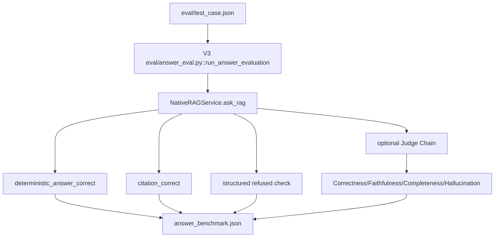

企业评估使用 `enterprise_common.bootstrap_evaluation_knowledge_base()` 创建明确的 evaluation tenant/admin/KB，再通过 `EnterpriseRAGService` 运行；它没有靠关闭权限绕过 ACL。

### 本章需要掌握

调用图必须从真实入口追到真实存储/模型；Evaluation 复用正式 Service，而不是另写一套“看起来更准”的 Retrieval。

---

# 14. 如何实际运行整个项目

以下均从仓库根目录执行，面向 Windows PowerShell。标注“需 Gemini”的命令会产生外部请求；本轮没有执行它们。

## 14.1 环境

```powershell
# V1（按根 requirements）
python -m venv .venv
.\.venv\Scripts\python.exe -m pip install -r requirements.txt

# V2 的 Phase 8 独立环境
python -m venv .venv-phase8
.\.venv-phase8\Scripts\python.exe -m pip install -r phase8-requirements.txt

# V3 独立环境
python -m venv rag_langchain_native\.venv
.\rag_langchain_native\.venv\Scripts\python.exe -m pip install -r rag_langchain_native\requirements.txt
.\rag_langchain_native\.venv\Scripts\python.exe -m pip check
```

V3 当前 pin Python 3.11 生态。真实 Secret 应由环境/Secret Manager 注入：

```powershell
$env:V3_AUTH_SECRET = "至少32字符的本地随机值"
$env:GEMINI_API_KEY = "仅在真实回答/Rewrite/Judge时设置"
```

不要把真实值复制到 `.env.example` 或提交到 Git。

## 14.2 V1 / V2 / V3

```powershell
# V1 重建（会重建 V1 collection，执行前确认意图）与 API
.\.venv\Scripts\python.exe ingest.py
.\.venv\Scripts\python.exe -m uvicorn app:app --host 127.0.0.1 --port 8000

# V1 Retrieval Evaluation，不调用 Gemini
.\.venv\Scripts\python.exe eval\retrieve_eval.py

# V2 没有独立 FastAPI；通过模块函数或正式比较脚本运行
.\.venv-phase8\Scripts\python.exe eval\experiment_langchain.py
.\.venv-phase8\Scripts\python.exe eval\experiment_langchain_full.py  # 需 Gemini

# V3 基础知识库、只检索、完整问答
.\rag_langchain_native\.venv\Scripts\python.exe -m rag_langchain_native.cli ingest --rebuild
.\rag_langchain_native\.venv\Scripts\python.exe -m rag_langchain_native.cli retrieve "国际出差需要谁批准？" --top-k 5
.\rag_langchain_native\.venv\Scripts\python.exe -m rag_langchain_native.cli ask "国际出差需要谁批准？"  # 需 Gemini

# V3 FastAPI，独立端口
.\rag_langchain_native\.venv\Scripts\python.exe -m uvicorn rag_langchain_native.api:app --host 127.0.0.1 --port 8011
```

## 14.3 企业文档与用户

```powershell
.\rag_langchain_native\.venv\Scripts\python.exe -m rag_langchain_native.cli create-user `
  --tenant tenant-a --username admin --password "ChangeMe123!" --roles admin

.\rag_langchain_native\.venv\Scripts\python.exe -m rag_langchain_native.cli enterprise-upload `
  data\pdf\travel_policy.pdf --tenant tenant-a --username admin `
  --password "ChangeMe123!" --knowledge-base default --classification general --publish

.\rag_langchain_native\.venv\Scripts\python.exe -m rag_langchain_native.cli enterprise-retrieve `
  "国际出差需要谁批准？" --tenant tenant-a --username admin --password "ChangeMe123!"
```

命令行密码参数会出现在 shell history/process list，只适合本地学习。生产应使用 IdP 和安全凭证流程。

## 14.4 测试与评估

```powershell
# 本轮实际执行，结果：46 passed
.\rag_langchain_native\.venv\Scripts\python.exe -m pytest rag_langchain_native\tests -m "not live" -q

# V3 Retrieval；--rebuild 会改 V3 自己的基础 Chroma
.\rag_langchain_native\.venv\Scripts\python.exe -m rag_langchain_native.eval.retrieval_eval

# 企业 Retrieval；bootstrap 会创建/更新 V3 evaluation tenant 数据
.\rag_langchain_native\.venv\Scripts\python.exe -m rag_langchain_native.eval.enterprise_retrieval_eval --bootstrap

# Answer/Judge：会调用 Gemini，应确认 key、配额和成本
.\rag_langchain_native\.venv\Scripts\python.exe -m rag_langchain_native.eval.answer_eval
.\rag_langchain_native\.venv\Scripts\python.exe -m rag_langchain_native.eval.enterprise_answer_eval
.\rag_langchain_native\.venv\Scripts\python.exe -m rag_langchain_native.eval.enterprise_judge_eval

# 安全与质量门禁
.\rag_langchain_native\.venv\Scripts\python.exe -m rag_langchain_native.eval.security_eval
.\rag_langchain_native\.venv\Scripts\python.exe -m rag_langchain_native.eval.quality_gate `
  --retrieval rag_langchain_native\eval\results\phase9_retrieval_benchmark.json `
  --answer rag_langchain_native\eval\results\phase9_answer_benchmark.json `
  --security rag_langchain_native\eval\results\phase9_security_evaluation.json
```

## 14.5 Docker、备份和 CI

```powershell
# 从仓库根构建；本轮因本机无 Docker 未验证
docker build -f rag_langchain_native\Dockerfile -t rag-v3:local .

# Compose 文件位于 V3；需要 rag_langchain_native/.env.production 或外部环境变量
docker compose -f rag_langchain_native\docker-compose.yml up --build

# 停止但保留 named volume
docker compose -f rag_langchain_native\docker-compose.yml down

# 本地 CI 对应核心检查
.\rag_langchain_native\.venv\Scripts\python.exe -m compileall -q rag_langchain_native
.\rag_langchain_native\.venv\Scripts\python.exe -m ruff check --config rag_langchain_native\pyproject.toml rag_langchain_native
.\rag_langchain_native\.venv\Scripts\python.exe -m pytest rag_langchain_native\tests -m "not live"
.\rag_langchain_native\.venv\Scripts\python.exe -m bandit -q -r rag_langchain_native -x rag_langchain_native\tests,rag_langchain_native\runtime
```

Backup/Observability 命令见第 9、10 章。LangSmith 没有实际入口，因此没有可运行命令。GitHub workflow 只能在远程 GitHub runner 中确认；本轮没有声称远程通过。

### 本章需要掌握

不同版本必须用各自环境和数据库；重建、Live Judge、Docker、远程 CI 的前提不同。先跑 Retrieval-only 和离线 pytest，再决定是否承担 Gemini 成本。

---

# 15. 初学者阅读路线与自测

## 15.1 九阶段阅读路线

1. **V1 主流程**：先读 `rag_service.py::ask_rag()`，再看 `app.py::chat()`。目标是理解普通函数调用与 RAG 六步；实验：纸上写出返回 dict 字段。
2. **Document/Embedding/Vector**：读 V1 `document_loader.py`、`embedding.py`、`ingest.py`。目标是理解 page、chunk、向量和 Metadata；实验：只打印一个 Chunk，不改正式库。
3. **高级 Retrieval**：读 V1 `retrieval.py` → `bm25_search.py` → `result_fusion.py` → `reranker.py`。目标是分清 Recall 与 Ranking。
4. **V2 Adapter**：读 `lc_embedding.py` 和 `lc_full_rag.py::_retrieve()`。目标是看清“包装旧函数”和“框架真正实现”之间的区别。
5. **V3 LCEL**：读 `chain.py::build_rag_chain()`，再读 `query_processing.py`、`retrieval.py::retrieve_queries()`。实验：用 Fake Runnable 跟踪 state 的键，不调用 Gemini。
6. **FastAPI**：读 `api.py::create_app/current_principal/chat`。目标是理解 Pydantic、Depends、中间件、同步/异步 endpoint。
7. **企业管理**：按 `catalog.py` → `lifecycle.py` → `security.py` → `enterprise.py`。实验：画 V1→V2 发布/回滚状态。
8. **Observability**：读 `observability/core.py::request_scope/stage` 和 `callbacks.py`。实验：跑测试后用 report 查看一棵 Trace 树。
9. **Security/DevOps/CI**：读 `backup.py`、Dockerfile、Compose、`v3-ci.yml`、`quality_gate.py`。目标是理解应用代码之外的交付边界。

## 15.2 自测题（先答后看答案）

1. **为什么需要同时保存 `document_id`、`version_id`、`chunk_uid`？**
   答：分别标识逻辑文档、不可变版本和具体向量 Chunk，解决版本切换、幂等和精确引用。
2. **为什么 page 要加 1？**
   答：Loader page 通常 0-based；测试集和用户阅读器用 1-based。
3. **V3 Query 与 Document Embedding 有何区别？**
   答：同一 E5 模型/空间，但分别带 `query: ` 与 `passage: ` 前缀，且归一化。
4. **`Retriever.invoke()` 返回什么？**
   答：标准形式是有序 `list[Document]`；Scored Retriever 把 distance 放进 Metadata。
5. **为什么 RRF 不直接相加 vector distance 与 BM25 score？**
   答：方向和尺度不同；RRF 用排名规避不可比原始分数。
6. **Reranker 能修复 Top-20 没有正确 Chunk 吗？**
   答：不能，它只重排输入候选。
7. **Rewrite 与 Expansion 区别？**
   答：Rewrite 产生一条更清晰 Query；Expansion 保留输入并产生多条角度以增 Recall。
8. **`chain = prompt | llm | parser` 定义时为什么不调用 Gemini？**
   答：它只构造 RunnableSequence；`.invoke()` 执行到 ChatModel 节点时才调用。
9. **`state` 是 LangChain 的特殊数据库吗？**
   答：不是，是各 Runnable 传递和扩展的普通 Python dict。
10. **为什么 Citation 不让 LLM 自己写？**
    答：模型可能编造；真实 Retrieved Document Metadata 可确定性验证。
11. **为什么权限不能在回答后过滤？**
    答：未授权内容已经进入候选、Reranker、Context、模型或日志，泄露已发生。
12. **空 AuthorizationScope 应表示什么？**
    答：deny all 和结构化拒答，不能回退全库。
13. **Publish 与 Index 是同一操作吗？**
    答：不是；先成功索引，后原子切 active version。
14. **V3 Token 是 JWT 吗？**
    答：不是标准 JWT，是项目自定义两段 HMAC 签名 Token；生产建议 OIDC/JWT 方案。
15. **LangChain Callback 与 OpenTelemetry 的关系？**
    答：Callback 提供 LangChain 生命周期事件，项目把它们转换为 OTel Span/Token Metrics。
16. **为什么 Metrics 不用 user_id 作 label？**
    答：高基数会造成存储和聚合爆炸，也增加隐私风险。
17. **`async def` 为什么需要 `await`？**
    答：协程只有被 await/调度才执行；等待 I/O 时可让事件循环处理其他任务。
18. **Offline Gate PASS 能证明 Gemini 回答质量吗？**
    答：不能，它主要证明固定 Fixture 下流程和安全契约；Live 质量需真实模型和数据。
19. **Docker Volume 为什么必要？**
    答：镜像/容器可替换，知识库状态必须持久化，否则重建容器会丢数据。
20. **Hit@10=100% 能证明无越权吗？**
    答：不能；准确率与安全是不同维度，必须单独做 tenant/ACL 测试。

### 本章需要掌握

按数据流由浅入深阅读，比从框架抽象开始更有效；每次小实验只验证一个问题，并避免改正式 Chroma 或调用付费模型。

---

# 16. 项目现状与未来优化

## 16.1 可从源码确认的已完成能力

- V1 手写 RAG、V2 过渡版、V3 独立 LangChain-first 主链并存。
- V3 独立 PDF Ingestion、E5 Embedding、Chroma、中文 BM25、双层 RRF、本地 Reranker、可选 Rewrite/Expansion、Guard、Gemini Structured Output、Metadata Citation。
- SQLite Catalog、Document Version、显式 publish/rollback、soft delete/restore、RBAC/ACL、tenant scope、conversation ownership、contextual rewrite、router。
- OpenTelemetry 本地/可选 OTLP、JSON structured logs、LangChain callback、Token Usage、可配置 cost、失败分类、CLI/API report。
- API/上传资源限制、HMAC Token、内容 trust boundary、安全头、备份恢复、Docker/Compose/Caddy 配置。
- V3 pytest、安全测试、质量 Gate、3 个 GitHub workflow、Dependabot。

## 16.2 验证分层

### 本轮实际验证

- Git 开始状态为空；本次只创建本文档。
- V3 离线测试：`46 passed in 18.28s`，命令为 `pytest rag_langchain_native/tests -m "not live" -q`。
- 逐文件静态追踪了 V1/V2/V3 主入口、企业链、Observability、Docker 与 workflow。
- Docker 命令不可用，因此未进行本机 build/smoke。
- 没有调用 Gemini，没有重跑 Live Answer/Judge。

### 仓库中存在的历史结果

- 当前 `phase9_retrieval_benchmark.json`：28 cases，Hit@1 27/28（96.43%），Hit@3/5/10 100%，MRR 0.9821，无 Top10 miss；平均约 1040 ms。延迟不是受控硬件基准。
- `phase9_answer_benchmark.json`：32 cases；answer accuracy 96.43%，citation/refusal 100%，failed `Q023`；该文件的 Judge 字段为空。
- 独立 `phase9_judge_benchmark.json`：32/32 judged，三项均值 2.0/2，无 hallucination。这是历史模型运行结果，不保证可重复，也不能替代人工抽查。
- `phase9_security_evaluation.json`：7/7 历史安全 Case 通过。
- `phase12_quality_gate.json`：一次历史 Gate PASS，其 baseline provenance 已记录。

### 代码存在但本轮未验证

- 真实 Gemini Answer/Rewrite/Expansion/Judge、真实配额/Usage metadata。
- Docker build/runtime、Caddy HTTPS、远程 GitHub Actions、Branch Protection、Dependabot PR。
- OTLP 外部后端、真实生产多租户压力、备份的跨机器灾难恢复。

## 16.3 当前局限

**必须在生产前解决：**

- 自定义 HMAC Token 应替换/接入企业 IdP/OIDC，增加密钥轮换、撤销、MFA 与审计。
- 单机 SQLite、本地 Chroma、内存 BM25、JSON Cache/限流/锁不适合无改造横向扩容。
- `/ready` 只做轻量本地检查；缺少完整 startup/lifespan 与 OTel flush hook。
- 上传 PDF 缺少恶意文件扫描、解析 sandbox/硬资源隔离；本地 backup 需要加密、远端与演练。
- 必须在真实 GitHub 仓库配置 required checks/branch rules，部署环境配置 secret、TLS 与可信代理。

**建议优化：**

- 建立受控的 production-like load/security/red-team 测试，特别是 indirect prompt injection、长文档与并发发布。
- 给 BM25 增量/持久化策略或适合规模的搜索引擎；设计 Chroma/向量库生产拓扑。
- 基于真实正负样本重新校准 Answer Guard 阈值，持续监控 false accept/false refusal。
- 增加真正的 SSE token streaming 时，要同时设计断开取消、最终 Citation 事件、错误事件与 Observability；当前没有该能力。
- 补充 OpenTelemetry shutdown/lifespan、可选 Prometheus/Collector，以及明确的 pricing 配置治理。

**长期演进：**

- 数据库迁移、异步后台 Ingestion、任务队列、对象存储、分布式锁与蓝绿索引。
- 外部策略引擎/文档级 ABAC、更强租户物理隔离、合规保留与审计不可抵赖。
- 版本兼容矩阵与定期依赖升级；LangChain/classic 接口升级尤其需要 Regression Benchmark。

## 16.4 客观结论

V3 已经不是“把 V1 `ask_rag()` 套一层 RunnableLambda”：Loader、Splitter、Embeddings、VectorStore、Retriever、BM25Retriever、ChatModel、Prompt、Structured Output 和 LCEL 都真实工作在主链。但 Hybrid 调试字段、Query-level RRF、权限 Scope、Catalog、Cache、Guard、Citation、Observability 和安全运维仍是项目定制代码。

LangChain 的最大真实收益是统一 `Document/Retriever/Runnable` 契约、可组合流程、Callback 和组件替换性；它没有自动提升 Hit@K、消除幻觉、提供企业 ACL 或让系统天然达到生产安全标准。保留 V1 有助理解原理，保留 V2 有助理解迁移，V3 则是工程主线。

### 本章需要掌握

评价工程必须同时看源码、测试、历史指标和运行环境；准确率、可靠性、安全、可运维性是四个不同维度。下一位维护者应先保证 Gate 可复现，再做算法或基础设施升级。
