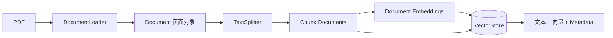
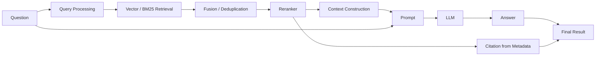
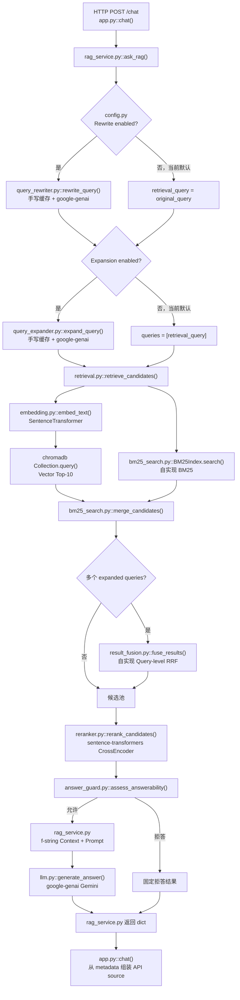
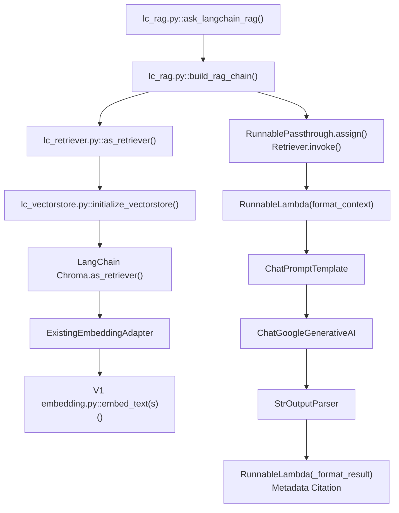
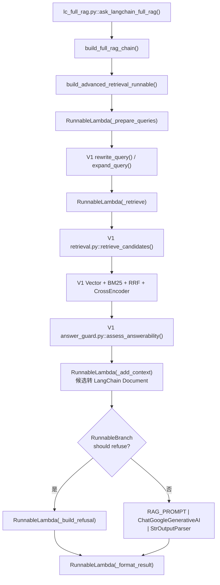
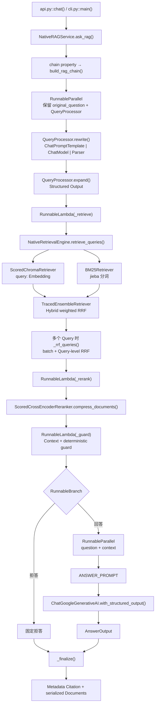

# RAG V1 / V2 / V3 三版本代码深度解析与初学者学习指南

> 审计基线：本文只依据当前工作区中的真实代码。分析对象是根目录 V1、`langchain_rag/` V2、`rag_langchain_native/` V3，以及只读测试集 `eval/test_case.json`。本文没有调用 Gemini、没有运行付费问答，也没有把“框架理论上支持”写成“项目已经实现”。

## 目录

1. [先建立 RAG 全局认识](#1-先建立-rag-全局认识)
2. [三套系统的真实边界与入口](#2-三套系统的真实边界与入口)
3. [V1、V2、V3 真实调用流程](#3-v1v2v3-真实调用流程)
4. [22 个关键方法逐个拆解](#4-22-个关键方法逐个拆解)
5. [用真实问题追踪完整数据流](#5-用真实问题追踪完整数据流)
6. [13 个关键 RAG 技术方案](#6-13-个关键-rag-技术方案)
7. [LangChain 核心原理](#7-langchain-核心原理)
8. [V1 / V2 / V3 逐项代码对比](#8-v1--v2--v3-逐项代码对比)
9. [LangChain 在本项目中的真实价值](#9-langchain-在本项目中的真实价值)
10. [三版本工程架构优劣](#10-三版本工程架构优劣)
11. [推荐阅读顺序与自测题](#11-推荐阅读顺序与自测题)

---

## 0. 先读结论：三个版本不是同一个服务的三次覆盖

当前仓库同时保留了三条不同的实现路径：

| 版本 | 定位 | 真正入口 | 关键事实 |
|---|---|---|---|
| V1 Manual RAG | 根目录手写业务，当前根 FastAPI 实际使用 | `app.py::chat()` → `rag_service.py::ask_rag()` | 手写 PDF、Chunk、BM25、RRF、多查询融合、Reranker 与流程控制 |
| V2 LangChain Wrapper | 实验性的 LangChain 包装与回归对照 | `langchain_rag/lc_rag.py::ask_langchain_rag()`；完整版本是 `lc_full_rag.py::ask_langchain_full_rag()` | 最小链使用 LangChain VectorStore；完整高级链的 Retrieval 仍调用 V1 函数 |
| V3 LangChain Native | 独立数据库、独立 API、LangChain-first 系统 | `rag_langchain_native/api.py::chat()` → `NativeRAGService.ask_rag()` | Ingestion、VectorStore、Retriever、Prompt、ChatModel、LCEL 均独立；少量自定义扩展保留调试分数与稳定去重 |

最容易误解的地方有四个：

1. 根目录 `app.py` 没有调用 V2 或 V3；它仍然 `from rag_service import ask_rag`。
2. V2 的 `lc_rag.py` 是一条纯向量最小 RAG 链；V2 的高级完整链在 `lc_full_rag.py`，后者导入了 V1 的 `retrieve_candidates()`、`rewrite_query()`、`expand_query()` 和 `assess_answerability()`。
3. V3 不是对 V1 `ask_rag()` 的 `RunnableLambda` 包装。它拥有自己的 Ingestion、Chroma、Embedding、BM25、Reranker、Query Processing、API 和 Evaluation。
4. V3 默认 `rewrite_enabled=False`、`expansion_enabled=False`；代码已经接入这些能力，不等于默认每次请求都会调用它们。

---

## 1. 先建立 RAG 全局认识

### 1.1 RAG 是什么

RAG（Retrieval-Augmented Generation，检索增强生成）可以理解为“先查资料，再让大模型根据资料回答”。它把两个能力分开：

- Retrieval 负责找对资料；
- Generation 负责把资料组织成自然语言答案。

这样做不是为了让模型凭空知道更多，而是把企业自己的、模型训练时未必见过的文档放进当前请求。

### 1.2 为什么有 Ingestion 和 Query 两个阶段

**Ingestion（知识库构建）**是离线或低频阶段：读取 PDF、切成 Chunk、计算文档向量、写入数据库。它通常只在文档新增或切分/Embedding 配置改变时执行。

**Query（在线问答）**是每个问题都执行的阶段：处理问题、计算 Query 向量、检索候选、重排、构造 Context、调用 LLM。

把两者分开后，无需每次提问都重新解析所有 PDF 和计算所有文档向量。

### 1.3 为什么 PDF 不能直接交给 LLM

技术上可以把小 PDF 的全文放进模型，但工程上通常不合适：

- 文档可能超过模型上下文窗口；
- 每次都传全文，延迟和费用高；
- 无关内容会干扰答案；
- 很难稳定定位页码和来源；
- 文档一多，无法把所有内容一次发送。

RAG 先选出少量相关 Chunk，只把它们作为 Context。

### 1.4 为什么要 Chunk

整份 PDF 的向量过于宽泛，无法精确代表某一条制度。Chunk 把长文档切成较小知识单元。Overlap 让相邻块共享一段文字，降低一句话刚好被边界切断的风险。

Chunk 太小会丢失上下文，太大则混入无关主题；Overlap 太小会断句，太大则产生重复候选。它们需要用 Retrieval Evaluation 验证，而不是凭感觉决定。

### 1.5 为什么需要 Embedding

Embedding 把文字转换为固定维度的浮点数向量。语义相近的 Query 与 Document 在向量空间中通常更接近，因此即便用词不完全相同也可能被找出。

数据类型可以记成：

```text
str → Embedding Model → list[float]
```

### 1.6 为什么 VectorStore 必须保存 Metadata

向量只适合计算相似度，不能告诉用户“答案来自哪一页”。因此每个 Chunk 要同时保存：

- 文本；
- 向量；
- `source`；
- `page`；
- `chunk_id` / `document_id`。

Metadata 还承担稳定去重、过滤、更新和 Citation 的职责。只保存文本或只按文本去重，都可能把不同页面的相同文字误认为同一个 Chunk。

### 1.7 为什么 Retrieval 后还需要 Reranker

Embedding 检索擅长从大量文档中快速找候选，但它通常分别编码 Query 和 Document。Cross-Encoder Reranker 把 `(Query, Document)` 一起输入模型，进行更细致的相关性判断，因此适合对 Top-N 小候选集重新排序。

Reranker 只能重排已有候选；正确文档没有进入候选池时，它无法凭空找回来。

### 1.8 为什么 LLM 必须接收 Context

模型要回答企业制度，就必须看到检索出的制度文本。Prompt 中的 Context 是当前回答可用的证据范围；Original Question 则告诉模型用户真正问的是什么。Rewrite/Expansion 只服务 Retrieval，不应偷偷替代用户原始问题。

### 1.9 为什么 Citation 必须来自真实 Metadata

LLM 输出的“第 2 页”只是字符串，可能编造。系统从真正检索到的 `Document.metadata` 生成 Citation，才能保证 Citation 至少指向真实候选。注意：这能验证“来源是否真实”，但仍需 Faithfulness Evaluation 判断答案内容是否真的被该 Chunk 支持。

### 1.10 为什么 Retrieval 和 Answer 要分开评估

- Retrieval Hit@K：正确 `expected_source + expected_page` 是否进入前 K 名；它诊断“资料找没找对”。
- Answer Correctness：最终答案是否表达正确内容；它诊断“资料有了以后是否答对”。
- Faithfulness：答案中的主张是否被 Context 支持；它诊断“有没有脱离证据”。
- Citation：返回的来源/页码是否正确。
- Refusal：该答时是否回答、不该答时是否拒绝。

若不分开，最终答案错时无法判断是召回失败还是生成失败。

### 图 1：完整 RAG 知识库构建流程



### 图 2：完整 RAG 问答流程



---

## 2. 三套系统的真实边界与入口

### 2.1 V1 的入口

- HTTP 入口：`app.py::chat()`（第 60–87 行）。
- RAG 入口：`rag_service.py::ask_rag()`（第 22–185 行）。
- CLI 式简单调用还存在于 `rag.py`，但生产 HTTP `/chat` 的真实路径是 `app.py`。
- Ingestion 入口：批量重建是 `ingest.py` 顶层脚本；上传增量入库走 `app.py::upload_document()` → `knowledge_service.py::add_pdf_to_knowledge()`。

### 2.2 V2 的入口

V2 没有接管根 `app.py`，也没有独立 FastAPI。它有两条不同用途的入口：

1. 纯向量学习链：`langchain_rag/lc_rag.py::ask_langchain_rag()`。
2. 高级完整链：`langchain_rag/lc_full_rag.py::ask_langchain_full_rag()`。

长期对比脚本 `eval/experiment_langchain_full.py` 实际调用第二条：Retrieval 对比在第 184 行调用 `retrieve_advanced()`，Answer 对比在第 627 行调用 `ask_langchain_full_rag()`。

当前仓库引用搜索没有发现 `ask_langchain_rag()` 被其他业务文件调用；因此最小纯向量链应视为保留的学习/库入口，而不是已部署主流程。高级完整链的实际调用者是 Benchmark，也没有接入根 FastAPI。

### 2.3 V3 的入口

- 独立 HTTP 入口：`rag_langchain_native/api.py::create_app()` 内的 `chat()`（第 44–49 行）。
- 独立 CLI：`rag_langchain_native/cli.py::main()`。
- 业务入口：`rag_langchain_native/chain.py::NativeRAGService.ask_rag()`。
- LCEL 构建入口：`NativeRAGService.build_rag_chain()`。
- Retrieval-only：`NativeRAGService.retrieve_only()`。
- Ingestion：`rag_langchain_native/ingestion.py::ingest_pdf()` 或 `rebuild_knowledge_base()`。

### 2.4 Evaluation 的边界

- 历史 V1 Retrieval Evaluation：`eval/retrieve_eval.py`，测试集路径准确为 `eval/test_case.json`。它调用 V1 `retrieve_candidates()`，只判断同一候选的 `source` 与 `page` 是否同时匹配。
- V1 Answer / End-to-End：`eval/answer_eval.py`、`eval/end_to_end_eval.py` 调用 `rag_service.ask_rag()`。
- V2 对照：`eval/experiment_langchain_full.py` 同时调用 V1 和 V2 公开入口。
- V3 Retrieval：`rag_langchain_native/eval/retrieval_eval.py` 调用 `NativeRAGService.retrieve_only()`。
- V3 Answer：`rag_langchain_native/eval/answer_eval.py` 调用 `NativeRAGService.ask_rag()`。
- V3 三版本汇总：`rag_langchain_native/eval/compare_versions.py` 读取历史 V1/V2 与 V3 结果；代码明确设置 `strictly_fair_comparison=False`，因为 V3 的 E5 前缀、归一化和 Chunk 边界与历史配置不同。

---

## 3. V1、V2、V3 真实调用流程

## 3.1 V1：根 FastAPI 当前实际执行链



分类：

- 普通 Python 流程控制：`rag_service.py`、`retrieval.py`。
- 自己实现的算法：固定窗口 Chunk、BM25、候选合并、RRF、阈值拒答。
- 第三方库：PyMuPDF、SentenceTransformers、ChromaDB、Google GenAI。
- 当前 FastAPI 默认行为：Hybrid 与 Reranker 为 `ask_rag()` 的默认参数 `True`；Rewrite 与 Expansion 在 `config.py` 中为 `False`。

### 3.1.1 V1 Ingestion 链


## 3.2 V2：两条 LangChain 路径必须分开理解

### 3.2.1 V2 最小纯向量链



这一条真正使用了 LangChain `Document`、`Chroma`、`Retriever`、LCEL、Prompt、ChatModel 和 OutputParser；但 Embedding 是 V1 函数的 Adapter。它只做 Vector Search，不包含高级 Hybrid/Reranker/Rewrite/Expansion。

### 3.2.2 V2 高级完整链（正式对比脚本所用）



客观结论：V2 的回答阶段与分支由 LCEL 真正编排；高级 Retrieval 本身仍是 V1 实现，只是放在 `RunnableLambda` 节点中。它没有直接调用 V1 的完整 `ask_rag()`，所以不是“整条旧链套一个壳”，但 Retrieval 算法没有迁移到 LangChain Retriever 体系。

## 3.3 V3：独立 LangChain Native 链

### 3.3.1 V3 Ingestion


### 3.3.2 V3 Query / Answer



这里“Native”不等于零自定义代码。`ScoredChromaRetriever`、`TracedEnsembleRetriever` 和 `ScoredCrossEncoderReranker` 都继承 LangChain 抽象，并添加项目需要的 distance、route rank、fusion score、rerank score。多 Query 结果的 `_rrf_queries()` 仍是自定义，因为简单 Union 无法保留项目需要的 RRF 排名与调试字段。

## 3.4 三版本并排对比图

```mermaid
flowchart LR
    subgraph V1["V1 Manual"]
        V1A[app.py / string] --> V1B[手写 Rewrite / Expansion]
        V1B --> V1C[raw Chroma + 自写 BM25 / RRF]
        V1C --> V1D[SentenceTransformers CrossEncoder]
        V1D --> V1E[f-string Context / Prompt]
        V1E --> V1F[google-genai]
        V1F --> V1G[dict + API source]
    end

    subgraph V2["V2 Wrapper"]
        V2A[ask_langchain_full_rag] --> V2B[RunnableLambda 包装 Query Processing]
        V2B --> V2C[RunnableLambda 调 V1 Retrieval]
        V2C --> V2D[V1 Reranker]
        V2D --> V2E[Runnable Context + ChatPromptTemplate]
        V2E --> V2F[ChatGoogleGenerativeAI + Parser]
        V2F --> V2G[RunnableBranch + Metadata source]
    end

    subgraph V3["V3 Native"]
        V3A[独立 API / CLI] --> V3B[RunnableParallel + QueryProcessor]
        V3B --> V3C[LC Chroma Retriever + BM25Retriever + Ensemble]
        V3C --> V3D[CrossEncoder Document Compressor]
        V3D --> V3E[Runnable Context + ChatPromptTemplate]
        V3E --> V3F[ChatGoogleGenerativeAI Structured Output]
        V3F --> V3G[RunnableBranch + Metadata Citation]
    end
```



| 阶段 | V1 | V2 高级链 | V3 |
|---|---|---|---|
| Input | 根 FastAPI Pydantic 请求 | Python 函数/Benchmark，无独立 API | 独立 FastAPI、CLI |
| Query Processing | 普通函数 + google-genai | `RunnableLambda` 内调用 V1 | 独立 `QueryProcessor`，Prompt/Model/Parser LCEL |
| Retrieval | raw Chroma + 自写 BM25 | 调 V1 Retrieval | LangChain Retriever + 必要扩展 |
| Reranking | SentenceTransformers `CrossEncoder` | 调 V1 Reranker | LangChain CrossEncoder compressor 子类 |
| Context | f-string 循环 | Python formatter 作为 Runnable 节点 | `Document` formatter 作为 Runnable 节点 |
| Prompt | 原始 f-string | `ChatPromptTemplate` | `ChatPromptTemplate` |
| LLM | Google GenAI Client | `ChatGoogleGenerativeAI` | `ChatGoogleGenerativeAI` + Structured Output |
| Output | 普通 dict；API 再组装 source | LCEL `_format_result()` | LCEL `_finalize()` + Metadata Citation |

---
## 4. 22 个关键方法逐个拆解

下面的方法覆盖三版中最值得对照阅读的路径。行号基于本文生成时的当前代码；若以后编辑源文件，应以函数名重新定位。

### 4.1 V1 `document_loader.load_pdf()`

**1. 实际文件位置**

`document_loader.py:6`，普通模块函数。

**2. 关键代码**

```python
doc = pymupdf.open(file_path)
for page_index, page in enumerate(doc):
    text = page.get_text("text", sort=True).strip()
    chunks = split_text(text, chunk_size, chunk_overlap)
    for chunk_id, chunk in enumerate(chunks):
        documents.append({
            "text": chunk,
            "source": filename,
            "page": page_index + 1,
            "chunk_id": chunk_id
        })
```

**3. 一句话解释**

它逐页读取 PDF，把每页切成文本块，并把页码与来源绑定到每个块。

**4. 输入是什么**

`file_path` 是 PDF 路径；`chunk_size`、`chunk_overlap` 默认来自根 `config.py`。例如 `load_pdf("data/pdf/travel_policy.pdf", 200, 30)`。

**5. 输出是什么**

`list[dict]`，每项形如 `{"text": "...", "source": "travel_policy.pdf", "page": 2, "chunk_id": 0}`。

**6. 方法内部做了什么**

打开 PDF → 枚举页面 → 提取并排序文本 → 跳过空页 → 调 `split_text()` → 生成从 1 开始的页码 → 关闭 PDF。

**7. 谁调用了它**

`ingest.py` 和 `knowledge_service.py::add_pdf_to_knowledge()`。

**8. 它调用了谁**

`pymupdf.open()`、Page 的 `get_text()`、同文件 `split_text()`。

**9. 为什么需要这个方法**

把“文件”转换成可向量化、可引用、可单独更新的知识单元。

**10. V1、V2、V3 的区别**

V1 直接用 PyMuPDF 并返回字典；V2 不重新切 PDF，而是从 V1 Chroma 复制已有 Chunk；V3 用 `PyMuPDFLoader` 返回标准 `Document`。

**11. 初学者知识点**

`enumerate()` 同时给出序号和值；`page_index + 1` 把底层 0-based 页码变成测试集使用的 1-based；`with` 未用于 PDF，因此代码显式 `doc.close()`。

### 4.2 V1 `document_loader.split_text()`

**1. 实际文件位置**

`document_loader.py:33`。

**2. 关键代码**

```python
chunks = []
start = 0
while start < len(text):
    end = min(start + chunk_size, len(text))
    chunk = text[start:end].strip()
    if chunk:
        chunks.append(chunk)
    start += chunk_size - overlap
```

**3. 一句话解释**

它用固定字符窗口切文本，并让相邻窗口保留重叠字符。

**4. 输入是什么**

`text: str`、`chunk_size: int`、`overlap: int`。

**5. 输出是什么**

`list[str]`，只包含非空 Chunk。

**6. 方法内部做了什么**

从索引 0 开始截取至 `start + chunk_size`，然后向前移动 `chunk_size - overlap`。

**7. 谁调用了它**

`load_pdf()`。

**8. 它调用了谁**

只使用 Python 的切片、`min()` 和 `strip()`。

**9. 为什么需要这个方法**

把长页面限制为适合检索与模型输入的小块。

**10. V1、V2、V3 的区别**

V1 是固定字符切片；V2 复用已经切好的结果；V3 使用 `RecursiveCharacterTextSplitter`，优先从段落、换行和中文标点处切。

**11. 初学者知识点**

`text[start:end]` 左闭右开；Overlap 通过缩短步长实现。配置必须保证 `overlap < chunk_size`，V1 此函数本身没有显式校验。

### 4.3 V1 `embedding.embed_text()` / `embed_texts()`

**1. 实际文件位置**

`embedding.py:5` 与 `embedding.py:8`。

**2. 关键代码**

```python
embedding_model = SentenceTransformer('intfloat/multilingual-e5-base')

def embed_text(text):
    return embedding_model.encode(text).tolist()

def embed_texts(texts: list[str]):
    return embedding_model.encode(texts).tolist()
```

**3. 一句话解释**

把一个字符串或一批字符串变成普通 Python 浮点列表。

**4. 输入是什么**

单条 `str` 或 `list[str]`。

**5. 输出是什么**

单条为 `list[float]`，批量为 `list[list[float]]`；当前模型维度为 768。

**6. 方法内部做了什么**

复用模块加载时创建的 `SentenceTransformer`，执行 `.encode()`，再把 NumPy 结果转成 list。

**7. 谁调用了它**

`retrieval.py` 调 `embed_text()`；`ingest.py` 与 `knowledge_service.py` 调 `embed_texts()`；V2 Adapter 也直接调用它们。

**8. 它调用了谁**

SentenceTransformers 的 `encode()`。

**9. 为什么需要这个方法**

保证入库文档和在线 Query 都能进入同一向量空间。

**10. V1、V2、V3 的区别**

V1/V2 把原始文本直接编码，没有显式 E5 `query:` / `passage:` 前缀，也没有显式归一化；V3 用独立 `HuggingFaceEmbeddings`，分别配置两种前缀并归一化。因此 V3 数据库不能与 V1/V2 向量作严格逐值比较。

**11. 初学者知识点**

模型对象在模块 import 时创建一次；`.tolist()` 解决 NumPy 类型不便 JSON/数据库接口直接使用的问题。

### 4.4 V1 `BM25Index.search()`

**1. 实际文件位置**

`bm25_search.py:90`，所属类 `BM25Index`。

**2. 关键代码**

```python
query_tokens = tokenize(query)
for index, term_frequency in enumerate(self.term_frequencies):
    score = 0.0
    for token in query_tokens:
        frequency = term_frequency.get(token, 0)
        if not frequency:
            continue
        idf = self.inverse_document_frequencies.get(token, 0)
        denominator = frequency + self.k1 * length_normalization
        score += idf * frequency * (self.k1 + 1) / denominator
```

**3. 一句话解释**

它根据关键词稀有程度、词频和文档长度给每个 Chunk 打分。

**4. 输入是什么**

`query` 字符串与 `top_k` 整数；索引数据已在构造函数中准备。

**5. 输出是什么**

按分数降序的 `list[dict]`，每项含 `document`、`metadata`、`bm25_score`。

**6. 方法内部做了什么**

分词 → 遍历文档词频 → 计算 BM25 → 丢弃 0 分文档 → 排序 → 取 Top-K。

**7. 谁调用了它**

`retrieval.py::_retrieve_candidate_pool()`。

**8. 它调用了谁**

同文件 `tokenize()`；索引通常由 `BM25Index.from_chroma()` 从 Chroma 文本创建。

**9. 为什么需要这个方法**

向量语义检索可能忽略精确数字、缩写或专有名词，BM25 提供关键词路线。

**10. V1、V2、V3 的区别**

V1 自写 BM25 和中文单字/双字分词；V2 完整链直接复用 V1；V3 用 LangChain `BM25Retriever.from_documents()` 和 `jieba` 预处理。

**11. 初学者知识点**

`self` 表示当前索引对象；构造函数先预计算词频和 IDF，搜索时避免重复做全部统计。

### 4.5 V1 `result_fusion.fuse_results()`

**1. 实际文件位置**

`result_fusion.py:7`。

**2. 关键代码**

```python
for query, candidates in zip(queries, result_sets):
    seen_in_query = set()
    for rank, candidate in enumerate(candidates, start=1):
        key = candidate_key(candidate)
        if key in seen_in_query:
            continue
        seen_in_query.add(key)
        fused["fusion_score"] += 1.0 / (rrf_k + rank)
        fused["matched_queries"].append(query)
```

**3. 一句话解释**

它将多个 Expansion Query 的候选按 RRF 累积分数合成一个无重复列表。

**4. 输入是什么**

`result_sets: list[list[dict]]`、相同长度的 `queries: list[str]`、默认 `rrf_k=60`。

**5. 输出是什么**

排序后的候选字典列表，增加 `fusion_score`、`matched_queries`、`query_ranks`。

**6. 方法内部做了什么**

用 `source + page + chunk_id` 形成 key → 每个 Query 内去重 → 累加 `1/(k+rank)` → 保留更小 distance 与更大 BM25 分 → 稳定排序。

**7. 谁调用了它**

`retrieval.py::retrieve_candidates()` 在 Query 数量大于 1 时调用。

**8. 它调用了谁**

`bm25_search.py::candidate_key()`。

**9. 为什么需要这个方法**

Expansion 会让同一 Chunk 被多条 Query 找到；不融合会重复占据候选位。

**10. V1、V2、V3 的区别**

V1 自写 Query-level RRF；V2 完整链复用它；V3 Hybrid route 使用 `EnsembleRetriever` 的 RRF思想，多 Query 层仍用自定义 `_rrf_queries()` 保存调试信息。

**11. 初学者知识点**

`dict` 适合按稳定 key 聚合；`set` 适合 O(1) 去重；`zip()` 按位置配对 Query 与结果集。

### 4.6 V1 `retrieval.retrieve_candidates()`

**1. 实际文件位置**

`retrieval.py:52`。

**2. 关键代码**

```python
queries = expanded_queries or [question]
queries = list(dict.fromkeys(queries))
if len(queries) == 1:
    candidates = _retrieve_candidate_pool(
        queries[0],
        collection,
        use_hybrid,
        bm25_index,
    )
else:
    result_sets = [
        _retrieve_candidate_pool(
            query,
            collection,
            use_hybrid,
            bm25_index,
        )
        for query in queries
    ]
    candidates = fuse_results(result_sets, queries)
    candidates = candidates[:RERANK_CANDIDATE_K]

if use_reranker:
    return rerank_candidates(question, candidates, top_n=final_top_k)
return candidates[:final_top_k]
```

**3. 一句话解释**

这是 V1 Retrieval 总控：为一条或多条 Query 获取 Vector/BM25 候选、融合，并可选重排。

**4. 输入是什么**

检索问题、Chroma collection、Hybrid/Reranker 开关、可复用 BM25 索引、最终 K、多条 Expansion Query。

**5. 输出是什么**

`list[dict]`；候选保持 `document`、`metadata`、`original_distance`、`bm25_score`、`fusion_score`、`rerank_score` 等字段绑定。

**6. 方法内部做了什么**

必要时建 BM25 索引 → Query 去重并确保原 Query 存在 → 单 Query 直接检索，多 Query 执行 RRF → Reranker 或截断。

**7. 谁调用了它**

V1 `rag_service.ask_rag()`、`eval/retrieve_eval.py`，以及 V2 `lc_full_rag._retrieve()`。

**8. 它调用了谁**

`_retrieve_candidate_pool()`、`BM25Index.from_chroma()`、`fuse_results()`、`rerank_candidates()`。

**9. 为什么需要这个方法**

给所有 Retrieval 实验与业务链提供一个统一入口。

**10. V1、V2、V3 的区别**

V1 用候选字典；V2 完整链不替换它；V3 用 `NativeRetrievalEngine` 和标准 `Document`，Retriever 支持 `.invoke()` / `.batch()`。

**11. 初学者知识点**

`expanded_queries=None` 表示可选参数；`dict.fromkeys()` 在现代 Python 中可保序去重；布尔开关决定不同算法分支。

### 4.7 V1 `reranker.rerank_candidates()`

**1. 实际文件位置**

`reranker.py:46`。

**2. 关键代码**

```python
pairs = [
    (question, candidate["document"])
    for candidate in candidates
]
scores = get_reranker().predict(pairs, show_progress_bar=False)
reranked = [
    {**candidate, "rerank_score": float(score)}
    for candidate, score in zip(candidates, scores)
]
reranked.sort(key=lambda candidate: candidate["rerank_score"], reverse=True)
```

**3. 一句话解释**

它让 Cross-Encoder 同时阅读问题和每个候选，再按新相关性分数排序。

**4. 输入是什么**

`question: str`、候选字典列表、`top_n`。

**5. 输出是什么**

Top-N 候选字典，每项新增 `rerank_score`；原 Metadata 与 distance 不丢失。

**6. 方法内部做了什么**

构造 `(question, document)` 对 → 批量预测 → 用字典展开复制原字段 → 排序 → 截断。

**7. 谁调用了它**

`retrieval.retrieve_candidates()`。

**8. 它调用了谁**

缓存的 `get_reranker()` 与 SentenceTransformers `CrossEncoder.predict()`。

**9. 为什么需要这个方法**

第一阶段追求 Recall，第二阶段用更贵但更精细的模型提高前几名排序。

**10. V1、V2、V3 的区别**

V1/V2 使用候选字典和直接 CrossEncoder；V3 通过 LangChain `CrossEncoderReranker`/document compressor 接口工作，并扩展为保存 score。

**11. 初学者知识点**

`{**candidate, ...}` 创建新字典；若分数与候选顺序错位，Metadata 会绑错，因此 `zip()` 的顺序一致性非常重要。

### 4.8 V1 `rag_service.ask_rag()`

**1. 实际文件位置**

`rag_service.py:22`，V1 核心业务入口。

**2. 关键代码**

```python
original_query = question
retrieval_query = rewrite_query(original_query) if QUERY_REWRITE_ENABLED else original_query
expanded_queries = expand_query(retrieval_query) if QUERY_EXPANSION_ENABLED else [retrieval_query]
candidates = retrieve_candidates(
    retrieval_query, collection,
    use_hybrid=use_hybrid,
    use_reranker=use_reranker,
    final_top_k=top_k,
    expanded_queries=expanded_queries if QUERY_EXPANSION_ENABLED else None,
)
```

**3. 一句话解释**

它手动串起 V1 的 Query Processing、Retrieval、拒答、Context、Prompt、Gemini 和结果字典。

**4. 输入是什么**

`question: str`，以及 Top-K、Hybrid、Reranker 开关。

**5. 输出是什么**

普通 `dict`，含 Query 调试字段、Answer、`refused`、documents/metadatas/各类 score 和 latency。

**6. 方法内部做了什么**

保留 original → 可选改写/扩展 → Retrieval → 拆出并行数组 → 阈值 Guard → 拒答或构造 f-string Prompt → Gemini → 汇总结果。

**7. 谁调用了它**

`app.py::chat()`、V1 Answer/End-to-End Evaluation、简单脚本 `rag.py`。

**8. 它调用了谁**

`rewrite_query()`、`expand_query()`、`retrieve_candidates()`、`assess_answerability()`、`generate_answer()`。

**9. 为什么需要这个方法**

它是 V1 所有子模块的业务编排层。

**10. V1、V2、V3 的区别**

V1 通过一整个 Python 函数顺序控制；V2 把阶段包装成 Runnable；V3 由 LCEL 组合多个明确节点，但节点内部仍可调用普通 Python 算法。

**11. 初学者知识点**

函数默认参数在定义时绑定；`zip(documents, metadatas, distances)` 依赖三个列表严格对齐；这也是 V3 更倾向用一个 `Document` 对象承载文本与 Metadata 的原因。

### 4.9 V1 `llm.generate_answer()`

**1. 实际文件位置**

`llm.py:6`。

**2. 关键代码**

```python
def generate_answer(prompt: str) -> str:
    response = client.models.generate_content(
        model=LLM_MODEL,
        contents=prompt
    )
    return response.text
```

**3. 一句话解释**

它把完整 Prompt 发给 Gemini，并返回纯文本。

**4. 输入是什么**

已经拼好的 `prompt: str`。

**5. 输出是什么**

`str`。

**6. 方法内部做了什么**

调用 Google GenAI Client 的 `generate_content()`，模型名来自根 `config.py`。

**7. 谁调用了它**

V1 `rag_service.ask_rag()`。

**8. 它调用了谁**

`google.genai.Client.models.generate_content()`。

**9. 为什么需要这个方法**

隔离 Gemini SDK 的最小调用点。

**10. V1、V2、V3 的区别**

V1 返回 `response.text`；V2/V3 用 `ChatGoogleGenerativeAI`，可接进 Runnable，V3 还优先请求 `AnswerOutput` 结构化结果。

**11. 初学者知识点**

这里不是异步函数，也没有流式输出；调用会阻塞到完整响应返回。

### 4.10 V2 `ExistingEmbeddingAdapter.embed_query()` / `embed_documents()`

**1. 实际文件位置**

`langchain_rag/lc_embedding.py:6`，类 `ExistingEmbeddingAdapter(Embeddings)`。

**2. 关键代码**

```python
class ExistingEmbeddingAdapter(Embeddings):
    def embed_query(self, text: str) -> list[float]:
        return embed_text(text)

    def embed_documents(self, texts: list[str]) -> list[list[float]]:
        return embed_texts(texts)
```

**3. 一句话解释**

它把 V1 两个函数适配成 LangChain 期望的 Embeddings 接口。

**4. 输入是什么**

Query 单字符串，或 Documents 字符串列表。

**5. 输出是什么**

LangChain 约定的单向量或向量列表。

**6. 方法内部做了什么**

没有新增算法，只委托给根 `embedding.py`。

**7. 谁调用了它**

`lc_vectorstore.py::get_vectorstore()` 创建 LangChain Chroma 时传入。

**8. 它调用了谁**

V1 `embed_text()`、`embed_texts()`。

**9. 为什么需要这个方法**

LangChain Chroma 需要一个实现 `Embeddings` 协议的对象，不能直接接收两个松散函数。

**10. V1、V2、V3 的区别**

这是典型“接口包装，没有改变模型行为”；V3 则独立创建 `HuggingFaceEmbeddings`，不依赖 V1。

**11. 初学者知识点**

继承 `Embeddings` 是面向接口编程；调用者只知道对象有这两个方法，不需要知道底层是 SentenceTransformers 还是其他模型。

### 4.11 V2 `lc_vectorstore.initialize_vectorstore()`

**1. 实际文件位置**

`langchain_rag/lc_vectorstore.py:99`。

**2. 关键代码**

```python
vectorstore = get_vectorstore()
source_documents, source_ids = load_source_documents()
existing_data = vectorstore.get(include=["documents", "metadatas"])
if not existing_data["ids"]:
    vectorstore.add_documents(documents=source_documents, ids=source_ids)
else:
    _validate_existing_collection(source_documents, source_ids, existing_data)
return vectorstore
```

**3. 一句话解释**

它只读 V1 Chroma 的文本与 Metadata，在独立 V2 Chroma 建立或验证一份内容一致的集合。

**4. 输入是什么**

无显式参数；路径与 collection 常量定义在同文件。

**5. 输出是什么**

`langchain_chroma.Chroma` 对象。

**6. 方法内部做了什么**

打开 V2 store → 读取 V1 records → 空库时加入 → 非空时严格核对 ID、文本、Metadata，差异时拒绝覆盖。

**7. 谁调用了它**

`lc_retriever.as_retriever()`、两个 similarity search helper。

**8. 它调用了谁**

`get_vectorstore()`、`load_source_documents()`、`_validate_existing_collection()`、LangChain `add_documents()`。

**9. 为什么需要这个方法**

让 V1/V2 纯向量对比时保持 Chunk、Metadata、ID 与 Embedding 行为一致，同时不写旧库。

**10. V1、V2、V3 的区别**

V1 直接重建根 Chroma；V2 从 V1 复制；V3 从原始 PDF 独立加载、切分、Embedding，写入 V3 runtime。

**11. 初学者知识点**

`@lru_cache` 用于复用 VectorStore 对象；“读取旧库再写独立库”与“直接复用旧 collection”不是一回事。

### 4.12 V2 `lc_rag.build_rag_chain()`

**1. 实际文件位置**

`langchain_rag/lc_rag.py:120`。

**2. 关键代码**

```python
retrieval_chain = RunnablePassthrough.assign(
    retrieved_documents=itemgetter("question") | retriever,
)
context_chain = retrieval_chain.assign(
    context=RunnableLambda(
        lambda values: format_context(values["retrieved_documents"])
    ),
)
answer_chain = context_chain.assign(
    answer=RAG_PROMPT | get_chat_model() | StrOutputParser(),
)
return answer_chain | RunnableLambda(_format_result)
```

**3. 一句话解释**

它用 LCEL 把纯向量 Retriever、Context、Prompt、Gemini 和结果格式化串起来。

**4. 输入是什么**

构建时输入 `top_k`；运行时 `.invoke()` 输入 `{"question": str}`。

**5. 输出是什么**

一个 `Runnable`；运行结果是含 question、answer、sources、documents、context 的 dict。

**6. 方法内部做了什么**

保留原字典 → 抽出 question 给 Retriever → 添加 documents → 添加 context → 生成 answer → 格式化。

**7. 谁调用了它**

`ask_langchain_rag()`。

**8. 它调用了谁**

`as_retriever()`、`format_context()`、`RAG_PROMPT`、`get_chat_model()`、`StrOutputParser`、`_format_result()`。

**9. 为什么需要这个方法**

展示 LangChain 真正的流程组合，而不是一个大函数内部手动顺序调用。

**10. V1、V2、V3 的区别**

比 V1 更框架化，但只含 Vector Search；V3 将 Hybrid、多 Query、Reranker、Guard 和分支也放入主 Runnable 图。

**11. 初学者知识点**

`itemgetter("question") | retriever` 表示先从 dict 取值，再把字符串交给 Retriever；`assign()` 在保留旧字段的同时新增字段。

### 4.13 V2 `lc_full_rag.build_full_rag_chain()`

**1. 实际文件位置**

`langchain_rag/lc_full_rag.py:304`。

**2. 关键代码**

```python
answer_runnable = (
    RAG_PROMPT
    | get_chat_model()
    | StrOutputParser()
    | RunnableLambda(strip_model_citations)
)
return (
    retrieval_runnable
    | RunnableBranch(
        (_should_refuse, RunnableLambda(_build_refusal)),
        generation_runnable,
    )
    | RunnableLambda(_format_result)
)
```

**3. 一句话解释**

它用 LCEL 编排 V2 高级检索、拒答分支、生成与结果格式化。

**4. 输入是什么**

构建参数含最终 K 与各开关；运行时是 `{"question": ..., "_request_started_at": ...}`。

**5. 输出是什么**

`Runnable`；`.invoke()` 返回兼容 V1 Evaluation 的结果 dict。

**6. 方法内部做了什么**

先构造 Retrieval Runnable → 构造 Prompt/Model/Parser → 构造 generation 子链 → 用 `RunnableBranch` 在拒答和生成间选择 → 格式化。

**7. 谁调用了它**

`ask_langchain_full_rag()`，后者被 `eval/experiment_langchain_full.py` 调用。

**8. 它调用了谁**

`build_advanced_retrieval_runnable()`、`get_chat_model()`、多个格式化辅助函数。

**9. 为什么需要这个方法**

让 V2 在保持 V1 算法的同时验证 LCEL 编排能否维持同样的业务契约。

**10. V1、V2、V3 的区别**

V2 这里真正使用 LCEL，但 `build_advanced_retrieval_runnable()` 内部最终仍调用 V1 `retrieve_candidates()`；V3 的 Retriever 本身也进入 LangChain 抽象。

**11. 初学者知识点**

`RunnableBranch((predicate, branch), default)` 类似 `if/else`；`strip_model_citations` 删除模型自己写的来源行，以 Metadata 为准。

### 4.14 V3 `ingestion.load_pdf_pages()` / `split_pages()`

**1. 实际文件位置**

`rag_langchain_native/ingestion.py:22` 与 `:39`。

**2. 关键代码**

```python
pages = PyMuPDFLoader(str(path), mode="page").load()
metadata.update(source=path.name, page=zero_based_page + 1)

splitter = RecursiveCharacterTextSplitter(
    chunk_size=settings.chunk_size,
    chunk_overlap=settings.chunk_overlap,
    separators=["\n\n", "\n", "。", "；", "，", " ", ""],
)
page_chunks = splitter.split_documents([page])
```

**3. 一句话解释**

它用 LangChain Loader 产生页面 Document，再用 TextSplitter 产生保留 Metadata 的 Chunk Document。

**4. 输入是什么**

PDF 路径；或 `list[Document]` 加 V3 `Settings`。

**5. 输出是什么**

页面或 Chunk 的 `list[Document]`；Chunk Metadata 增加 `chunk_id` 与稳定 `document_id`。

**6. 方法内部做了什么**

Loader 读取 → 页码加 1 → 每页单独递归切分 → SHA-256 的前 24 位生成稳定 ID → 创建新 Document。

**7. 谁调用了它**

`ingest_pdf()` 调二者；`rebuild_knowledge_base()` 调 `ingest_pdf()`。

**8. 它调用了谁**

`PyMuPDFLoader.load()`、`RecursiveCharacterTextSplitter.split_documents()`、`_stable_id()`。

**9. 为什么需要这个方法**

建立 V3 独立、可重复构建、可引用且与测试页码一致的数据。

**10. V1、V2、V3 的区别**

V1 输出字典并固定截字符；V2 不做 Ingestion；V3 输出 LangChain Document 并优先按语义边界切。

**11. 初学者知识点**

`Document` 把 `page_content` 与 `metadata` 绑在同一对象；`dict(page.metadata)` 是复制，避免直接污染 Loader 原对象。

### 4.15 V3 `embedding.get_embeddings()`

**1. 实际文件位置**

`rag_langchain_native/embedding.py:40`。

**2. 关键代码**

```python
return HuggingFaceEmbeddings(
    model=model_name,
    encode_kwargs={
        "normalize_embeddings": normalize,
        "prompt": document_prefix,
    },
    query_encode_kwargs={
        "normalize_embeddings": normalize,
        "prompt": query_prefix,
    },
)
```

**3. 一句话解释**

它创建一个能区分 Query 编码和 Document 编码的 LangChain Embeddings 对象。

**4. 输入是什么**

V3 `Settings`，包含模型名、设备、batch、normalize 与前缀。

**5. 输出是什么**

`HuggingFaceEmbeddings`，提供 `embed_query()` 与 `embed_documents()`。

**6. 方法内部做了什么**

创建 V3 cache 目录 → 调被 `lru_cache` 缓存的工厂 → 为文档设置 `passage: `，为 Query 设置 `query: `。

**7. 谁调用了它**

`vectorstore.create_vectorstore()`。

**8. 它调用了谁**

`_cached_embeddings()` 与 LangChain HuggingFace 集成。

**9. 为什么需要这个方法**

E5 的训练规范区分 Query/Passage；接口分离能防止误用同一前缀。

**10. V1、V2、V3 的区别**

V1/V2 raw encode；V3 正确应用 E5 前缀并归一化。这是配置改进，但也使三版不是相同向量实验。

**11. 初学者知识点**

`@lru_cache(maxsize=2)` 按参数缓存模型对象，避免每次请求重新加载几百 MB 模型。

### 4.16 V3 `vectorstore.create_vectorstore()` / `as_retriever()`

**1. 实际文件位置**

`rag_langchain_native/vectorstore.py:14` 与 `:24`。

**2. 关键代码**

```python
store = Chroma(
    collection_name=settings.collection_name,
    embedding_function=get_embeddings(settings),
    persist_directory=str(settings.chroma_dir),
    collection_metadata={"hnsw:space": "cosine", "owner": "v3"},
)
retriever = store.as_retriever(
    search_type="similarity", search_kwargs={"k": top_k}
)
```

**3. 一句话解释**

前者创建独立 LangChain Chroma，后者把 VectorStore 转成统一 Retriever 接口。

**4. 输入是什么**

V3 Settings；`as_retriever()` 还接收 store 和 Top-K。

**5. 输出是什么**

`Chroma` 或 `VectorStoreRetriever`。

**6. 方法内部做了什么**

确保 runtime 目录 → 绑定 collection、Embedding、cosine 距离 → Retriever 封装查询参数。

**7. 谁调用了它**

Ingestion 与 `NativeRAGService.__init__()` 创建 store；当前高级检索为保存 distance 使用自定义 `ScoredChromaRetriever`，而 `as_retriever()` 是可用的标准入口。

**8. 它调用了谁**

LangChain `Chroma()`、`Chroma.as_retriever()`。

**9. 为什么需要这个方法**

VectorStore 管存储细节；Retriever 向上层提供“Query → Documents”的统一契约。

**10. V1、V2、V3 的区别**

V1 调 raw collection API；V2 用 LangChain Chroma 但 Embedding 适配 V1；V3 的 store 与 Embedding、数据路径都独立。

**11. 初学者知识点**

`similarity_search()` 是 VectorStore 方法；`retriever.invoke(query)` 是 Runnable/Retriever 统一调用方式。二者能找相同文档，但抽象层不同。

### 4.17 V3 `NativeRetrievalEngine.retrieve_queries()`

**1. 实际文件位置**

`rag_langchain_native/retrieval.py:210`，所属类 `NativeRetrievalEngine`。

**2. 关键代码**

```python
unique_queries = list(dict.fromkeys(
    query.strip() for query in queries if query.strip()
))
result_sets = self.base_retriever.batch(unique_queries)
if len(unique_queries) == 1:
    return list(result_sets[0])[: self.settings.candidate_k]
fused = _rrf_queries(result_sets, unique_queries, self.settings.rrf_k)
return fused[: self.settings.candidate_k]
```

**3. 一句话解释**

它批量执行一条或多条 Retrieval Query，并在多 Query 时进行第二层 RRF。

**4. 输入是什么**

`queries: list[str]`，通常来自 QueryProcessor 的 `expanded_queries`。

**5. 输出是什么**

候选 `list[Document]`，Metadata 含 retrieval route、rank、fusion、matched query 等调试信息。

**6. 方法内部做了什么**

去空/去重 → `base_retriever.batch()` → 单 Query 直接截断 → 多 Query 按稳定 Document ID 融合 → 截取 candidate K。

**7. 谁调用了它**

`NativeRAGService._retrieve()` 和 `retrieve_only()`。

**8. 它调用了谁**

`TracedEnsembleRetriever` 或单路 Retriever 的 `.batch()`，以及自定义 `_rrf_queries()`。

**9. 为什么需要这个方法**

Query Expansion 要对多个表达执行相同 Retrieval，并统一候选池后再 Rerank。

**10. V1、V2、V3 的区别**

V1 用列表推导逐条调用；V2 复用 V1；V3 使用 Retriever 的批量接口，但 Query-level RRF 仍是项目自定义。

**11. 初学者知识点**

`.batch(list_of_inputs)` 的输出与输入位置一一对应；它提供统一批处理能力，但不保证所有底层组件都真正并行，具体并发由 Runnable 实现与配置决定。

### 4.18 V3 `TracedEnsembleRetriever.weighted_reciprocal_rank()`

**1. 实际文件位置**

`rag_langchain_native/retrieval.py:67`，继承 `EnsembleRetriever`。

**2. 关键代码**

```python
for index, (documents, weight) in enumerate(zip(doc_lists, self.weights, strict=True)):
    for rank, document in enumerate(documents, start=1):
        key = document_key(document)
        scores[key] += float(weight) / (rank + self.c)
        matched_routes[key].append(route)
        route_ranks[key][route] = rank

for key in sorted(scores, key=scores.get, reverse=True):
    document = first_seen[key]
    document.metadata.update(
        fusion_score=scores[key],
        matched_retrievers=matched_routes[key],
        retriever_ranks=route_ranks[key],
    )
```

**3. 一句话解释**

它沿用 EnsembleRetriever 的 RRF 角色，并把融合过程的可观察信息写回 Metadata。

**4. 输入是什么**

Vector 与 BM25 等多个 Retriever 返回的 `list[list[Document]]`。

**5. 输出是什么**

按加权 RRF 排序且稳定去重的 `list[Document]`。

**6. 方法内部做了什么**

验证路线与权重数量 → 每条路线内去重 → 按 `weight/(rank+c)` 累加 → 合并 Metadata → 排序。

**7. 谁调用了它**

基类 `EnsembleRetriever.invoke()` / `.batch()` 在融合阶段调用；Engine 把它设为 `base_retriever`。

**8. 它调用了谁**

`document_key()`、`clone_document()`。

**9. 为什么需要这个方法**

原生 Ensemble 能融合，但项目 Evaluation 还需要知道候选来自哪条路线、各自排名和 fusion score。

**10. V1、V2、V3 的区别**

V1 `merge_candidates()` 对单 Query Vector/BM25 主要按出现顺序合并，并非 route-level RRF；多 Query 才由 `fuse_results()` RRF。V3 在 Vector/BM25 层明确使用加权 RRF，再在多 Query 层执行另一层 RRF。

**11. 初学者知识点**

“继承后覆盖方法”是在保留框架生命周期的同时定制算法输出；`strict=True` 会在 zip 长度不一致时抛错，避免静默丢数据。

### 4.19 V3 `ScoredCrossEncoderReranker.compress_documents()`

**1. 实际文件位置**

`rag_langchain_native/reranker.py:18`，继承 `CrossEncoderReranker`。

**2. 关键代码**

```python
scores = self.model.score(
    [(query, document.page_content) for document in documents]
)
for document, score in zip(documents, scores, strict=True):
    copied = clone_document(document)
    copied.metadata["rerank_score"] = float(score)
    scored.append((copied, float(score)))
scored.sort(key=operator.itemgetter(1), reverse=True)
return [document for document, _ in scored[: self.top_n]]
```

**3. 一句话解释**

它使用 LangChain Cross-Encoder compressor 重排 Document，并保留分数。

**4. 输入是什么**

`documents: Sequence[Document]`、`query: str`、可选 callbacks。

**5. 输出是什么**

Top-N `Sequence[Document]`，每个 Document 的 Metadata 多一个 `rerank_score`。

**6. 方法内部做了什么**

建立 Query/Content pairs → 本地模型评分 → 克隆 Document → 写 score → 排序截断。

**7. 谁调用了它**

`rerank_documents()`，再由 `NativeRAGService._rerank()` / `retrieve_only()` 调用。

**8. 它调用了谁**

LangChain `HuggingFaceCrossEncoder.score()` 与 `clone_document()`。

**9. 为什么需要这个方法**

框架原生 compressor 满足重排，但默认接口未必暴露项目所需 score，所以做最小扩展。

**10. V1、V2、V3 的区别**

数学目标相近；V1 直接操作候选 dict，V3 遵循 Document Compressor 接口。LangChain 没有自动让同一模型更准确。

**11. 初学者知识点**

`Sequence` 比 `list` 更宽泛；复制 Document 避免无意修改共享候选对象。

### 4.20 V3 `QueryProcessor.rewrite()` / `expand()` / `process()`

**1. 实际文件位置**

`rag_langchain_native/query_processing.py:124`、`:141`、`:167`。

**2. 关键代码**

```python
chain = REWRITE_PROMPT | self._require_model() | StrOutputParser()
rewritten = chain.invoke({"question": question}).strip()

structured_model = self._require_model().with_structured_output(ExpansionOutput)
chain = EXPANSION_PROMPT | structured_model
output = chain.invoke({"query": query, "count": self.settings.expansion_count})

retrieval_query, rewrite_failed = self.rewrite(original)
expanded_queries, expansion_failed = self.expand(retrieval_query)
```

**3. 一句话解释**

它保留 Original Question，按开关执行 Rewrite 和 Expansion，并提供独立 Cache 与失败回退。

**4. 输入是什么**

`question: str`；构造器还接收 ChatModel/Runnable 与 Settings。

**5. 输出是什么**

`dict`：`retrieval_query`、`expanded_queries`、`rewrite_failed`、`expansion_failed`。

**6. 方法内部做了什么**

开关关闭则原样返回 → 开启先查 JSON cache → 限流 → 调 LCEL → 写 cache → 失败回退原 Query。

**7. 谁调用了它**

`as_runnable()` 被 V3 主链使用；`retrieve_only()` 直接调用 `process()`。

**8. 它调用了谁**

`ChatPromptTemplate`、ChatModel、`StrOutputParser` 或 Structured Output、`JsonCache`、`RequestThrottle`。

**9. 为什么需要这个方法**

让口语问题更适合检索，并通过多表达提升 Recall，同时不让 LLM 故障拖垮整个 RAG。

**10. V1、V2、V3 的区别**

V1 用 google-genai 与手写 JSON parsing/cache；V2 完整链直接调用 V1；V3 使用 ChatModel/Prompt/Parser 的 LCEL，Cache 仍由项目自己维护。

**11. 初学者知识点**

返回 `tuple[str, bool]` 同时表达值与失败状态；Pydantic `ExpansionOutput` 约束模型输出结构；`except Exception` 在这里是有意的容错边界，但会牺牲错误细节，需要调试字段补偿。

### 4.21 V3 `NativeRAGService.build_rag_chain()`

**1. 实际文件位置**

`rag_langchain_native/chain.py:235`。

**2. 关键代码**

```python
query_stage = RunnableParallel(
    original_question=RunnablePassthrough(),
    query_processing=processor.as_runnable(),
) | RunnableLambda(self._merge_query_state)

return (
    RunnableLambda(lambda question: str(question).strip())
    | query_stage
    | RunnableLambda(self._retrieve)
    | RunnableLambda(self._rerank)
    | RunnableLambda(self._guard)
    | RunnableBranch((lambda state: state["refused"], refusal), success)
)
```

**3. 一句话解释**

这是 V3 的 LCEL 主图：它显式连接 Query Processing、Retrieval、Rerank、Guard、生成/拒答分支与最终结果。

**4. 输入是什么**

构建时使用 Service 中已注入的 Settings、VectorStore、模型和 Reranker；运行时输入一个 Question 字符串。

**5. 输出是什么**

`Runnable`；最终 `.invoke()` 返回 V3 结构化 dict。

**6. 方法内部做了什么**

清理输入 → Parallel 同时保留原问题并处理 Query → 依次检索/重排/Guard → Branch → Structured Answer 或固定拒答 → Metadata Citation。

**7. 谁调用了它**

`chain` property 首次访问时调用；`ask_rag()`、`aask_rag()`、`batch_ask()` 使用缓存后的链。

**8. 它调用了谁**

QueryProcessor、Engine、Reranker、Prompt、ChatModel、Pydantic Structured Output、多个 helper。

**9. 为什么需要这个方法**

它让主流程成为可组合、可 invoke/batch/ainvoke 的对象，而不是只能调用一个固定同步大函数。

**10. V1、V2、V3 的区别**

V1 是普通函数总控；V2 高级 Retrieval 仍封装 V1；V3 每个主要阶段由自己的组件提供，LCEL 负责主流程。

**11. 初学者知识点**

`@property` 让 `service.chain` 看似字段、实际执行方法；懒加载避免初始化时就要求 Gemini Key；`RunnablePassthrough.assign()` 保留状态并新增字段。

### 4.22 V3 `ask_rag()` / `aask_rag()` / `batch_ask()`

**1. 实际文件位置**

`rag_langchain_native/chain.py:292`、`:295`、`:298`。

**2. 关键代码**

```python
def ask_rag(self, question: str) -> dict:
    return self.chain.invoke(question)

async def aask_rag(self, question: str) -> dict:
    return await self.chain.ainvoke(question)

def batch_ask(self, questions: list[str]) -> list[dict]:
    return self.chain.batch(questions)
```

**3. 一句话解释**

三个方法用同一条 Chain 暴露同步、异步和批量执行方式。

**4. 输入是什么**

单个 `str` 或 `list[str]`。

**5. 输出是什么**

单个结果 `dict`，或与输入顺序对应的 `list[dict]`。

**6. 方法内部做了什么**

本身不重复业务逻辑，只选择 Runnable 的执行协议。

**7. 谁调用了它**

API `/chat` 和 CLI `ask` 用同步方法；测试覆盖了 `aask_rag()`；Evaluation 用同步方法。

**8. 它调用了谁**

缓存的 `self.chain` 上的 `.invoke()`、`.ainvoke()`、`.batch()`。

**9. 为什么需要这个方法**

为上层隐藏 LCEL 图细节，并提供稳定业务 API。

**10. V1、V2、V3 的区别**

V1 只有同步普通函数；V2 公开入口只调用 `.invoke()`；V3 明确暴露三种模式。当前 FastAPI `/chat` 仍是同步 `def`，所以 V3 的异步优势尚未完全用于 HTTP 主链。

**11. 初学者知识点**

`async def` 返回协程，必须 `await`；`.batch()` 不等于一次 LLM 请求，它是统一批量调度接口；当前代码没有业务级 `.stream()` 或 SSE 路由。

---

## 5. 用真实问题追踪完整数据流

本节选择测试集 `eval/test_case.json` 中真实存在的 Q001：

```json
{
  "id": "Q001",
  "question": "国内常规出差最迟需要提前多久提交申请？",
  "expected_answer": "提前2个工作日",
  "expected_source": "travel_policy.pdf",
  "expected_page": 2,
  "should_answer": true
}
```

下面是**静态调用追踪**，不调用 Gemini。检索示例中引用的排名来自仓库已有结果文件；它不是本轮重新运行的结果。模型最终措辞仅给出数据结构，不编造本次 Answer。

### 5.1 Step 1：用户输入

三版最初输入都是：

```text
str: "国内常规出差最迟需要提前多久提交申请？"
```

- V1 HTTP：Pydantic `QuestionRequest` → `app.py::chat()` → `rag_service.ask_rag(str)`。
- V2：对比脚本直接调用 `ask_langchain_full_rag(str)`；它没有接入根 `/chat`。
- V3 HTTP：Pydantic `QueryRequest` → `api.py::chat()` → `NativeRAGService.ask_rag(str)`。

### 5.2 Step 2：Query Processing

当前根 `config.py` 与 V3 `DEFAULT_SETTINGS` 都把 Rewrite、Expansion 默认设为 False，所以默认真实数据是：

```text
str original_question
→ Query Processing
→ {
     retrieval_query: 同一个 str,
     expanded_queries: [同一个 str]
   }
```

具体调用：

- V1：`rag_service.ask_rag()` 中的条件表达式。
- V2 高级链：`RunnableLambda(_prepare_queries)`；关闭时原样传递。
- V3：`RunnableParallel` 调 `QueryProcessor.process()`；关闭时 `rewrite()` 返回 `(question, False)`，`expand()` 返回 `([query], False)`。

如果以后开启，Rewrite/Expansion 的实际结果要以 Cache 或 Gemini 返回为准。本文不会为 Q001 编造一条“真实改写”。

### 5.3 Step 3：Embedding

#### V1 / V2 高级链

```text
str
→ embedding.py::embed_text()
→ list[float]，768 维
```

V1 直接编码原始字符串。V2 高级链调用 V1 Retrieval，因此相同；V2 最小纯向量链的 `ExistingEmbeddingAdapter.embed_query()` 最终也委托同一个 V1 函数。

#### V3

```text
str
→ HuggingFaceEmbeddings.embed_query()
→ 内部加 query: 前缀并归一化
→ list[float]，768 维
```

这里模型名称仍是 `intfloat/multilingual-e5-base`，但编码规范和 V1/V2 不同，因此向量值与距离不可直接视为同一个实验。

### 5.4 Step 4：Retrieval

#### V1

```text
str + raw Chroma Collection
→ retrieval.retrieve_candidates()
→ list[dict candidate]
```

已有 `eval/results/retrieve_baseline.json` 中 Q001 的 Vector baseline Top-1 是：

```json
{
  "source": "travel_policy.pdf",
  "page": 2,
  "chunk_id": 0,
  "original_distance": 0.23155556619167328
}
```

注意该文件代表保存时的 baseline 配置，不应被误写成本轮实时输出。

#### V2 高级链

```text
dict state
→ lc_full_rag._retrieve()
→ V1 retrieve_candidates()
→ dict state + candidates
```

已有 `eval/results/langchain_full_benchmark.json` 记录 Q001 在 V1 与 V2 的高级 Retrieval 都命中 rank 1，候选顺序一致。这是合理结果，因为 V2 高级链本来就复用了 V1 检索函数与数据库，而不是 LangChain 算法自动“变准”。

#### V3

```text
list[str]
→ NativeRetrievalEngine.retrieve_queries()
→ base_retriever.batch()
→ list[Document]
```

已有 `rag_langchain_native/eval/results/retrieval_benchmark.json` 中 Q001 的前三名摘要为：

| Rank | Source | Page | Chunk | Vector distance | Fusion score | Rerank score |
|---:|---|---:|---:|---:|---:|---:|
| 1 | `travel_policy.pdf` | 2 | 0 | 0.111431 | 0.016261 | 3.774189 |
| 2 | `travel_policy.pdf` | 2 | 1 | 0.116159 | 0.016261 | 0.668036 |
| 3 | `employee_handbook.pdf` | 4 | 2 | 0.132490 | 0.015749 | -1.218731 |

Top-1 的 Metadata 还记录了：

```json
{
  "document_id": "df69081c4207028937104218",
  "matched_retrievers": ["vector", "bm25"],
  "matched_queries": ["国内常规出差最迟需要提前多久提交申请？"]
}
```

### 5.5 Step 5：Reranker

- V1：`list[dict]` → `rerank_candidates(question, candidates)` → `list[dict]`。
- V2：V1 的同一函数在 `retrieve_candidates()` 内执行。
- V3：`list[Document]` → `ScoredCrossEncoderReranker.compress_documents()` → `list[Document]`。

三版都把 Query 和每个 Chunk 组成 pair。区别在于 V1 候选字段散在 dict 中，V3 把 `rerank_score` 写入该 Document 的 Metadata，文本与来源仍在同一个对象上。

### 5.6 Step 6：Context

V1 构造字符串：

```text
list[dict/string/metadata]
→ rag_service.py 中的 for + f-string
→ str context
```

V2 高级链：

```text
list[candidate dict]
→ format_candidate_context()
→ str context
```

V3：

```text
list[Document]
→ chain.py::format_context()
→ str context
```

其片段形式为：

```text
[Source: travel_policy.pdf, Page: 2, Chunk: 0]
2. 出差申请与审批……国内出差原则上应至少提前2个工作日提交……
```

### 5.7 Step 7：Prompt

- V1 在 `rag_service.py:125` 用一个大 f-string，把 Context 与 `original_query` 插入。
- V2 用 `langchain_rag/lc_rag.py::RAG_PROMPT` 的 `ChatPromptTemplate`。
- V3 用 `rag_langchain_native/chain.py::ANSWER_PROMPT`，Human message 明确传入 Original Question 和 Retrieved Context。

V3 数据流是：

```text
{question: str, context: str}
→ ChatPromptTemplate
→ ChatPromptValue / messages
```

### 5.8 Step 8：Gemini

本轮未调用模型。代码层的数据类型是：

- V1：`str prompt` → google-genai → `str response.text`。
- V2：PromptValue → `ChatGoogleGenerativeAI` → AIMessage → `StrOutputParser` → `str`。
- V3：PromptValue → `ChatGoogleGenerativeAI.with_structured_output(AnswerOutput)` → `AnswerOutput(answer, refused, refusal_reason)`；测试 Fake Model 不支持 structured output 时才走 `StrOutputParser` fallback。

不能把期望答案“提前2个工作日”说成本轮 Gemini 的实际输出；它只是测试集 Ground Truth。

### 5.9 Step 9：Citation

- V1 `rag_service` 返回平行的 `documents` / `metadatas`，`app.py::chat()` 再从 Metadata 组装 `source`。
- V2 `_format_result()` 调 `build_sources(candidates)`，按 `source + page + chunk_id` 去重；还会去掉 LLM 自写 Citation 行。
- V3 `_finalize()` 调 `build_citations(documents)`，直接从 `Document.metadata` 读取同一三元组。

因此 Citation 链的关键不是让 LLM“记住页码”，而是保证 Metadata 从 Ingestion 到 Reranker 始终跟随正确文本。

### 5.10 Step 10：最终返回

V1 `rag_service.ask_rag()` 的核心结构：

```python
{
    "answer": str,
    "refused": bool,
    "documents": list[str],
    "metadatas": list[dict],
    "distances": list[float | None],
    ...
}
```

根 API 再映射成 `QuestionResponse` 的 `source` 数组。

V2 高级链返回与旧 Evaluation 兼容的 dict，还增加 `sources`、`retrieved_documents` 与 `context`。

V3 返回：

```python
{
    "question": str,
    "original_query": str,
    "retrieval_query": str,
    "expanded_queries": list[str],
    "answer": str,
    "refused": bool,
    "refusal_reason": str | None,
    "sources": list[dict],
    "documents": list[dict],
    "retrieved_context": str,
    "retrieval_latency_ms": float,
}
```

---

## 6. 13 个关键 RAG 技术方案

每节按相同问题讲：解决什么、不用会怎样、原理与例子、三版实现、是否原生、优缺点、代码位置。

### 6.1 PDF Loader

1. **解决问题**：把二进制 PDF 变成按页文本和 Metadata。
2. **不采用**：后续 TextSplitter 与 Embedding 没有可处理的字符串，也无法知道页码。
3. **原理**：PDF parser 遍历页面并提取布局中的文本对象；Loader 再包装成统一对象。
4. **例子**：`travel_policy.pdf` 第 2 页变成一份文本和 `page=2`。
5. **V1**：`document_loader.load_pdf()` 直接调用 `pymupdf.open()`。
6. **V2**：不重新加载 PDF；`lc_vectorstore.load_source_documents()` 从 V1 Chroma 读取已经生成的 Chunk。
7. **V3**：`ingestion.load_pdf_pages()` 用 LangChain `PyMuPDFLoader(mode="page")`。
8. **V3 是否原生**：是，Loader 与 `Document` 是 LangChain 生态能力；页码修正和 source 规范化仍是业务代码。
9. **优缺点**：V1 直观、依赖少；V3 接口统一、Metadata 自动随 Document 走，但多一层抽象。
10. **代码位置**：`document_loader.py:6`、`langchain_rag/lc_vectorstore.py:19`、`rag_langchain_native/ingestion.py:22`。

PyMuPDF 是底层 PDF 解析库；`PyMuPDFLoader` 是 LangChain 对它的 Loader 包装，不是另一种 PDF 引擎。

### 6.2 Chunking

1. **解决问题**：把长页面拆成主题更集中的检索单位。
2. **不采用**：整页/整文档向量过于宽泛，Context 也更容易超长。
3. **原理**：按最大长度切分，相邻块使用 Overlap 保留边界上下文。
4. **例子**：200 字窗口、30 字 overlap，步长约 170 字。
5. **V1**：`split_text()` 固定字符切片。
6. **V2**：直接复制 V1 Chunk，不切分。
7. **V3**：`RecursiveCharacterTextSplitter` 按段落、换行、中文标点逐级寻找切点。
8. **V3 是否原生**：是，切分算法来自 `langchain-text-splitters`；稳定 ID 是自定义。
9. **优缺点**：固定窗口可预测、易复现；Recursive 语义边界更自然，但即使 size/overlap 相同，Chunk 内容也不一定与 V1 一致。
10. **代码位置**：`document_loader.py:33`、`rag_langchain_native/ingestion.py:39`。

### 6.3 Embedding

1. **解决问题**：让相似语义能通过向量距离检索。
2. **不采用**：只能依赖关键词，难以召回不同措辞。
3. **原理**：神经模型把文本投影成固定维度向量；Query 与 Document 需遵守同一模型规范。
4. **例子**：“国外出差领导怎么批”与“国际出差最终批准人”可能在向量空间接近。
5. **V1**：`SentenceTransformer.encode(raw_text)`。
6. **V2**：`ExistingEmbeddingAdapter` 继续调用 V1，确保回归一致。
7. **V3**：`HuggingFaceEmbeddings`；Query 用 `query: `，Document 用 `passage: `，均 normalize。
8. **V3 是否原生**：是，使用 LangChain HuggingFace Integration；特殊参数由 V3 Settings 明确配置。
9. **优缺点**：V2 一致性最好；V3 更符合 E5 规范，但不能复用 V1 已有向量进行公平逐值对比。
10. **代码位置**：`embedding.py`、`langchain_rag/lc_embedding.py`、`rag_langchain_native/embedding.py`。

Query Embedding 与 Document Embedding 分开，是因为检索模型可能对“问题角色”和“候选段落角色”使用不同提示前缀；把 Document 方法误用于 Query 会改变向量语义。

### 6.4 Vector Database / Chroma

1. **解决问题**：持久化向量与文本，并快速执行近邻搜索。
2. **不采用**：每次请求都要重新算全部向量并遍历比较。
3. **原理**：存储 ID、embedding、document、metadata，通过 HNSW 等索引找最近向量。
4. **例子**：Query 向量返回 Top-10 Chunk 与 distance。
5. **V1**：raw `chromadb.PersistentClient` 和 `collection.query()`。
6. **V2**：`langchain_chroma.Chroma`，独立 `chroma_db_langchain/`；高级链仍读 V1 raw collection。
7. **V3**：LangChain Chroma，独立 `rag_langchain_native/runtime/chroma/`，cosine distance。
8. **V3 是否原生**：是；为了保留 distance，V3 Retriever 调 `similarity_search_with_score()`。
9. **优缺点**：LangChain 统一了接口；数据库的索引性能与准确率仍由 Chroma、Embedding 和配置决定。
10. **代码位置**：`ingest.py`、`lc_vectorstore.py`、`rag_langchain_native/vectorstore.py`。

### 6.5 BM25

1. **解决问题**：补足向量搜索对精确词、缩写、数字的弱点。
2. **不采用**：某些关键词完全匹配的 Chunk 可能被语义邻近内容挤掉。
3. **原理**：根据 Query 词在文档中的频率、全库稀有程度与文档长度打分。
4. **例子**：`MFA`、`CISO`、`802.1X` 这类实体适合关键词路线。
5. **V1**：`BM25Index` 自实现；中文连续文本拆成单字和双字。
6. **V2**：完整链复用 V1。
7. **V3**：LangChain `BM25Retriever`，`preprocess_func=chinese_tokenize`，内部用 jieba。当前标准 Retriever 返回 Document，但没有把原始 BM25 数值写进 Metadata。
8. **V3 是否原生**：Retriever 是 LangChain Community 组件；中文 tokenize 是自定义业务策略。V3 能看到 BM25 route/rank 和 RRF score，但不能把当前 `bm25_score` 字段当作已实际填充。
9. **优缺点**：V1 完全透明但维护算法代码；V3 少写索引与排名代码，但依赖 `rank-bm25`/LangChain 版本。中文若不分词，整句可能被当成一个 token，召回会很差。
10. **代码位置**：`bm25_search.py`、`rag_langchain_native/retrieval.py:20,173`。

### 6.6 Hybrid Search

1. **解决问题**：同时利用语义相似与关键词精确匹配。
2. **不采用**：单一路线的盲点会直接变成 Miss。
3. **原理**：Vector 与 BM25 各自产生候选，再去重融合。
4. **例子**：口语问题由 Vector 找同义内容；型号/缩写由 BM25 找精确内容。
5. **V1**：`_retrieve_candidate_pool()` + `merge_candidates()`。
6. **V2**：完整链复用 V1 Hybrid；最小 `lc_rag.py` 没有 Hybrid。
7. **V3**：`ScoredChromaRetriever` + `BM25Retriever` + `TracedEnsembleRetriever`。
8. **V3 是否原生**：Retriever 与 Ensemble 生命周期来自 LangChain；trace 保存逻辑自定义。
9. **优缺点**：Recall 可能提高，但需要建 BM25、扩大候选并增加延迟；不是一定比 Vector 好，必须消融实验验证。
10. **代码位置**：`retrieval.py:13`、`bm25_search.py:138`、`rag_langchain_native/retrieval.py:157`。

### 6.7 RRF / Ensemble Retrieval

1. **解决问题**：不同 Retriever 的分数尺度不可直接相加。
2. **不采用**：Vector distance 越小越好、BM25 score 越大越好，直接相加没有统一含义。
3. **原理**：只使用排名，按 `weight / (k + rank)` 累加；多路线高排名的文档得分更高。
4. **例子**：某 Chunk 在 Vector 第 2、BM25 第 1，会积累两次贡献。
5. **V1**：单 Query Vector/BM25 用 `merge_candidates()`；多个 Query 用 `fuse_results()` RRF。
6. **V2**：完整链完全复用上述逻辑。
7. **V3**：Hybrid 层用 `TracedEnsembleRetriever` 加权 RRF；多 Query 层用 `_rrf_queries()`。
8. **V3 是否原生**：Hybrid 的基类是 LangChain `EnsembleRetriever`，但项目覆盖融合方法以保留 trace；多 Query RRF 自定义。
9. **优缺点**：鲁棒、无需分数校准；但丢失了原始分数强弱信息，`k` 和权重仍需评估。
10. **代码位置**：`result_fusion.py`、`rag_langchain_native/retrieval.py:67,118`。

### 6.8 Reranker

1. **解决问题**：提升候选池前几名的精确排序。
2. **不采用**：Retriever 的高 Recall 候选未必把最能回答问题的 Chunk 放在第一。
3. **原理**：Embedding 分开编码、适合快速全库搜索；Cross-Encoder 一起编码 Query/Document、精细但昂贵。
4. **例子**：两段都提到“申请”，Reranker 可判断哪段真的回答“最迟提前多久”。
5. **V1**：SentenceTransformers `CrossEncoder.predict()`。
6. **V2**：完整链复用 V1。
7. **V3**：`HuggingFaceCrossEncoder` + `ScoredCrossEncoderReranker.compress_documents()`。
8. **V3 是否原生**：模型与 compressor 接口来自 LangChain；保存 score 的子类是最小扩展。当前主链直接调用 compressor，没有使用 `ContextualCompressionRetriever`，不能把后者列为“已接入”。
9. **优缺点**：通常改善 Top-1/Top-3，但增加模型加载和逐候选计算；候选中没有正确答案时无能为力。
10. **代码位置**：`reranker.py`、`rag_langchain_native/reranker.py`。

### 6.9 Query Rewrite

1. **解决问题**：把口语、含糊问法转换成更清晰的单条检索表达。
2. **不采用**：短问题或省略主语可能不利于检索。
3. **原理**：LLM 在严格 Prompt 下改写，原始用户问题仍保留给最终回答。
4. **例子**：“国外出差领导怎么批？”可改写成国际出差审批相关检索句；这只是示意，实际值以 Cache/模型为准。
5. **V1**：`query_rewriter.rewrite_query()`，google-genai + JSON cache。
6. **V2**：高级链 `_prepare_queries()` 调 V1。
7. **V3**：`REWRITE_PROMPT | ChatModel | StrOutputParser`，独立 runtime cache。
8. **V3 是否原生**：Prompt/ChatModel/Parser/LCEL 是；Cache、限流、fallback 自定义。
9. **优缺点**：可能提高表达清晰度，也可能改变意图或实体；会增加 LLM 延迟与费用。三版默认均关闭。
10. **代码位置**：`query_rewriter.py`、`lc_full_rag.py:40`、`rag_langchain_native/query_processing.py:124`。

### 6.10 Query Expansion

1. **解决问题**：用多个检索角度提高 Recall。
2. **不采用**：单条 Query 的某个措辞可能错过相关 Chunk。
3. **原理**：保留输入 Query，再生成多条同意图表达，分别检索并融合。
4. **例子**：审批流程可分别关注“申请步骤”“审批人”“最终批准人”；不是生成答案。
5. **V1**：`query_expander.expand_query()` + 手写实体保护和缓存。
6. **V2**：高级链复用 V1。
7. **V3**：Structured Output `ExpansionOutput` 生成 Query list，Retriever `.batch()`，再 Query-level RRF。
8. **V3 是否原生**：生成与批量 Retriever 是 LangChain；项目没有使用 `MultiQueryRetriever`，因为还需要 RRF trace，融合为自定义。
9. **优缺点**：可能提升 Recall；也会成倍增加 Retrieval、引入噪声和延迟。默认关闭。
10. **代码位置**：`query_expander.py`、`lc_full_rag.py:40`、`query_processing.py:141`、`retrieval.py:210`（V3）。

Rewrite 输出一条更适合检索的 Query；Expansion 输出多条互补 Query。两者可以串联，但不是同一功能。

### 6.11 Prompt / Context

1. **解决问题**：告诉 LLM 证据是什么、用户原问题是什么、回答边界是什么。
2. **不采用**：模型只能凭参数知识生成，无法被当前企业文档约束。
3. **原理**：把角色规则放 system，把 `{question}` 与 `{context}` 放 human message 或字符串模板。
4. **例子**：Context 含“提前 2 个工作日”，Question 仍是用户原句。
5. **V1**：`rag_service.py` f-string。
6. **V2**：`lc_rag.RAG_PROMPT` ChatPromptTemplate。
7. **V3**：`chain.ANSWER_PROMPT`，并请求 `AnswerOutput`。
8. **V3 是否原生**：Prompt、ChatModel、Structured Output 都是 LangChain 接口；Context 文本格式仍是业务选择。
9. **优缺点**：模板可复用、字段清楚；但字段类型不匹配会在运行时出错，框架不会替你判断 Context 是否正确。
10. **代码位置**：`rag_service.py:106-147`、`langchain_rag/lc_rag.py:15`、`rag_langchain_native/chain.py:29`。

Original Question 用于最终回答；rewritten/expanded queries 只用于找资料。混用会导致模型回答“改写后的问题”而不是用户真正的问题。

### 6.12 Citation

1. **解决问题**：让用户和 Evaluation 能定位答案依据。
2. **不采用**：答案无法审计，也难以发现模型编造来源。
3. **原理**：从最终 Retrieved Documents 的 Metadata 生成，不信任模型自由文本。
4. **例子**：`{"source": "travel_policy.pdf", "page": 2, "chunk_id": 0}`。
5. **V1**：`rag_service` 保留 Metadata，`app.py::chat()` 组装 `source`；但 V1 Prompt 仍要求 LLM 在答案文本中写来源，形成“双 Citation”。
6. **V2**：`build_sources()` / `build_citations()`；`strip_model_citations()` 移除模型来源行。
7. **V3**：`build_citations(list[Document])` 按 source/page/chunk 去重；Prompt 明确要求模型不要自造 citation。
8. **V3 是否原生**：Metadata 容器是 LangChain Document；Citation 格式与去重是自定义业务逻辑。
9. **优缺点**：确定性强；但“候选来源真实”不代表“答案每句话都有证据”，还要评 Faithfulness。
10. **代码位置**：`app.py:66-86`、`lc_rag.py:63,99`、`lc_full_rag.py:178`、`rag_langchain_native/chain.py:77`。

### 6.13 Evaluation

1. **解决问题**：用数据判断改动影响，而不是只看几个演示问题。
2. **不采用**：无法区分召回、生成、引用和拒答问题，也容易凭主观挑参数。
3. **原理**：固定测试集与 Ground Truth，分别计算分层指标。
4. **例子**：Q001 候选同时满足 `travel_policy.pdf + page 2` 才算 Retrieval Hit。
5. **V1**：`eval/retrieve_eval.py`；`eval/answer_eval.py`；`eval/end_to_end_eval.py`。
6. **V2**：`eval/experiment_langchain_full.py` 对比 V1/V2。
7. **V3**：自身 `eval/retrieval_eval.py`、`answer_eval.py`、`ablation.py`、`compare_versions.py`。
8. **V3 是否原生**：业务 Pipeline 用 LangChain；指标计算和 Ground Truth 比较仍应是确定性的普通 Python，不需要强行框架化。
9. **优缺点**：Hit@K 可定位 Retrieval；Answer Correctness 看内容；Faithfulness 看证据支持；Refusal 看边界；Citation 看来源。LLM Judge 有语义能力，但有成本、波动与模型偏差。
10. **代码位置**：上述 eval 文件；真实测试集始终是 `eval/test_case.json`。

指标解释：

- `Hit@K`：正确 source/page 是否在前 K。
- `MRR`：正确结果排名倒数的平均，越接近 1 越好。
- `Answer Correctness`：答案是否包含或表达期望内容。
- `Faithfulness`：答案是否完全受 Context 支持。
- `Refusal Accuracy`：该拒答的是否拒答。
- `Citation Accuracy`：Citation 是否含预期 source/page。

---

## 7. LangChain 核心原理

### 7.1 Document

通俗理解：一张“文本 + 身份证信息”的卡片。

```python
Document(
    page_content="国内出差原则上应至少提前2个工作日提交",
    metadata={"source": "travel_policy.pdf", "page": 2, "chunk_id": 0},
)
```

V3 从 Loader、Splitter、Retriever 到 Reranker 都传 `Document`。这减少了 V1 平行维护 `documents`、`metadatas`、`distances` 时错位的风险。`Document` 不会自动保证 Metadata 正确；正确页码仍由 ingestion 负责。

### 7.2 Embeddings

通俗理解：一个有两种入口的“文字坐标转换器”。

- `embed_query(str) -> list[float]`
- `embed_documents(list[str]) -> list[list[float]]`

V2 Adapter 只是把 V1 函数适配到接口；V3 `HuggingFaceEmbeddings` 才独立实现模型配置。

### 7.3 VectorStore

通俗理解：管理向量、文本和 Metadata 的仓库。它既能 `add_documents()`，也能 `similarity_search()`。V3 使用 `langchain_chroma.Chroma`，但底层真正保存和索引数据的仍是 ChromaDB。

### 7.4 Retriever

通俗理解：只承诺“给我 Query，我给你 Documents”，不暴露数据库细节。

```text
str → retriever.invoke() → list[Document]
```

Retriever 不等于 Chroma：Chroma Retriever、BM25Retriever、EnsembleRetriever 都遵守相近接口。上层 Chain 可以替换 Retriever，而不用改 Prompt。

### 7.5 Runnable

Runnable 是 LangChain 的统一“可执行组件”协议。Prompt、ChatModel、OutputParser、Retriever、RunnableLambda 都可以成为 Runnable。常见方法：

- `invoke(input)`：单个同步调用；
- `batch(inputs)`：一批输入；
- `ainvoke(input)`：单个异步调用；
- `stream(input)`：迭代产生输出块，前提是下游组件和整条链支持真正增量输出。

### 7.6 RunnableLambda

把普通 Python callable 变成 Runnable 节点。例如 V3：

```python
RunnableLambda(self._retrieve).with_config(run_name="retrieval")
```

适合小型数据转换、接入已验证的算法或加 trace 名称。不适合把整个旧 `ask_rag()` 包成一个节点冒充框架化。V2 高级 Retrieval 的多个 Lambda 有编排价值，但内部算法仍是 V1，这一点不能混淆。

### 7.7 RunnablePassthrough

它把输入原样传下去。`.assign()` 在保留原字典的同时添加字段：

```python
RunnablePassthrough.assign(answer_result=answer_chain)
```

可以类比成：

```python
new_state = {**old_state, "answer_result": answer_chain(old_state)}
```

### 7.8 RunnableParallel

让同一个输入进入多个命名分支，并把结果合成 dict。V3：

```python
RunnableParallel(
    original_question=RunnablePassthrough(),
    query_processing=processor.as_runnable(),
)
```

输入是字符串，输出是：

```python
{
    "original_question": "...",
    "query_processing": {...},
}
```

名字叫 Parallel 不代表业务一定获得线性加速；是否并行、是否受模型/线程限制，需要运行时验证。

### 7.9 RunnableSequence

`A | B | C` 构建的就是顺序执行图（概念上是 `RunnableSequence`）：A 的输出成为 B 的输入，B 的输出成为 C 的输入。项目没有手写 `RunnableSequence(...)` 构造器，但大量使用 `|` 得到它。

### 7.10 LCEL

LCEL（LangChain Expression Language）就是用 `|`、字典/Parallel、Branch、assign 等组合 Runnable 的表达方式。

```python
chain = prompt | llm | parser
```

等价的普通 Python 心智模型是：

```python
prompt_value = prompt.invoke(input_dict)
message = llm.invoke(prompt_value)
text = parser.invoke(message)
```

`|` 能连接对象，是因为 Runnable 类重载了 Python 的 `__or__` 运算符。它不是 Shell pipe，也不是把字符串拼起来。

### 7.11 ChatPromptTemplate

它把带变量的 system/human 消息定义为可验证、可复用模板。输入通常是 dict，输出是 PromptValue/消息列表，而不是最终答案。V2/V3 都用它；V1 只用 f-string。

### 7.12 ChatModel

`ChatGoogleGenerativeAI` 把 Gemini 适配成 LangChain ChatModel：输入消息，输出 AIMessage；可参与 LCEL、callbacks、structured output、async 等统一协议。它不会让 Gemini 本身更聪明。

### 7.13 OutputParser

Parser 把模型输出转换成下游需要的类型：

- `StrOutputParser()`：AIMessage → `str`；
- `.with_structured_output(AnswerOutput)`：约束/解析成 Pydantic 对象。

V3 Query Expansion 和 Answer 优先使用 Structured Output，从而避免手写脆弱 JSON 字符串解析。

### 7.14 深入解释 `invoke()`、`batch()`、`ainvoke()`、`stream()`

| 方法 | 输入 | 返回 | 当前项目实际使用 |
|---|---|---|---|
| `invoke(x)` | 一个输入 | 一个完整输出 | V2/V3 主链实际使用 |
| `batch([x1, x2])` | 多个输入 | 与输入顺序对应的结果列表 | V3 多 Query Retriever、`batch_ask()` 实际使用 |
| `ainvoke(x)` | 一个输入 | await 后得到完整输出 | V3 `aask_rag()` 与测试使用；当前 `/chat` 未使用 |
| `stream(x)` | 一个输入 | 输出块迭代器 | 框架支持，但当前 V3 没有稳定的 token streaming/SSE 业务入口 |

`stream()` 不等于“只要调用就逐 token”。如果链中先要求 Structured Output、又必须完成 Guard/Finalization，某些步骤只有拿到完整模型结果才能继续。真正 SSE 还需 API 用 `StreamingResponse`，定义 token/source/error/done 事件，并处理断连与异常；当前代码未实现。

### 7.15 LangChain Chain 与普通函数调用的区别

普通 Python：

```python
docs = retrieve(question)
context = format_context(docs)
answer = generate(prompt(context, question))
```

LCEL：

```python
chain = retriever | formatter | prompt | llm | parser
answer = chain.invoke(question)
```

LCEL 的收益是统一执行协议、组合、分支、批量/异步入口、配置与潜在 tracing。普通函数的收益是直接、易调试、类型与控制流完全自由。适合确定性算法（稳定 ID、阈值、指标、Cache 文件事务）的逻辑，没有必要为了“全 LangChain”强行改写。

### 7.16 何时用 RunnableLambda，何时用普通函数

用 `RunnableLambda`：

- 该函数确实是 Chain 中的一个数据变换阶段；
- 希望它参与 `invoke/batch/ainvoke` 和 tracing；
- 输入输出契约清楚。

用普通函数：

- 算法只在某个节点内部使用；
- 文件 I/O、稳定 ID、指标统计等逻辑不需要成为链节点；
- 强行包装只会增加抽象层。

V3 的 `_retrieve`、`_rerank` 是合理的 RunnableLambda 边界；`document_key()`、`expected_rank()` 保持普通函数更清楚。

### 7.17 Chain 不等于 Agent

当前 V2/V3 是预先定义好的确定性流程：每次都按既定顺序经过相同阶段。Agent 通常会让模型根据状态动态选择工具、循环或规划。V3 没有 Agent，也不需要 Agent 才能称为 LangChain 应用。

---

## 8. V1 / V2 / V3 逐项代码对比

### 8.1 完整功能表

| 功能 | V1 实现 | V2 实现 | V3 实现 | V3 是否由 LangChain 接管 | 实际收益 |
|---|---|---|---|---|---|
| PDF Loading | `document_loader.py::load_pdf()` + PyMuPDF | 不加载 PDF，从 V1 Chroma 复制 | `ingestion.py::load_pdf_pages()` + `PyMuPDFLoader` | 是，Loader 接管读取接口；页码修正仍自定义 | 标准 Document 输出 |
| Chunking | `split_text()` 固定字符窗口 | 复用 V1 既有 Chunk | `split_pages()` + `RecursiveCharacterTextSplitter` | 是 | 优先语义边界；但与 V1 Chunk 不同 |
| Embedding | `embedding.py::embed_text(s)` | `ExistingEmbeddingAdapter` 包 V1 | `HuggingFaceEmbeddings` | 是 | Query/Document 接口与 E5 前缀分离 |
| VectorStore | raw Chroma collection | LangChain Chroma 独立库；高级链仍用 V1 raw 库 | LangChain Chroma，V3 runtime | 是 | 存储与 Retriever 接口统一 |
| Retriever | 没有统一对象，直接 `collection.query()` | 最小链用 `as_retriever()`；高级链调 V1 | `ScoredChromaRetriever`、BM25、Ensemble 均为 Retriever | 是，但有必要子类 | `.invoke/.batch` 与可替换路线 |
| BM25 | 自写 `BM25Index` | **复用手写实现，并没有被 LangChain 替换** | `BM25Retriever` + jieba | 大部分是 | 少维护 BM25 主公式，中文策略仍自定 |
| Hybrid | `merge_candidates()` | **复用手写实现** | `TracedEnsembleRetriever` | 是 + 扩展 | 统一多 Retriever 融合生命周期 |
| RRF | 多 Query `fuse_results()` | **复用手写实现** | Ensemble route RRF + 自定义 Query RRF | 部分 | Route 级框架化；trace 和多 Query 仍自定义 |
| Reranker | `rerank_candidates()` + CrossEncoder | **复用手写实现** | LangChain CrossEncoder compressor 子类 | 是 + 扩展 | Document compressor 接口、Metadata 保持 |
| Rewrite | google-genai + 手写 Cache | **复用手写实现** | Prompt `|` ChatModel `|` Parser + V3 Cache | 生成链是；Cache 不是 | 统一 Prompt/Model/Parser，fallback 仍明确 |
| Expansion | google-genai structured response | **复用手写实现** | Structured Output + Retriever batch + RRF | 部分 | 结构化输出、批量协议；融合仍自定义 |
| Context | f-string 拼装平行列表 | formatter 放进 Runnable | `format_context(list[Document])` | 编排是，格式化仍自定义 | Document 降低文本/Metadata 错位 |
| Prompt | 一个大 f-string | `ChatPromptTemplate` | `ChatPromptTemplate` | 是 | 角色、变量、复用更清楚 |
| Gemini | `google.genai.Client` | `ChatGoogleGenerativeAI` | `ChatGoogleGenerativeAI` + Structured Output | 是 | Runnable、async、parser 协议统一 |
| Citation | API 从 Metadata 拼；LLM 也被要求输出文本来源 | 从 Metadata 生成并删模型 Citation 行 | 从 `Document.metadata` 确定生成 | 容器是；规则自定义 | 避免信任模型编造来源 |
| Refusal | 自写 `answer_guard` + 固定返回 | V1 guard + `RunnableBranch` | 自写 guard + `RunnableBranch` + AnswerOutput | 编排是，阈值不是 | 可观察分支；阈值仍需数据校准 |
| FastAPI | 根 `app.py`，实际生产入口 | 无独立 FastAPI，未接根入口 | 独立 `api.py`，端口约定 8011 | FastAPI 本身不是 LangChain | 三版隔离，不破坏旧服务 |
| Evaluation | 根 `eval/*` | `experiment_langchain_full.py` | V3 自有 `eval/*` | 不应交给 LangChain | 确定性指标保持普通 Python 更稳 |

### 8.2 八组真实 Before / Middle / After

#### 对比 1：PDF → 页面对象

**Before — V1**

```python
doc = pymupdf.open(file_path)
for page_index, page in enumerate(doc):
    text = page.get_text("text", sort=True).strip()
```

**Middle — V2**

```python
source_data = source_collection.get(
    include=["documents", "metadatas"],
)
```

V2 没有 Loader，而是复制 V1 已处理数据。

**After — V3**

```python
pages = PyMuPDFLoader(str(path), mode="page").load()
for page in pages:
    metadata = dict(page.metadata)
```

**变化**：V3 省去手动打开、遍历、关闭 PDF 的样板；页码从 0 修正到 1、source 规范化仍需自己写。底层依然是 PyMuPDF，并非算法性能凭空提高。

#### 对比 2：Chunk

**Before — V1**

```python
while start < text_length:
    end = min(start + chunk_size, text_length)
    chunks.append(text[start:end].strip())
    start += chunk_size - overlap
```

**Middle — V2**

```python
Document(id=record_id, page_content=document, metadata=metadata)
```

这里只包装旧 Chunk，不重新切分。

**After — V3**

```python
splitter = RecursiveCharacterTextSplitter(
    chunk_size=settings.chunk_size,
    chunk_overlap=settings.chunk_overlap,
    separators=["\n\n", "\n", "。", "；", "，", " ", ""],
)
page_chunks = splitter.split_documents([page])
```

**变化**：V3 不再维护窗口循环，Metadata 由 `split_documents()` 复制；稳定 `chunk_id/document_id` 仍是业务责任。

#### 对比 3：Embedding 接口

**Before — V1**

```python
def embed_text(text):
    return embedding_model.encode(text).tolist()
```

**Middle — V2**

```python
def embed_query(self, text: str) -> list[float]:
    return embed_text(text)
```

V2 只是 Adapter，模型行为没有变化。

**After — V3**

```python
HuggingFaceEmbeddings(
    encode_kwargs={
        "batch_size": batch_size,
        "normalize_embeddings": normalize,
        "prompt": document_prefix,
    },
    query_encode_kwargs={
        "batch_size": batch_size,
        "normalize_embeddings": normalize,
        "prompt": query_prefix,
    },
)
```

**变化**：V3 由一个标准对象同时服务 VectorStore 和 Retriever，且区分 E5 角色。模型下载、设备、batch、前缀配置复杂度仍存在，只是集中起来。

#### 对比 4：Vector Search → Retriever

**Before — V1**

```python
results = collection.query(
    query_embeddings=[question_embedding],
    n_results=VECTOR_RETRIEVAL_K,
    include=["documents", "metadatas", "distances"],
)
```

**Middle — V2 最小链**

```python
return vectorstore.as_retriever(
    search_type="similarity",
    search_kwargs={"k": top_k},
)
```

**After — V3**

```python
class ScoredChromaRetriever(BaseRetriever):
    def _get_relevant_documents(self, query, *, run_manager):
        results = self.vectorstore.similarity_search_with_score(query, k=self.k)
```

**变化**：Retriever 统一为 `str -> list[Document]`。V3 仍需最小子类，因为标准 `as_retriever()` 不满足保存原始 distance 的调试需求；这不是多余 Adapter。

#### 对比 5：Hybrid / RRF

**Before — V1**

```python
candidates = merge_candidates(candidates, bm25_candidates)

result_sets = [
    _retrieve_candidate_pool(
        query,
        collection,
        use_hybrid,
        bm25_index,
    )
    for query in queries
]
candidates = fuse_results(result_sets, queries)
```

上面的两个片段分别来自 V1 的候选合并和多 Query 融合。

**Middle — V2**

```python
candidates = retrieve_candidates(
    state["retrieval_query"],
    get_source_collection(),
    use_hybrid=use_hybrid,
    use_reranker=use_reranker,
    bm25_index=None,
    final_top_k=final_top_k,
    expanded_queries=(
        state["expanded_queries"]
        if use_query_expansion
        else None
    ),
)
```

它把整个 V1 Retrieval 当节点调用。

**After — V3**

```python
return TracedEnsembleRetriever(
    retrievers=retrievers,
    weights=weights,
    c=self.settings.rrf_k,
    id_key="document_id",
)
```

**变化**：V3 的 Vector/BM25 都是 Retriever，Ensemble 负责路由融合。但 trace 与多 Query RRF 仍需项目代码；LangChain 不替业务决定权重和 stable ID。

#### 对比 6：Reranker

**Before — V1**

```python
scores = get_reranker().predict(
    pairs,
    show_progress_bar=False,
    convert_to_numpy=True,
)
reranked = [
    {
        **candidate,
        "rerank_score": float(score),
    }
    for candidate, score in zip(candidates, scores)
]
```

**Middle — V2**

```python
# lc_full_rag._retrieve() 最终仍进入 V1 retrieve_candidates()
```

**After — V3**

```python
class ScoredCrossEncoderReranker(CrossEncoderReranker):
    def compress_documents(self, documents, query, callbacks=None):
        scores = self.model.score([(query, doc.page_content) for doc in documents])
```

**变化**：重排算法本质相同，主要收益是符合 Document Compressor 协议。为保存 score 覆盖了框架方法，所以代码没有完全消失。

#### 对比 7：Prompt → LLM → Parser

**Before — V1**

```python
prompt = f"""知识库：
{context}
问题：
{original_query}"""
answer = generate_answer(prompt)
```

**Middle — V2**

```python
RAG_PROMPT | get_chat_model() | StrOutputParser()
```

**After — V3**

```python
answer_model = model.with_structured_output(AnswerOutput)
answer_chain = answer_inputs | ANSWER_PROMPT | answer_model
```

**变化**：V2 已真正替换手动 SDK/文本提取；V3 再把 `refused` 与 `refusal_reason` 变成结构化字段。Prompt 内容仍由开发者设计，LangChain 不自动解决幻觉。

#### 对比 8：主流程与分支

**Before — V1**

```python
if (
    ANSWERABILITY_GUARD_ENABLED
    and not answerability["should_answer"]
):
    total_latency_ms = (
        time.perf_counter() - request_started_at
    ) * 1000

generation_started_at = time.perf_counter()
answer = generate_answer(prompt)
```

这里展示的是实际条件与生成调用；两个分支各自较长的返回字典已在 5.10 节单独列出数据结构。

**Middle — V2**

```python
retrieval_runnable | RunnableBranch(
    (_should_refuse, RunnableLambda(_build_refusal)),
    generation_runnable,
) | RunnableLambda(_format_result)
```

**After — V3**

```python
query_stage
| RunnableLambda(self._retrieve)
| RunnableLambda(self._rerank)
| RunnableLambda(self._guard)
| RunnableBranch((lambda state: state["refused"], refusal), success)
```

**变化**：V2 已让 LangChain 接管分支编排，V3 的区别在于各 Retrieval 组件也独立于 V1。流程图更可组合，但阅读者必须理解 state dict 在节点间如何演化。

### 8.3 哪些只是包装，哪些真正被替换

**主要只是包装：**

- V2 `ExistingEmbeddingAdapter`：调用原 `embed_text(s)`。
- V2 `_prepare_queries`：调用原 `rewrite_query/expand_query`。
- V2 `_retrieve`：调用原 `retrieve_candidates`，因此 BM25、RRF、Reranker 仍是 V1。
- V2 `candidate_to_document`：把旧 candidate dict 转成 `Document`，没有改变检索结果。

**真正利用框架：**

- V2 最小链：LangChain Chroma Retriever、LCEL `assign`、Prompt、ChatModel、Parser。
- V2 完整链：LCEL sequence 与 `RunnableBranch`、ChatModel。
- V3：PyMuPDFLoader、TextSplitter、HuggingFaceEmbeddings、Chroma、BaseRetriever/BM25Retriever/EnsembleRetriever、CrossEncoder compressor、ChatPromptTemplate、Structured Output、RunnableParallel/Branch/Sequence、invoke/batch/ainvoke。

**三版都仍需要项目自己维护：**

- 配置与阈值；
- 文档 ID 与去重语义；
- 中文分词策略；
- Query Cache、限流与 fallback；
- Context 格式和 Citation 输出契约；
- Ground Truth 与 Evaluation 指标；
- 错误处理、数据隔离和 API 业务契约。

---

## 9. LangChain 在本项目中的真实价值

### 9.1 先回答最常见的三个误区

1. **LangChain 本身不会提高 RAG 准确率。** V2 高级链与 V1 候选一致，正是因为它调用同一 Retrieval；准确率来自 Embedding、Chunk、Retriever、融合、Reranker 和数据。
2. **LangChain 不会让 Gemini 更聪明。** 它统一调用方式、Prompt 和 Parser；底层仍是同一个 Gemini 模型。
3. **LangChain 不会自动提升性能。** 多一层抽象甚至可能带来少量开销。`.batch()`、async 只有在底层、限流与部署方式合适时才有吞吐收益。

### 9.2 A 类：V3 已经真实获得的收益

| 收益 | 当前真实证据 | 意义 |
|---|---|---|
| 统一文档对象 | Ingestion、Retrieval、Reranker 都传 `Document` | 文本与 Metadata 不易错位 |
| Embedding 角色分离 | `query_encode_kwargs` / `encode_kwargs` | 明确 Query 与 Passage 规范 |
| VectorStore 接口 | `langchain_chroma.Chroma` | add/search/retriever 入口统一 |
| 多 Retriever 组合 | `BM25Retriever` + `EnsembleRetriever` | Vector/BM25 共享统一契约 |
| 主流程 LCEL | `build_rag_chain()` | 阶段、分支、输入输出关系显式化 |
| Structured Output | `AnswerOutput`、`ExpansionOutput` | 少依赖脆弱的 JSON 字符串手解析 |
| 同链多执行模式 | `invoke`、`ainvoke`、`batch` | 不重复业务编排代码 |
| 组件注入测试 | Service 构造器可注入 llm/query_model/reranker/store | 更容易用 Fake 组件做离线测试 |
| 独立数据隔离 | V3 Settings 与 runtime | 不写 V1/V2 数据库或缓存 |

### 9.3 B 类：LangChain 支持，但 V3 尚未充分使用

- **真正 token streaming**：当前没有 `.stream()` 业务包装，也没有 SSE API。
- **异步 HTTP 主链**：有 `aask_rag()`，但 `/chat` 是同步 `def`，未 `await` 它。
- **Callbacks / Tracing**：V3 给节点命名，但仓库没有配置 LangSmith 或自建 callback 观测系统。
- **可配置并发与批量吞吐**：Retriever 使用 `.batch()`，Service 暴露 `batch_ask()`；尚无正式吞吐 Benchmark。
- **运行时组件热切换**：接口允许替换，但生产配置工厂仍较固定。
- **流式 OutputParser**：Structured Answer 要完整解析，当前没有设计“token 先到、结构字段后到”的协议。

### 9.4 C 类：V3 不一定比 V1/V2 更好的方面

- 依赖更多：LangChain Core、Community、Classic、Chroma、HuggingFace、Google 集成之间有版本兼容成本。
- 抽象更深：初学者调试时需理解 Runnable、Pydantic、Retriever 生命周期。
- V3 Chunk 与 Embedding 行为不同，不能把结果差异归因于“是否 LangChain”。
- 自定义 trace 子类仍然不少；有些代码只是为适配框架接口而移动，并非消失。
- 小型固定流程中，V1 的直接函数调用更容易逐行单步。
- `langchain_classic` 中的 Ensemble/Compressor 带来维护风险，需要关注版本迁移。

### 9.5 为什么 Retriever 是重要抽象

如果上层只依赖：

```text
Query → list[Document]
```

那么底层可以是 Chroma、BM25、Ensemble，甚至以后是 Elasticsearch 或远端服务。Prompt 与 LLM 不需要知道候选从哪里来。V1 的 `retrieve_candidates()` 也在做类似“统一入口”，但 LangChain Retriever 额外获得通用 `.invoke/.batch/ainvoke`、callbacks 和组合协议。

### 9.6 LCEL 相比手动编排解决了什么

- 用统一语法表达顺序、并行字段、assign 与分支；
- 同一条链可获得同步、异步、批量调用入口；
- 节点可单独命名、注入与未来 tracing；
- Prompt、Model、Parser 能直接组合。

代价是状态 dict 的字段契约主要靠开发者维护。V3 的 `_merge_query_state()`、`_retrieve()`、`_guard()` 如果键名不一致，依然会运行时失败。

### 9.7 更换 LLM 或 Vector DB 的真实优势

- 更换 LLM：若新模型实现 LangChain ChatModel，`Prompt | Model | Parser` 外层结构可保留；但参数、structured output、限流和输出质量仍需回归。
- 更换 Vector DB：若实现 VectorStore/Retriever 接口，上层 Retrieval Engine 与 Chain 改动可能较小；但距离语义、filter、ID、持久化和 score 字段不一定兼容。

“可替换”意味着接口减小改动面，不意味着零改动、零测试。

### 9.8 三版本适合什么场景

| 场景 | 更适合 | 原因 |
|---|---|---|
| 学习底层 RAG 原理 | V1 | 算法与调用都直接可见 |
| 学习 LangChain 迁移边界 | V2 | 能看见 Adapter、包装与真正 LCEL 的区别 |
| 快速拼装生态组件 | V3 | Loader、Splitter、Retriever、Model 接口统一 |
| 自定义算法研究 | V1 或 V3 混合 | V1 透明；V3 可继承抽象并保留生态 |
| 企业长期扩展 | V3 更有潜力 | 隔离、标准对象、测试注入、多执行协议 |
| 极致性能调优 | 先测再决定 | LangChain 不天然更快，关键路径可能需自定义 |
| 小型固定 Demo | V1 可能更合适 | 依赖少、控制流简单 |

---

## 10. 三版本工程架构优劣

| 维度 | V1 | V2 | V3 |
|---|---|---|---|
| 模块职责 | 已拆模块，但 `ask_rag()` 承担很多编排 | 最小链与完整链并存，学习价值高但入口容易混淆 | Ingestion/Retrieval/Query/Chain/API/Eval 边界较清楚 |
| 耦合 | `rag_service` 直接依赖全局 collection 与具体函数 | 高级链强耦合 V1 模块 | 业务运行时独立 V1/V2，Service 可注入组件 |
| 可读性 | 对 Python 初学者最直接 | 同时理解旧 dict 和 Runnable，认知负担最大 | 学会 LCEL 后主流程清楚，内部抽象更深 |
| 可测试性 | 可测函数多，但全局模型/collection 增加隔离难度 | 可比较两套结果；高级链仍受 V1 全局依赖影响 | 构造器可注入 Fake store/model/reranker，离线测试更方便 |
| 可替换性 | 具体 SDK 与数据结构耦合 | Prompt/ChatModel 可替换；Retrieval 仍具体 | Retriever/ChatModel/Embeddings 接口更统一 |
| 依赖复杂度 | 最低 | V1 依赖 + LangChain 集成 | 最高，并含 `langchain_classic` |
| 配置管理 | 根常量，简单但全局 | 复用根配置 | frozen dataclass + `V3_` 环境变量，隔离清楚 |
| 异常处理 | Rewrite/Expansion fallback；API 统一 500 | 基本沿用 V1，Runnable 异常向上传 | Query fallback、结构化异常边界；API 仍把大多数错误转 500 |
| 异步能力 | 无 | 底层 Runnable 理论支持，公开入口只 invoke | 有 `ainvoke()`，但 HTTP `/chat` 尚未使用 |
| 数据隔离 | 根 `chroma_db` / 根 eval cache | 独立 LC vector db，但高级链读取 V1 DB | runtime/chroma/cache/uploads 全独立 |
| Citation | API Metadata Citation + LLM 文本 Citation 并存 | Metadata 为权威并删除模型行 | Metadata 为权威、结构更统一 |
| 可维护性 | 小规模很直接；扩展分支会增大主函数 | 适合作迁移学习与回归，不宜长期双轨增加 | 最适合继续演进，但需控制抽象与版本升级成本 |

### 10.1 当前值得保留的自定义代码

- `document_key()` 与稳定 `document_id`：框架不知道项目的业务唯一性定义。
- 中文 `chinese_tokenize()`：通用 BM25 不知道当前语言需求。
- `TracedEnsembleRetriever`：Evaluation 需要 route、rank、score。
- `_rrf_queries()`：多 Query 需要可解释的 RRF，而非简单 union。
- `ScoredCrossEncoderReranker`：需要把 score 保留到 Metadata。
- Query Cache / throttle / fallback：这是可靠性与成本策略。
- Answer Guard：阈值来自项目数据分布，不能交给框架默认值。
- Citation / Evaluation：属于业务契约与 Ground Truth。

### 10.2 可能的工程债务或注意点

这里只分析，不在本轮修改：

1. V1 `app.py` 上传大小检查使用 `os.path.getsize(UPLOAD_DIR)`，并在超限时 `os.remove(UPLOAD_DIR)`；这是目录而非刚上传文件，值得单独修复与测试。
2. V1 的 `ingest.py` 在模块顶层删除 collection，import 它就有重建风险；它应被视作脚本而非可安全导入库。
3. V2 有“最小纯向量链”和“完整 wrapper 链”两种入口，命名/README 必须持续说明用途。
4. V3 的 `vectorstore.as_retriever()` 是标准 helper，但高级主链为保存 distance 使用 `ScoredChromaRetriever`；这不是重复业务入口，却容易让初学者误以为两者都在一次请求中运行。
5. V3 `retrieve_only()` 不通过主 LCEL 图，而是直接调用 processor/engine/reranker；这是为了 Retrieval Evaluation 避免 Answer Generation，合理但应保持行为回归。
6. V3 当前无 SSE token streaming，不能因为有 `.ainvoke()` 就宣称支持实时 token 推送。
7. V3 `BM25Retriever` 当前没有暴露原始 BM25 score；因此 `assess_answerability()` 中的 `bm25_score` 分支通常没有数据，默认启用 Reranker 时主要依赖 rerank score，Vector-only 场景依赖 vector distance。若以后把 BM25 分数纳入拒答校准，需要先建立显式的 scored BM25 contract。

---

## 11. 推荐阅读顺序与自测题

### 11.1 推荐阅读路径

#### 第 1 步：从真正 HTTP 入口理解 V1

1. `app.py::chat()`：看请求对象如何进入。
2. `rag_service.py::ask_rag()`：用纸画出普通函数顺序。
3. `retrieval.py::retrieve_candidates()`：理解 candidate dict 如何流动。

目标：能口头说清 `str → candidates → context → prompt → answer dict`。

#### 第 2 步：理解知识库如何产生

1. `document_loader.py::load_pdf()` / `split_text()`。
2. `embedding.py::embed_texts()`。
3. `ingest.py` 的 `collection.upsert()`。

再对照 V3：

4. `rag_langchain_native/ingestion.py::load_pdf_pages()` / `split_pages()`。
5. `rag_langchain_native/vectorstore.py::add_documents()`。

目标：理解 `source/page/chunk_id/document_id` 为什么必须在入库时建立。

#### 第 3 步：对照 Embedding 与 Retriever

1. V1 `embedding.py`。
2. V2 `langchain_rag/lc_embedding.py`，看 Adapter 只做了什么。
3. V3 `rag_langchain_native/embedding.py`，看 Query/Document 前缀。
4. V3 `rag_langchain_native/retrieval.py::NativeRetrievalEngine`。

目标：理解 VectorStore 与 Retriever 不是同一个概念。

#### 第 4 步：先读 V2 最小 LCEL，再读 V3

1. `langchain_rag/lc_rag.py::build_rag_chain()`。
2. 手工把每个 `|` 改写成连续 `.invoke()` 的伪代码。
3. `rag_langchain_native/chain.py::build_rag_chain()`。

目标：理解 `RunnablePassthrough`、`Parallel`、`assign`、`Branch` 与 state dict。

#### 第 5 步：区分“包装”和“原生”

1. `langchain_rag/lc_full_rag.py::_retrieve()`。
2. 追到根 `retrieval.py::retrieve_candidates()`。
3. 再看 V3 `NativeRetrievalEngine.retrieve_queries()`。

目标：能够证明 V2 Retrieval 为什么是包装、V3 为什么是独立实现。

#### 第 6 步：最后读评估

1. `eval/retrieve_eval.py`。
2. `eval/experiment_langchain_full.py`。
3. `rag_langchain_native/eval/retrieval_eval.py`。
4. `rag_langchain_native/eval/answer_eval.py`。

目标：知道每个指标对应 Pipeline 的哪一层，避免用 Answer Ground Truth 评 Retrieval。

### 11.2 最优先阅读的五个文件

1. `rag_service.py`：V1 全流程基准。
2. `retrieval.py`：V1 高级检索总控。
3. `langchain_rag/lc_full_rag.py`：看清 Wrapper 的边界。
4. `rag_langchain_native/retrieval.py`：V3 Retriever/Hybrid/RRF 核心。
5. `rag_langchain_native/chain.py`：V3 LCEL 主流程。

### 11.3 十五道自测题与参考答案

#### 1. 为什么 Ingestion 不应在每次 Query 时执行？

**答案**：PDF 解析、Chunk 和全部文档 Embedding 成本高且结果可持久化；在线只需计算 Query 向量并搜索。

#### 2. V1 根 `/chat` 最终调用 V2 还是 V3 吗？

**答案**：都不是。`app.py` 第 10 行导入根 `rag_service.ask_rag()`，`chat()` 第 64 行调用它。

#### 3. V2 高级链的 Hybrid Search 是 LangChain 原生实现吗？

**答案**：不是。`lc_full_rag._retrieve()` 调用根 `retrieval.retrieve_candidates()`，因此 BM25/merge/RRF/reranker 都复用 V1。

#### 4. V3 的 `Document` 解决了什么数据风险？

**答案**：把 page content 与 Metadata 放在同一个对象中，降低并行列表在排序、过滤、截断时错位的风险。

#### 5. VectorStore 与 Retriever 有什么区别？

**答案**：VectorStore 管持久化与相似搜索；Retriever 抽象为 Query → Documents，可由 Chroma、BM25 或 Ensemble 实现。

#### 6. 为什么 V3 Query 和 Document 使用不同前缀？

**答案**：E5 的检索训练约定使用 `query:` 与 `passage:` 表示不同角色。混用会改变向量语义。

#### 7. 为什么不能直接相加 Vector distance 与 BM25 score？

**答案**：二者方向与尺度都不同；RRF 用排名贡献避免分数校准问题。

#### 8. Reranker 为什么不能找回候选池外的正确 Chunk？

**答案**：它只给输入的候选重新评分，不执行全库检索。

#### 9. Rewrite 和 Expansion 的主要区别是什么？

**答案**：Rewrite 产生一条更清晰 Query；Expansion 保留输入并产生多条不同角度 Query，再分别检索融合。

#### 10. `prompt | llm | parser` 中 `|` 做了什么？

**答案**：通过 Runnable 的运算符重载构建顺序链，让前一节点输出作为后一节点输入；不是字符串或 Shell 管道。

#### 11. `RunnableParallel` 为什么用于 V3 Query Stage？

**答案**：同一个原问题一支原样保留为 `original_question`，另一支交给 QueryProcessor，随后合并成状态。

#### 12. `.invoke()` 与 `.ainvoke()` 有什么区别？

**答案**：前者同步阻塞返回完整结果；后者返回协程，需要 `await`，可用于异步应用。当前 V3 `/chat` 仍使用同步 `ask_rag()`。

#### 13. 当前 V3 是否支持真正 SSE token streaming？

**答案**：不支持。代码没有 `.stream()` 的业务出口，也没有 FastAPI `StreamingResponse`/SSE 事件协议。

#### 14. Citation 正确是否等于 Faithfulness 正确？

**答案**：不等于。Citation 只说明返回了某个真实来源；Faithfulness 还要检查答案中的主张是否被 Context 支持。

#### 15. 为什么 V1/V2 与 V3 Benchmark 不能只按框架名称解释差异？

**答案**：V3 同时改变了 E5 前缀、归一化、Splitter、Chroma distance 配置与独立数据，因此变量不只有 LangChain。`compare_versions.py` 也明确标记非严格公平对比。

---

## 12. 最终学习地图

可以把三版理解为三个不同问题的答案：

- **V1 回答“RAG 底层到底要做哪些事？”** 它最适合学算法、数据结构和明确控制流。
- **V2 回答“怎样把已经验证的手写系统逐步接入 LangChain？”** 它最适合学 Adapter 与迁移边界，也最能说明“用了 Runnable 不代表算法已框架化”。
- **V3 回答“怎样让 LangChain 真正承担组件协议与主流程编排，同时保留必要业务定制？”** 它最适合学 Document、Retriever、LCEL、Structured Output 与组件注入。

最重要的判断标准不是“LangChain 代码占比”，而是：

1. 数据契约是否清楚；
2. 文本、Metadata、Score 是否始终绑定；
3. Original Question 是否被保留；
4. Citation 是否来自真实 Metadata；
5. 每个优化是否经过分层 Evaluation；
6. 框架抽象是否真的降低了替换和测试成本，而不是只多包了一层。

本文结论对应的关键入口可再次快速定位：

```text
V1 HTTP: app.py::chat() -> rag_service.py::ask_rag()
V2 minimal: langchain_rag/lc_rag.py::ask_langchain_rag()
V2 full: langchain_rag/lc_full_rag.py::ask_langchain_full_rag()
V3 HTTP: rag_langchain_native/api.py::chat()
         -> rag_langchain_native/chain.py::NativeRAGService.ask_rag()
```


